# EMX-002《架构设计文档》

> **项目：Enterprise Meeting X（EMX）**
> **中文名称：企业实时会议与远程协作平台**
> **文档编号：EMX-002**
> **版本：v0.5 DRAFT**
> **阶段：Architecture Design**
> **状态：DRAFT / Final Gap Closure（AR-02 + AR-08 闭合；AR-03~AR-07 已闭合；AR-01 由 CodeArts 直接处理 spec.md 状态元数据）**
> **实现方：华为云团队**
> **部署目标：企业私有化 Debian Server**
> **需求基线：EMX-001 v0.2（PASS / CLOSED / FROZEN）**
> **Requirements Gate：FINAL ACCEPTANCE**
> **RR-01~RR-04：CLOSED**
> **D-01~D-03：EMX-002 Design Input**
> **基线 SHA256：218C395DB80C7A7052A8200ACA6BE9AA6229D4251AA4C1DDDB5B4A23A5DF1309**
> **当前裁决：不授权编码，待 Architecture Gate 二轮 Final Acceptance 后进入 EMX-003 Task Decomposition**
> **文档定位：架构设计（How），不含逐行代码实现**
> **本版变更：v0.4 → v0.5，依据 PM Architecture Gate 二轮裁决进行 Final Gap Closure，仅处理 AR-02 + AR-08 两项：AR-02 统一全文 Audit Failure 语义（§2.1.3.6 / §2.2 / §3.4.3 / §3.4.7 / §3.6.8 / §3.7.15 全文修正为 Low-Risk 异步补写 + Security-Critical Fail-Closed 双模型，§3.6.8 Remote Control Approved 时序改为 GrantControl → Transactional Outbox → Audit Store Append → Hash-Chain Commit → Audit ACK → OpenControlChannel → 控制会话建立）；AR-08 Requirements Baseline Binding（顶部基线升级为 EMX-001 v0.2 PASS / CLOSED / FROZEN + 新 SHA256）**
> **上版变更（v0.4）：v0.3 → v0.4，依据 PM Architecture Review 一轮裁决 🟡 HOLD 闭合 AR-02~AR-07 六项 Gap：AR-02 Security-Critical Audit Fail-Closed 策略 + Transactional Outbox + Durable Queue + Audit Failure Policy 表格（§4.1）；AR-03 Yjs Canonical Version Model 裁决 + 10 项并发/重连/恢复/Undo 语义（§4.2）；AR-04 Capacity Target vs Verified Boundary 明确声明 + Task 阶段验证门（§4.3）；AR-05 三层部署等级 Tier 1/2/3（§4.4）；AR-06 Screen Share → Remote Control 前置关系 ADR-001（§4.5）；AR-07 Remote Agent 语言选型 Go + Windows Boundary 收敛（§4.6）**
> **上版变更（v0.3）：依据 PM Architecture Review 裁决深度完善 D-01~D-07 七项 Gate 项：D-01 补齐设备身份/重连/Agent 绑定 Target/身份分离/被盗失效机制；D-02 补齐版本号机制/操作回放；D-03 补齐 TURN 带宽/WebSocket 连接数/V1 容量瓶颈边界/目标 vs 验证区分；D-04 补齐故障三态矩阵；D-05 补齐多网络路径差异/Firewall 设计原则；D-06 补齐零安装 ≠ Remote Control 零安装架构区分；D-07 补齐七者权限矩阵/Screen Share 与 Remote Control 架构分离/14 类审计事件实现**

---

# 一、需求与存量功能关系分析

## 1.1 需求功能与存量功能对比

### 1.1.1 已实现功能

EMX 为全新建设项目，当前代码仓库无任何存量业务代码（仅含 `.codeartsdoer` 工程配置目录与 `spec.md` 需求规格文档）。因此需求与存量代码的匹配关系为空集。

| 需求功能 | 存量功能 | 代码位置 | 匹配度 |
|---------|---------|---------|--------|
| （无） | （无存量业务代码） | — | — |

### 1.1.2 需要扩展的功能

由于无存量代码，不存在"在现有基础上改造"的场景。所有需求均以新建方式落地。本节为空。

| 需求功能 | 存量功能 | 差异说明 | 扩展方向 |
|---------|---------|---------|---------|
| （无） | （无） | — | — |

### 1.1.3 需要新增的功能或接口

EMX-001 v0.2 共定义 18 项 V1 必须能力（EMX-R001~R018）与 11 个核心场景（EMX-UC-001~011），全部为新增。按业务模块分组如下：

#### A. 会议管理模块（Meeting Service）

| 功能点 | 关联需求 | 输入 | 输出 | 核心逻辑 | 依赖模块 |
|--------|---------|------|------|---------|---------|
| 创建会议 | EMX-R001 | 主题/时间/安全等级/邀请名单 | 会议链接+会议号+密码 | 校验权限→生成不可枚举会议号→持久化 | 身份、存储、审计 |
| 内部用户入会 | EMX-R002 | 企业账号+会议号+密码 | 参会者会话 | 身份校验→权限判定→建立媒体/协作会话 | 身份、SFU、协作 |
| 主持人控制 | EMX-R012 | 控制指令(静音/踢出/锁定/移交) | 状态变更 | 权限校验→状态机流转→广播 | 状态、信令 |
| 候机室 | EMX-R013 | Guest 入会请求 | 候机室状态 | 入要素校验→进入候机室→等待 Host 批准 | 状态、信令 |
| 邀请通知 | EMX-R004 | 邮箱/通道+会议信息 | 邀请邮件/链接 | 生成邀请内容→调用企业邮件系统 | 邮件、审计 |

#### B. Guest 访问模块（Guest Access）

| 功能点 | 关联需求 | 输入 | 输出 | 核心逻辑 | 依赖模块 |
|--------|---------|------|------|---------|---------|
| Guest 入会 | EMX-R003 | 会议链接+密码+姓名 | 候机室/会议 | 链接解析→密码校验→重试锁定→候机室 | 状态、审计 |
| 浏览器入会 | EMX-R005 | 浏览器+Guest Token | 会议会话 | 浏览器能力检测→信令建立→媒体协商 | 信令、SFU |
| Guest Token 签发 | — | 会议+参会者+权限 | Token | 限定单一会议/时间窗/权限→签名颁发 | 身份、审计 |

#### C. 媒体模块（Media）

| 功能点 | 关联需求 | 输入 | 输出 | 核心逻辑 | 依赖模块 |
|--------|---------|------|------|---------|---------|
| 音频 | EMX-R006 | 麦克风流 | 转发流 | 权限校验→SFU 发布/订阅 | SFU、信令 |
| 视频 | EMX-R007 | 摄像头流 | 转发流 | 权限校验→SFU 发布/订阅 | SFU、信令 |
| 屏幕共享 | EMX-R008 | 屏幕/窗口/标签页流 | 转发流 | 互斥控制→SFU 发布 | SFU、信令、状态 |

#### D. 协作模块（Collaboration）

| 功能点 | 关联需求 | 输入 | 输出 | 核心逻辑 | 依赖模块 |
|--------|---------|------|------|---------|---------|
| PPT/文档演示 | EMX-R009 | 文件+翻页/批注指令 | 同步状态 | 上传→转码→页同步→批注广播 | 存储、信令、白板 |
| 白板 | EMX-R010 | 绘制对象操作 | 对象序列同步 | CRDT 合并→广播→持久化 | 信令、存储 |
| 会议聊天 | EMX-R011 | 聊天消息 | 广播消息 | 权限校验→广播→持久化 | 信令、存储 |

#### E. 远程控制模块（Remote Control）

| 功能点 | 关联需求 | 输入 | 输出 | 核心逻辑 | 依赖模块 |
|--------|---------|------|------|---------|---------|
| 远程控制申请 | EMX-R016 | 控制方+被控方 | 授权请求 | 默认 DENY→前提校验→请求转发 | 信令、状态、审计 |
| 被控端授权 | EMX-R017 | 权限勾选 | 控制会话 | 细粒度权限→建立会话→Remote Agent 通道 | Remote Agent、审计 |
| 立即终止控制 | EMX-R018 | ESC/断开 | 会话结束 | 单方面终止→恢复控制权→审计 | Remote Agent、审计 |

#### F. 录制与审计模块（Recording & Audit）

| 功能点 | 关联需求 | 输入 | 输出 | 核心逻辑 | 依赖模块 |
|--------|---------|------|------|---------|---------|
| 会议录制 | EMX-R014 | 录制控制指令 | 录制文件 | 通知→采集→合成→加密存储 | SFU、存储、审计 |
| 会议审计 | EMX-R015 | 业务事件 | append-only 日志 | 事件结构化→append→不可篡改 | 存储审计 |

#### G. 基础设施模块（Infrastructure）

| 功能点 | 关联需求 | 输入 | 输出 | 核心逻辑 | 依赖模块 |
|--------|---------|------|------|---------|---------|
| WebRTC/SFU/TURN | 全部媒体 | 媒体流 | 转发流 | SFU 编排→NAT 穿透→自适应码率 | 网络 |
| Gateway/API/WS | 全部 | HTTP/WS 请求 | 响应 | 反向代理→路由→负载均衡 | 网络 |
| 数据存储 | 全部 | 数据读写 | 持久化 | PostgreSQL/Redis/MinIO 分工 | — |
| Remote Agent | EMX-R016~R018 | 控制指令 | 本机操作 | 沙箱→指令执行→多显示器 | 信令、安全 |

## 1.2 存量功能详细分析

EMX 为全新建设项目，无存量业务代码可供分析。本节重点说明**外部依赖组件的接口契约与约束**，作为增量设计的输入约束：

### 1.2.1 外部 SFU（LiveKit）接口契约

- **入参**：Room 创建请求（房间名、空超时、容量）、Participant Token（权限声明）、媒体 Track 发布/订阅。
- **出参**：Room 句柄、Track ID、媒体 RTP 流。
- **异常**：房间满、Token 无效、媒体协商失败、ICE 连接失败。
- **副作用**：占用 UDP 媒体端口、消耗带宽、维护 Participant 状态。
- **约束**：单 Room 容量受 SFU 节点规格限制；需独立部署 WebRTC 端口段；需与 TURN 协同部署。

### 1.2.2 企业身份系统接口契约

- **入参**：员工凭证（用户名/密码或 Token）、创建权限校验请求。
- **出参**：员工身份属性（ID、姓名、部门、角色）。
- **异常**：凭证无效、账号禁用、权限不足。
- **约束**：V1 仅消费基础账号；SSO/MFA/AD/LDAP 深度集成划入 P1（V2）；EMX 不管理身份源。

### 1.2.3 企业邮件系统接口契约

- **入参**：邀请邮件内容（收件人、主题、正文、会议链接、密码、Guest 说明）。
- **出参**：投递结果（成功/失败）。
- **异常**：邮件系统不可达、收件地址无效。
- **约束**：EMX 不替代邮件服务器；不负责邮件投递本身的可靠性；仅生成邀请内容并调用 SMTP/IMAP 投递。

### 1.2.4 对象存储（MinIO）接口契约

- **入参**：Put/Get/Delete 请求（Bucket、Key、Content、加密密钥）。
- **出参**：对象句柄、下载流。
- **异常**：Bucket 不存在、配额超限、网络不可达。
- **约束**：S3 兼容协议；服务端加密（SSE-S3 或 SSE-KMS）；私有化部署于企业内网。

### 1.2.5 约束总结

1. **数据主权约束**：所有外部依赖（SFU、存储、邮件、身份）必须可私有化部署于企业控制的基础设施，不得以第三方 SaaS 为强制依赖（关联 spec.md §9）。
2. **不自研约束**：EMX 不自研完整 WebRTC 协议栈、不自研邮件服务器、不自研浏览器（关联 spec.md §1.5、§12.2）。
3. **安全约束**：所有外部链路强制 TLS 1.3；Guest Token 限定单一会议/时间窗/权限；审计 append-only（关联 spec.md §6.3）。
4. **兼容约束**：浏览器近 2 个稳定版本；微信内置浏览器引导跳转；Remote Agent V1 仅 Windows 10/11 x64（关联 spec.md §6.5）。
---

# 二、增量设计方案

## 2.1 实现模型

### 2.1.1 上下文视图

EMX 平台与企业内部系统、外部基础设施、终端用户之间的交互关系如下：

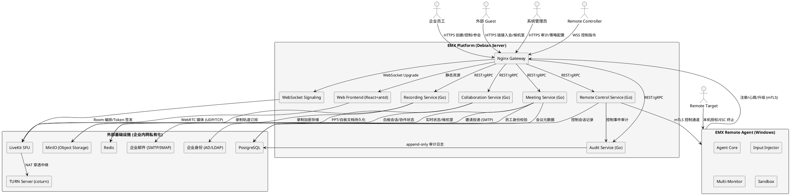

**通信协议与调用频率说明**：

| 链路 | 协议 | 频率/特征 | 关联需求 |
|------|------|----------|---------|
| 用户 ↔ Gateway | HTTPS (TLS 1.3) | 中频，REST 请求 | 全部 |
| 用户 ↔ WebSocket Signaling | WSS (TLS 1.3) | 长连接，信令 ≤500ms | EMX-R002~R013 |
| 浏览器 ↔ SFU | WebRTC (SRTP/DTLS) | 高频，媒体 ≤200ms | EMX-R006~R008 |
| SFU ↔ TURN | STUN/TURN | 中频，NAT 穿透 | EMX-R006~R008 |
| Service ↔ PostgreSQL | TCP (SQL) | 中频，事务 | 全部 |
| Service ↔ Redis | TCP (RESP) | 高频，状态读写 | EMX-R002~R013 |
| Service ↔ MinIO | HTTP (S3) | 低频，大文件 | EMX-R009/R010/R014 |
| Remote Agent ↔ Server | mTLS (gRPC) | 中频，控制指令 ≤80ms | EMX-R016~R018 |
| Service ↔ 企业邮件 | SMTP | 低频，邀请投递 | EMX-R004 |
| Service ↔ 企业身份 | LDAP/HTTPS | 低频，身份校验 | EMX-R001/R002 |

### 2.1.2 服务/组件总体架构

EMX 采用**模块化单体 + 独立媒体平面**架构：业务服务以 Go 模块化单体形式部署（共享进程或同机多进程），媒体平面由独立 LiveKit SFU 集群承担。此选择理由：

1. **V1 容量目标为单会议 ≥50 人、系统级并发会议数中等**（详见 D-03 容量模型），微服务全拆会引入不必要的运维复杂度；
2. **媒体平面独立**是 WebRTC 的硬性要求（UDP 端口段、带宽、NAT），必须与业务服务分离；
3. **Go 模块化单体**可在 V1 快速交付，后续按容量增长水平拆分（关联用户偏好 PREFERENCE_11/PREFERENCE_12 Go 后端）；
4. **私有化部署**要求编排简单（Docker Compose / systemd），模块化单体比全微服务更易交付。

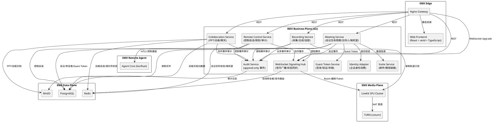

**模块职责说明**：

| 模块 | 职责 | 关联需求 | 核心类 |
|------|------|---------|--------|
| Meeting Service | 会议创建/状态机/主持人/候机室/锁定/结束 | EMX-R001/R002/R012/R013 | MeetingRepository, MeetingStateMachine, HostAuthority, WaitingRoomQueue |
| Collaboration Service | PPT 演示/白板 CRDT/聊天 | EMX-R009/R010/R011 | SlideDeckSession, WhiteboardCRDT, ChatChannel |
| Remote Control Service | 控制申请/授权/会话/超时/终止/审计 | EMX-R016/R017/R018 | ControlSessionManager, ConsentAuthorizer, RemoteAgentChannel |
| Recording Service | 录制控制/采集/合成/加密存储 | EMX-R014 | RecordingPipeline, MediaComposer, EncryptionAtRest |
| Audit Service | append-only 事件写入/查阅/不可篡改 | EMX-R015 | AuditAppender, AuditQuery, ImmutableStore |
| Identity Adapter | 企业身份消费（V1 基础账号） | EMX-R001/R002 | IdentityProvider, PermissionResolver |
| Invite Service | 邀请内容生成/邮件投递/微信链接 | EMX-R004 | InviteComposer, MailDispatcher, WeChatLinkGenerator |
| Guest Token Service | Token 签发/验证/吊销/时间窗 | EMX-R003 | GuestTokenIssuer, GuestTokenValidator |
| WebSocket Signaling Hub | 信令广播/状态同步/参会者路由 | 全部信令 | SignalingHub, ParticipantRouter, StateBroadcaster |
| LiveKit SFU Cluster | 媒体转发/自适应码率/RTP 路由 | EMX-R006/R007/R008 | (外部组件) |
| Remote Agent | 本机鼠标/键盘/多显示器/系统级操作 | EMX-R016~R018 | AgentCore, InputInjector, MultiMonitor, Sandbox |

**配置项及取值策略**：

| 配置项 | 默认值 | 取值策略 | 关联需求 |
|--------|--------|---------|---------|
| `security.defaultLevel` | L2 | 企业策略可调 | spec §7.1.1 规则 4 |
| `guestToken.validWindowBefore` | 30min | 企业策略可调 | spec §11.3 |
| `guestToken.validWindowAfter` | 30min | 企业策略可调 | spec §11.3 |
| `meeting.passwordRetryThreshold` | 5 | 企业策略可调 | spec §7.2.1 规则 6 |
| `meeting.passwordLockDuration` | 10min | 企业策略可调 | spec §7.2.1 规则 6 |
| `recording.retentionDays` | 90 | 企业策略可调，≥90 | spec §7.8.1 规则 6 |
| `audit.retentionDays` | 365 | 企业策略可调，≥365 | spec §6.3 规则 6 |
| `remoteControl.maxDuration` | 30min | 企业策略可调，>0 且 ≠∞ | spec §7.5.2 规则 11 |
| `remoteControl.requestTimeout` | 60s | 企业策略可调，>0 | spec §7.5.2 规则 12 |
| `remoteControl.defaultPolicy` | DENY | 不可改为隐式开启 | spec §7.5.2 规则 1 |
| `meeting.codeLength` | 6 | ≥6，排除易混淆字符 | spec §7.1.1 规则 2 |
| `media.screenShareFpsFloor` | 5 | 1080p 自适应降级下限 | spec §6.1 指标 5 |
| `media.videoBitrateCeiling` | 2.5Mbps | 单路视频码率上限 | spec §6.1 指标 4 |
| `media.audioBitrateCeiling` | 64kbps | 单路音频码率上限 | spec §6.1 指标 4 |
| `media.screenShareBitrateCeiling` | 4Mbps | 屏幕共享码率上限 | spec §6.1 指标 5 |
| `sfu.portRangeUdp` | 50000-60000 | UDP 媒体端口段 | spec §10.1 |
| `turn.portTcp` | 3478 | TURN TCP 端口 | spec §10.1 |
| `turn.portTls` | 5349 | TURN TLS 端口 | spec §10.1 |
| `recording.encryptionAlgorithm` | AES-256-GCM | 录制加密算法 | spec §7.8.1 规则 2 |
| `audit.hashChainAlgorithm` | SHA-256 | 审计哈希链算法 | spec §6.3 规则 6 |
| `guestToken.signingAlgorithm` | EdDSA (Ed25519) | Guest Token 签名算法 | spec §11.3 |
| `remoteAgent.mtlsCertValidity` | 24h | Remote Agent 证书有效期 | spec §7.5.2 规则 8 |

### 2.1.3 实现设计文档

#### 2.1.3.1 会议状态机设计

会议生命周期涉及多状态流转，需严格状态机约束以避免并发操作下的状态不一致（关联 spec §6.2 规则 4、§7.1.1 规则 7）。

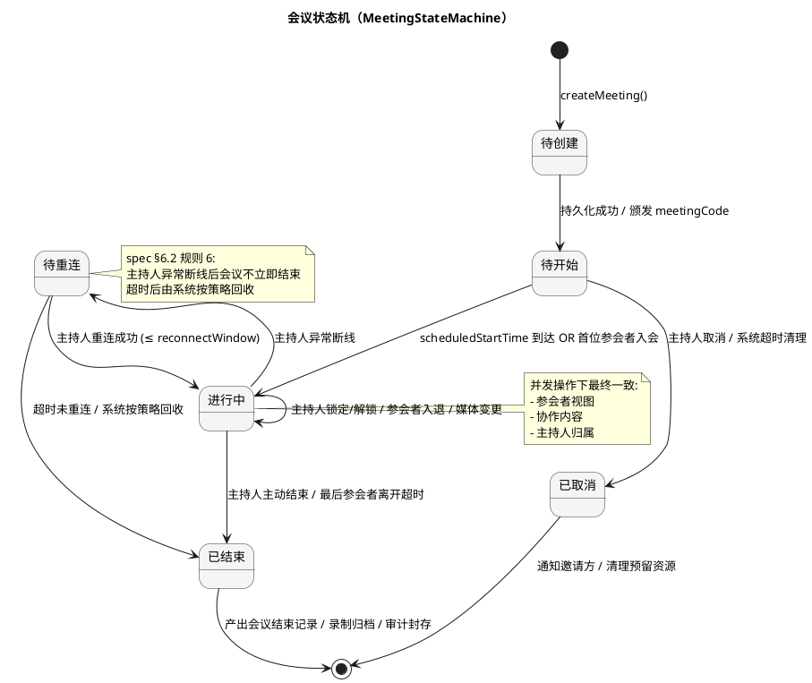

**状态转换约束**：

| 当前状态 | 允许的转换 | 触发条件 | 处理策略 | 关联需求 |
|---------|-----------|---------|---------|---------|
| 待创建 | → 待开始 | 持久化成功 + meetingCode 唯一性校验通过 | 同步颁发会议链接 | EMX-R001 |
| 待开始 | → 进行中 | 首位参会者入会 OR 计划开始时间到达 | 异步建立 SFU Room + 协作会话 | EMX-R002/R003 |
| 进行中 | → 进行中 | 主持人锁定/解锁 | 状态广播，锁定后拒绝入会 | EMX-R012 |
| 进行中 | → 待重连 | 主持人 WebSocket 断开 | 启动重连计时器，会议保持 | EMX-R012 spec §7.1.1 规则 7 |
| 待重连 | → 进行中 | 主持人重连成功 | 恢复控制权，广播重连事件 | spec §6.2 规则 6 |
| 待重连 | → 已结束 | 超过 reconnectWindow（默认 5min） | 系统按策略结束，产出记录 | spec §6.2 规则 6 |
| 进行中 | → 已结束 | 主持人主动结束 OR 末位参会者离开超时 | 全体退出 + 录制合成 + 审计封存 | EMX-R012 |

#### 2.1.3.2 参会者状态机设计

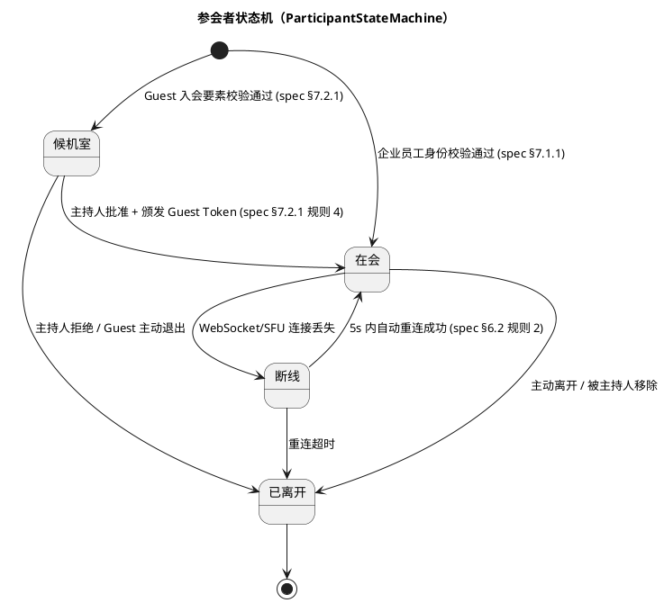

**Guest 与企业员工入会路径隔离**：企业员工入会跳过候机室直接进入"在会"；Guest 必须经候机室 → 主持人批准 → 颁发 Guest Token → 在会（关联 spec §7.2.1 规则 1、§6.3 规则 8）。

#### 2.1.3.3 远程控制会话状态机设计

远程控制涉及显式授权、双向超时、单方面终止等复杂流转，独立状态机约束（关联 spec §7.5.2 规则 1~13、§11.6）。

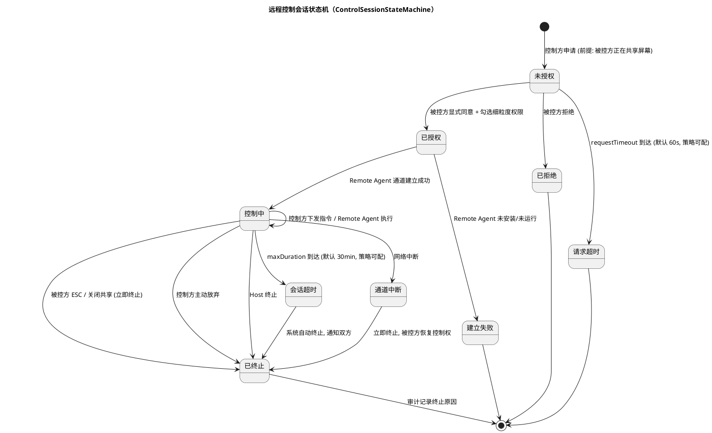

**两类超时独立约束**（关联 spec §7.5.2 规则 10、§11.6 RR-03）：

| 超时类型 | 字段 | 默认值 | 作用阶段 | 触发后行为 |
|---------|------|--------|---------|-----------|
| Control Request Timeout | `requestTimeout` | 60s | 未授权 → 已授权/已拒绝 | 请求自动失效，控制会话不建立 |
| Control Session Timeout | `maxDuration` | 30min | 控制中 → 已终止 | 系统自动终止，被控方恢复控制权 |

**约束**：`maxDuration > 0 且 maxDuration ≠ ∞`（禁止无限期授权，关联 spec §7.5.2 规则 13）；`requestTimeout > 0`；两者独立配置、独立计时、独立触发。

#### 2.1.3.4 屏幕共享互斥流程分支

同一时刻默认仅一位参会者共享屏幕（关联 spec §7.3.1 规则 4）。

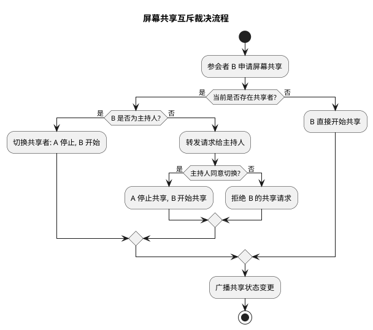

#### 2.1.3.5 扩展点设计

为后续版本（P1/P2）预留扩展点，避免 V1 实现阻塞后续演进（关联 spec §12.3）。

| 扩展点 | 接口 | 默认实现 (V1) | 后续版本扩展 | 关联需求 |
|--------|------|--------------|-------------|---------|
| IdentityProvider | `resolveIdentity(credential) → Identity` | 基础账号校验（用户名/密码） | AD/LDAP/SSO/MFA (P1) | EMX-R001/R002 |
| InviteChannel | `dispatch(invite, channel) → Result` | 邮件 + 微信链接 + 复制链接 | 企业 IM/CRM (P1/P2) | EMX-R004 |
| RecordingProcessor | `process(tracks, policy) → Recording` | 音视频合成 + AES-256-GCM 加密 | AI 转写/摘要/翻译 (P2) | EMX-R014 |
| AuditSink | `append(event) → Ack` | PostgreSQL append-only + SHA-256 哈希链 | 外部 SIEM 对接 (P1) | EMX-R015 |
| RemoteAgentPlatform | `injectInput(agent, event) → Ack` | Windows 10/11 x64 输入注入 | macOS (P1) | EMX-R016~R018 |
| SecurityLevelPolicy | `enforce(meeting, level) → Decision` | L1/L2/L3 | L4 MFA / L5 内部机密 / L6 E2EE (P2) | spec §7.10.2 规则 4 |

#### 2.1.3.6 事务边界设计

| 事务场景 | 事务边界 | 一致性级别 | 补偿策略 | 关联需求 |
|---------|---------|-----------|---------|---------|
| 会议创建 | meeting 元数据 + 预留存储空间 + 颁发 meetingCode | 强一致（PostgreSQL 单事务） | 失败回滚，meetingCode 释放 | EMX-R001 |
| Guest 入会批准 | 候机室移除 + 颁发 Guest Token + 加入参会者列表 | 强一致（PostgreSQL + Redis 双写） | Token 签发失败则回退候机室 | EMX-R003/R013 |
| 远程控制建立 | 控制会话记录 + Remote Agent 通道建立 + 审计写入 | 最终一致（先持久化后建通道） | 通道建立失败则标记会话为"建立失败" | EMX-R016/R017 |
| 录制停止 | 停止采集 + 触发合成 + 更新录制状态 | 最终一致（异步合成） | 合成失败保留分轨，支持重合成 | EMX-R014 spec §7.8.4 |
| 审计写入（Low-Risk 事件） | append 事件 + 哈希链更新 | 强一致（单行 append） | 写入失败 → Durable Queue 异步补写 + 运维告警，业务可继续 | EMX-R015 spec §7.10.4 |
| 审计写入（Security-Critical 事件） | 业务状态 + outbox 同事务原子提交 + Audit Store append + 哈希链 commit + Audit ACK | 强一致（Transactional Outbox） | Outbox / Durable Queue / Audit Store / Hash Chain / Audit ACK 任一失败 → **Fail-Closed，对应安全业务效果不得发生**（如 Remote Control Approved 失败 → MUST NOT establish Control Session） | EMX-R015 spec §6.3 规则 6、§7.5.2 规则 9、§4.1 |
| 白板对象合并 | CRDT 本地合并 + 广播 + 异步持久化 | 最终一致（CRDT 保证收敛） | 无需补偿，CRDT 幂等 | EMX-R010 |
| 主持人移交 | 原主持人失去控制权 + 新主持人获得控制权 + 广播 | 强一致（PostgreSQL 唯一约束 + Redis 原子操作） | 并发移交仅一位成功 | EMX-R012 spec §7.1.1 规则 5 |

## 2.2 接口设计

### 2.2.1 总体设计

EMX 接口分为四类，遵循"接口粒度适中、类型安全、版本可演进"原则（关联用户偏好 PREFERENCE_8 TypeScript strict、PREFERENCE_12 Go 后端）。

| 接口分类 | 协议 | 消费方 | 稳定性 | 版本策略 | 关联需求 |
|---------|------|--------|--------|---------|---------|
| REST API (HTTP/JSON) | HTTPS TLS 1.3 | Web 前端 / 外部集成 | 稳定 | URL 路径版本 `/api/v1/` | EMX-R001~R015 |
| WebSocket Signaling | WSS TLS 1.3 | 浏览器参会者 | 稳定 | 协议头版本协商 | EMX-R002~R013 |
| gRPC (mTLS) | HTTP/2 + mTLS | Remote Agent ↔ Server | 稳定 | protobuf 兼容性规则 | EMX-R016~R018 |
| 内部 Service-to-Service | gRPC (同机) | Go 模块间 | 实验 | 无外部暴露 | 全部 |

**接口变更策略**：
1. REST API 采用 URL 路径版本（`/api/v1/`、`/api/v2/`），不破坏旧版本；
2. WebSocket 信令采用协议头版本协商，旧客户端在新服务端可降级运行；
3. gRPC 接口遵循 protobuf 向后兼容规则（不删字段、不改字段编号、不改类型）；
4. 会议链接格式一经发布不可破坏性变更（关联 spec §6.5 规则 5）。

### 2.2.2 接口清单

#### A. 会议管理接口（MeetingService）

**接口签名**：

```go
// 创建会议
func (s *MeetingService) CreateMeeting(
    ctx context.Context,
    req CreateMeetingRequest,
) (CreateMeetingResponse, error)

type CreateMeetingRequest struct {
    Subject          string         // 非空, ≤200
    ScheduledStart   time.Time
    ScheduledEnd     time.Time      // > ScheduledStart
    SecurityLevel    SecurityLevel  // L0~L6, V1 支持 L1/L2/L3
    Password         string         // ≥L1 时必填, 6 位数字
    InvitationList   []InviteTarget // L3 时非空
    CreatorIdentity  IdentityClaim  // 企业员工身份
}

type CreateMeetingResponse struct {
    MeetingID    MeetingID    // 内部 ID, 不对外暴露
    MeetingCode  string       // ≥6 位, 不可枚举
    MeetingLink  string       // https://meet.xxx.com/j/{MeetingCode}
    Password     string       // 回显, 仅创建者可见
    CreatedAt    time.Time
}
```

- **业务说明**：企业员工创建会议，生成不可枚举会议号与链接（关联 EMX-R001、spec §7.1.1）。
- **前置条件**：调用方为企业员工且具备创建权限；SecurityLevel ∈ {L1, L2, L3}；Password 满足 6 位数字约束。
- **后置条件**：会议元数据持久化至 PostgreSQL；预留 MinIO 存储空间；审计事件 `Meeting Created` 写入。
- **异常映射**：

| 业务异常 | HTTP 状态码 | 错误码 | 关联 spec |
|---------|------------|--------|----------|
| 身份校验失败 | 403 | `EMX-E-AUTH-001` | spec §7.1.3 异常 1 |
| 会议号碰撞（重试上限内成功） | — | 无感知 | spec §7.1.3 异常 2 |
| 参数非法（时间/等级/密码） | 400 | `EMX-E-MEETING-001` | spec §11.1 |

**接口签名**：

```go
// 内部用户入会
func (s *MeetingService) JoinMeeting(
    ctx context.Context,
    req JoinMeetingRequest,
) (JoinMeetingResponse, error)

type JoinMeetingRequest struct {
    MeetingCode   string
    Password      string
    IdentityClaim IdentityClaim // 企业员工
}

type JoinMeetingResponse struct {
    ParticipantID  ParticipantID
    GuestToken     string       // 空对于企业员工
    SignalingURL   string       // WSS 端点
    SFUToken       string       // LiveKit Participant Token
    MeetingState   MeetingState // 当前会议状态快照
}
```

- **业务说明**：企业员工通过会议号 + 密码入会，跳过候机室直接进入"在会"（关联 EMX-R002、spec §7.1.1）。
- **前置条件**：会议状态 ∈ {待开始, 进行中}；未锁定；身份有效。
- **后置条件**：参会者状态置为"在会"；SFU Room 加入；审计事件 `Guest Joined`/`Participant Joined` 写入。

**接口签名**：

```go
// 主持人控制指令
func (s *MeetingService) HostControl(
    ctx context.Context,
    req HostControlRequest,
) (HostControlResponse, error)

type HostControlRequest struct {
    MeetingID       MeetingID
    HostParticipant ParticipantID
    Action          HostAction // {Mute, Kick, Lock, Unlock, TransferHost, EndMeeting}
    Target          *ParticipantID
}

type HostAction int
const (
    ActionMute HostAction = iota
    ActionKick
    ActionLock
    ActionUnlock
    ActionTransferHost
    ActionEndMeeting
)
```

- **业务说明**：主持人执行静音/踢出/锁定/移交/结束等控制（关联 EMX-R012、spec §7.7）。
- **前置条件**：调用方为当前会议主持人；目标参会者在会；Action 合法。
- **后置条件**：状态机流转；广播变更；审计写入。
- **异常映射**：非主持人调用 → 403 `EMX-E-AUTH-002`；目标不存在 → 404 `EMX-E-MEETING-002`。

#### B. Guest 访问接口（GuestAccessService）

**接口签名**：

```go
// Guest 入会（进入候机室）
func (s *GuestAccessService) GuestJoin(
    ctx context.Context,
    req GuestJoinRequest,
) (GuestJoinResponse, error)

type GuestJoinRequest struct {
    MeetingCode string
    Password    string         // ≥L1 时必填
    DisplayName string         // 非空, ≤50
    ClientIP    string         // 用于密码重试锁定
}

type GuestJoinResponse struct {
    WaitingRoomToken string    // 候机室短期凭证
    WaitingRoomState string    // 候机室状态
}
```

- **业务说明**：Guest 通过链接 + 密码 + 姓名入会，进入候机室等待主持人批准（关联 EMX-R003、spec §7.2.1）。
- **前置条件**：会议存在且未结束；未锁定；密码重试次数 < 5 或锁定已过期。
- **后置条件**：Guest 进入候机室（不可见/不可听/不可发送媒体）；审计事件 `Guest Joined`（候机室）写入。
- **异常映射**：

| 业务异常 | HTTP 状态码 | 错误码 | 关联 spec |
|---------|------------|--------|----------|
| 会议不存在/已结束 | 404 | `EMX-E-GUEST-001` | spec §7.2.3 异常 1 |
| 会议已锁定 | 403 | `EMX-E-GUEST-002` | spec §7.2.3 异常 2 |
| 密码错误 | 401 | `EMX-E-GUEST-003` | spec §7.2.1 规则 6 |
| IP 锁定（连续 5 次错误） | 429 | `EMX-E-GUEST-004` | spec §7.2.1 规则 6 |

**接口签名**：

```go
// 主持人批准候机室 Guest
func (s *GuestAccessService) ApproveGuest(
    ctx context.Context,
    req ApproveGuestRequest,
) (ApproveGuestResponse, error)

type ApproveGuestRequest struct {
    MeetingID       MeetingID
    HostParticipant ParticipantID
    GuestWaitingID  string
}

type ApproveGuestResponse struct {
    GuestToken  string // JWT, 限定单一会议/时间窗/权限
    Participant ParticipantID
}
```

- **业务说明**：主持人批准候机室 Guest，颁发 Guest Token（关联 EMX-R013、spec §7.2.1 规则 4）。
- **前置条件**：调用方为主持人；Guest 在候机室。
- **后置条件**：Guest 移出候机室进入"在会"；Guest Token 签发并持久化；审计事件 `Guest Approved` 写入。

#### C. 协作接口（CollaborationService）

**接口签名**：

```go
// 白板对象操作（WebSocket 信令）
func (s *CollaborationService) WhiteboardOp(
    ctx context.Context,
    req WhiteboardOpRequest,
) error

type WhiteboardOpRequest struct {
    MeetingID    MeetingID
    DocumentID   DocumentID
    Operation    CRDTOperation // {Insert, Update, Delete, Undo, Redo}
    Object       WhiteboardObject
    ClientClock  LamportClock  // CRDT 逻辑时钟
}

type WhiteboardObject struct {
    ObjectID string
    Type     ObjectType // {pen, highlighter, arrow, rectangle, circle, text, sticky, image, laser, eraser}
    Author   ParticipantID
    Geometry Geometry
    Style    Style
}
```

- **业务说明**：参会者白板绘制操作，经 CRDT 合并后广播（关联 EMX-R010、spec §7.4.2）。
- **前置条件**：参会者在会；具备白板权限；Object.Author == 调用方（删除时）或调用方为主持人。
- **后置条件**：CRDT 本地合并 → 广播全体 → 异步持久化至 MinIO；激光笔不持久化。
- **异常映射**：越权删除他人对象 → 403 `EMX-E-COLLAB-002`（spec §7.4.2 规则 4）。

**接口签名**：

```go
// PPT/文档演示翻页
func (s *CollaborationService) SlideNavigate(
    ctx context.Context,
    req SlideNavigateRequest,
) error

type SlideNavigateRequest struct {
    MeetingID    MeetingID
    DeckID       DocumentID
    TargetPage   int
    Operator     ParticipantID
}
```

- **业务说明**：演讲者翻页，全体同步（关联 EMX-R009、spec §7.4.1 规则 2）。
- **前置条件**：操作者为主持人或被授权翻页者。
- **后置条件**：当前页状态广播；同步延迟 ≤ 200ms（spec §6.1 指标 7）。

#### D. 远程控制接口（RemoteControlService）

**接口签名**：

```go
// 申请远程控制
func (s *RemoteControlService) RequestControl(
    ctx context.Context,
    req RequestControlRequest,
) (RequestControlResponse, error)

type RequestControlRequest struct {
    MeetingID         MeetingID
    Controller        ParticipantID // 控制方
    Target            ParticipantID // 被控方
}

type RequestControlResponse struct {
    RequestID    string
    ExpiresAt    time.Time // = now + requestTimeout (默认 60s)
}
```

- **业务说明**：控制方申请远程控制，触发被控方授权对话框（关联 EMX-R016、spec §7.5.2 规则 3）。
- **前置条件**：被控方正在共享屏幕（spec §7.5.2 规则 2）；被控方当前无控制会话（规则 7）；远程控制默认 DENY 已被显式申请覆盖。
- **后置条件**：请求转发给被控方；启动 requestTimeout 计时器；审计事件 `Remote Control Requested` 写入。
- **异常映射**：被控方未共享屏幕 → 409 `EMX-E-REMOTE-001`（spec §7.5.2 规则 2）；被控方已有控制会话 → 409 `EMX-E-REMOTE-002`（规则 7）。

**接口签名**：

```go
// 被控方授权（含细粒度权限勾选）
func (s *RemoteControlService) GrantControl(
    ctx context.Context,
    req GrantControlRequest,
) (GrantControlResponse, error)

type GrantControlRequest struct {
    RequestID         string
    TargetParticipant ParticipantID
    GrantedPermissions PermissionSet // 子集于 {鼠标移动, 鼠标点击, 键盘输入, Ctrl-Alt-Win, 剪贴板读, 剪贴板写, 文件传输, 应用启动}
}

type PermissionSet struct {
    MouseMove    bool
    MouseClick   bool
    Keyboard     bool
    CtrlAltWin   bool
    ClipboardRead  bool
    ClipboardWrite bool
    FileTransfer   bool
    AppLaunch      bool
}
```

- **业务说明**：被控方显式同意并勾选细粒度权限（关联 EMX-R017、spec §7.5.2 规则 4）。
- **前置条件**：请求未过期；被控方为请求目标。
- **后置条件**：建立 Remote Agent mTLS 通道；控制会话状态置为"控制中"；启动 maxDuration 计时器；审计事件 `Remote Control Approved` + 权限项写入。

**接口签名**：

```go
// 立即终止远程控制（被控方一键终止）
func (s *RemoteControlService) TerminateControl(
    ctx context.Context,
    req TerminateControlRequest,
) error

type TerminateControlRequest struct {
    SessionID    string
    TerminatedBy ParticipantID // 被控方 / 控制方 / Host
    Reason       TerminateReason // {ESC, 关闭共享, 主动放弃, Host终止, 通道中断, 会话超时, 请求超时}
}
```

- **业务说明**：单方面终止控制会话，被控方恢复完整控制权（关联 EMX-R018、spec §7.5.2 规则 5）。
- **前置条件**：会话状态为"控制中"。
- **后置条件**：Remote Agent 通道立即断开；控制方失去控制权；审计事件 `Remote Control Terminated` + 终止原因写入。

#### E. 录制接口（RecordingService）

**接口签名**：

```go
// 录制控制
func (s *RecordingService) ControlRecording(
    ctx context.Context,
    req RecordingControlRequest,
) error

type RecordingControlRequest struct {
    MeetingID MeetingID
    Operator  ParticipantID // 主持人
    Action    RecordingAction // {Start, Pause, Stop}
}
```

- **业务说明**：主持人开始/暂停/停止录制（关联 EMX-R014、spec §7.8.1）。
- **前置条件**：操作者为主持人；会议策略允许录制。
- **后置条件**：开始时通知全体参会者（视觉 + 音频提示）；停止时触发合成；审计事件写入。
- **异常映射**：非主持人 → 403 `EMX-E-RECORD-001`；会议策略禁止录制 → 403 `EMX-E-RECORD-002`。

#### F. Remote Agent gRPC 接口（mTLS）

**接口签名**（protobuf）：

```protobuf
service RemoteAgentService {
    // 注册（首次安装 → 注册 → 获取 mTLS 证书）
    rpc Register(RegisterRequest) returns (RegisterResponse);
    // 心跳
    rpc Heartbeat(HeartbeatRequest) returns (HeartbeatResponse);
    // 建立控制通道（双向流）
    rpc OpenControlChannel(stream ControlCommand) returns (stream ControlFeedback);
    // 输入注入
    rpc InjectInput(InputEvent) returns (InjectAck);
    // 查询本机能力（多显示器/系统版本）
    rpc QueryCapabilities(CapQuery) returns (CapReport);
}
```

- **业务说明**：Remote Agent 与 Server 之间的 mTLS gRPC 接口，承担注册、心跳、控制通道、输入注入（关联 EMX-R016~R018、spec §7.6）。
- **前置条件**：Remote Agent 持有有效 mTLS 证书（由 EMX 内部 CA 签发）；证书未过期/未吊销。
- **后置条件**：控制指令经沙箱校验后在本机执行；操作事件量计入审计（不含具体内容）。
- **异常映射**：证书无效/吊销 → 关闭连接 + 审计；沙箱拒绝越权指令 → `EMX-E-AGENT-001`。

#### G. 审计接口（AuditService）

**接口签名**：

```go
// 追加审计事件（内部调用，不对外暴露）
func (s *AuditService) AppendEvent(
    ctx context.Context,
    event AuditEvent,
) error

type AuditEvent struct {
    MeetingID    *MeetingID // 系统级事件可为空
    EventType    EventType  // spec §7.10.1 清单
    ActorID      ParticipantID
    ActorType    ActorType  // {企业员工, Guest, 系统, Host}
    OccurredAt   time.Time
    Payload      json.RawMessage // 结构化, 不含敏感明文
    PrevHash     string       // 哈希链前驱
}
```

- **业务说明**：append-only 审计事件写入，SHA-256 哈希链保证不可篡改（关联 EMX-R015、spec §7.10.2）。**事件分级**：Low-Risk 事件（UI/状态类）走 Durable Queue 异步补写；Security-Critical 事件（Remote Control Requested/Approved/Rejected/Terminated、Guest Approved、Participant Removed、权限/策略变更）走 Transactional Outbox + Fail-Closed，对应安全业务效果在 Audit ACK 前不得发生（详见 §4.1）。
- **前置条件**：调用方为内部服务；EventType ∈ spec §7.10.1 清单。
- **后置条件**：事件 append 至 PostgreSQL；哈希链更新；不可修改/删除。
- **异常映射**（分级处理，关联 §4.1 Audit Failure Policy 表格）：

| 事件风险等级 | 审计存储不可达时业务行为 | 关联 spec |
|------------|------------------------|----------|
| **Low-Risk**（Meeting Created / Guest Invited / Guest Joined 候机室 / Screen Share Started/Stopped / Recording Started/Stopped / Meeting Ended） | 业务可继续 + Durable Queue 异步补写 + 运维告警 | spec §7.10.4 异常 1 |
| **Security-Critical**（Remote Control Requested/Approved/Rejected/Terminated、Guest Approved、Participant Removed、权限/策略变更） | **Fail-Closed**：对应安全业务效果**不得发生**（如 Remote Control Approved → MUST NOT establish Control Session） + 返回 `EMX-E-AUDIT-002~006` + 运维告警 | spec §6.3 规则 6、§7.5.2 规则 9 |

## 2.3 数据模型

### 2.3.1 设计目标

数据模型需支持以下业务场景与质量目标（关联 spec §6.1~§6.4、§11）：

1. **业务场景**：
   - 单会议 ≥ 50 人并发参会（spec §6.1 指标 8）；
   - 系统级并发会议数由容量模型确定（详见 §3.3 D-03）；
   - 白板文档会后独立编辑（spec §7.4.2 规则 1）；
   - 录制保留期 ≥ 90 天，审计保留期 ≥ 365 天（spec §7.8.1 规则 6、§6.3 规则 6）；
   - Guest Token 时间窗限定（spec §11.3）。

2. **性能目标**：
   - 会议创建 ≤ 2s P95（spec §6.1 指标 1）；
   - 白板同步延迟 ≤ 100ms P95（spec §6.1 指标 6）；
   - 信令端到端 ≤ 500ms P95（spec §6.1 指标 3）。

3. **容量目标**：详见 §3.3 D-03 容量模型（Redis 内存 / PostgreSQL 数据量 / MinIO 存储估算）。

4. **兼容策略**：
   - 会议链接格式一经发布不可破坏性变更（spec §6.5 规则 5）；
   - 接口变更向后兼容（§2.2.1 版本策略）；
   - 存量数据迁移通过 schema 版本号管理，V1 不存在存量数据迁移问题（全新建设）。

### 2.3.2 模型实现

核心领域对象类图如下（关联 spec §11.1~§11.7 字段约束）：

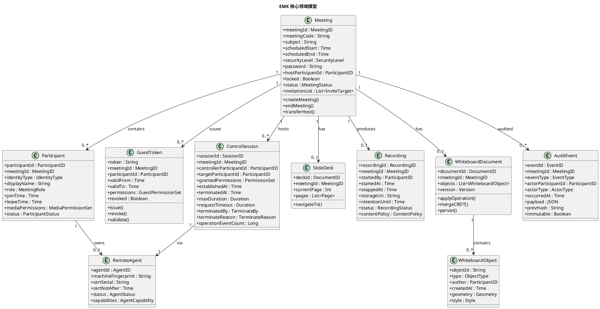

**对象关系与生命周期**：

| 对象 | 创建时机 | 销毁/归档时机 | 持久化策略 | 关联需求 |
|------|---------|-------------|-----------|---------|
| Meeting | CreateMeeting 成功 | 已结束 + 录制归档 + 审计封存 | PostgreSQL（元数据） + Redis（实时状态） | EMX-R001 |
| Participant | 入会成功 | 离会后保留记录（审计追溯） | PostgreSQL + Redis（在线状态） | EMX-R002/R003 |
| GuestToken | 主持人批准 Guest | validTo 过期 / 显式吊销 / 会议结束 | PostgreSQL | EMX-R003/R013 |
| WhiteboardDocument | 会议创建时初始化 | 会议结束后可独立编辑，按策略归档 | MinIO（对象序列） + PostgreSQL（元数据） | EMX-R010 |
| WhiteboardObject | 参会者绘制操作 | undo/删除/清空 | CRDT 合并 → 异步持久化至 MinIO | EMX-R010 |
| SlideDeck | 主持人上传演示文稿 | 会议结束 + 按保留期清理 | MinIO（文件） + PostgreSQL（页元数据） | EMX-R009 |
| Recording | 开始录制 | 保留期到期（默认 ≥ 90 天） | MinIO（AES-256-GCM 加密） + PostgreSQL（元数据） | EMX-R014 |
| ControlSession | 被控方授权 | 终止后保留记录（审计追溯） | PostgreSQL | EMX-R016~R018 |
| AuditEvent | 业务事件发生 | 保留期 ≥ 365 天，不可删除 | PostgreSQL append-only + SHA-256 哈希链 | EMX-R015 |
| RemoteAgent | 首次安装注册 | 证书吊销 / 显式注销 | PostgreSQL（注册记录） + 内部 CA（证书） | EMX-R016~R018 |

**持久化分工策略**（不包含表结构，仅说明存储选型理由）：

| 存储组件 | 承载对象 | 选型理由 | 关联需求 |
|---------|---------|---------|---------|
| PostgreSQL | Meeting / Participant / GuestToken / ControlSession / AuditEvent / SlideDeck 元数据 / WhiteboardDocument 元数据 / RemoteAgent 注册 | 强一致事务、append-only 审计、关系查询、保留期管理 | 全部业务数据 |
| Redis | 会议实时状态 / 候机室队列 / 在线参会者 / 白板会话临时态 / SFU Token 缓存 / 密码重试计数 / 主持人重连计时 | 低延迟读写（≤ 100ms 白板同步）、TTL 自动过期、Pub/Sub 信令广播 | EMX-R002~R013 |
| MinIO | 录制文件（加密） / PPT/Office/PDF 演示文稿 / 白板对象序列持久化 | S3 兼容、大文件、私有化、服务端加密 | EMX-R009/R010/R014 |
| 内部 CA（可选 cfssl/step-ca） | Remote Agent mTLS 证书 | 私有化 PKI、证书签发/轮换/吊销 | EMX-R016~R018 |

**领域对象与 spec 术语一致性**：所有领域对象命名严格对齐 spec §3 领域术语（Meeting / Guest / GuestToken / WaitingRoom / Whiteboard / SlideDeck / RemoteControl / RemoteAgent / Consent / Recording / AuditLog），确保需求-设计可追溯。

---

# 三、关键技术决策详细设计

> 本章对 EMX-002 架构设计中 12 项关键技术决策中尚未展开的 7 项进行详细设计，每项决策可追溯至 EMX-001 spec.md 具体需求。
>
> **决策清单**：
> - D-01 Remote Agent ↔ Server 加密、认证、信任边界（§3.1）
> - D-02 Whiteboard CRDT/OT/LWW 协同模型（§3.2）
> - D-03 Capacity Model 详细容量计算（§3.3）
> - D-04 故障边界与高可用策略（§3.4）
> - D-05 Debian 私有化部署拓扑（§3.5）
> - D-06 外部 Guest 零安装参会链路（§3.6）
> - D-07 安全模型与权限边界（§3.7）

## 3.1 D-01 — Remote Agent ↔ Server 加密、认证、信任边界

### 3.1.1 决策背景与关联需求

Remote Agent 运行在被控方本机（Windows 10/11 x64），承担鼠标/键盘/多显示器/系统级操作，与 EMX Server 之间建立控制通道（关联 spec §7.5.2 规则 8、§7.6、§6.3 安全性）。该通道承载系统级输入注入指令，安全等级最高，必须满足：

1. **双向身份认证**：Server 验证 Agent 身份，Agent 验证 Server 身份，防止中间人冒充；
2. **通道加密**：控制指令传输全程加密，防止窃听/篡改；
3. **信任边界隔离**：Agent 仅执行授权范围内指令，越权指令拒绝；
4. **证书生命周期管理**：签发、轮换、吊销完整闭环；
5. **沙箱约束**：Agent 不被滥用为通用后门。

### 3.1.2 mTLS 双向认证方案

**选型**：mTLS（mutual TLS）+ 内部 PKI（私有化 CA）。

**选型理由**：
- mTLS 是双向身份认证的工业标准，比 Token+TLS 单向认证更强（双向验证）；
- 私有化 PKI（cfssl 或 step-ca）可私有化部署，不依赖外部 CA SaaS，满足数据主权（spec §9）；
- gRPC 原生支持 mTLS，与 Go 后端技术栈一致（PREFERENCE_11/PREFERENCE_12）；
- 证书可承载 Agent 身份（CN/SAN），便于审计与吊销。

**证书体系**：

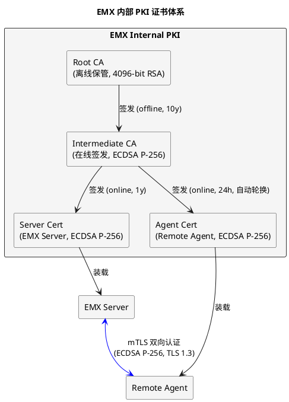

**证书参数**：

| 证书类型 | 签发方 | 算法 | 有效期 | 用途 | 关联配置项 |
|---------|--------|------|--------|------|-----------|
| Root CA | 离线生成 | RSA 4096 | 10 年 | 签发 Intermediate | — |
| Intermediate CA | Root CA | ECDSA P-256 | 5 年 | 签发 Server/Agent 证书 | — |
| Server Cert | Intermediate CA | ECDSA P-256 | 1 年 | EMX Server 身份 | — |
| Agent Cert | Intermediate CA | ECDSA P-256 | 24h | Remote Agent 身份 | `remoteAgent.mtlsCertValidity` |

**证书轮换策略**：
- Agent 证书有效期 24h，Agent 在有效期剩余 1/3（即 8h）时自动向 Server 申请续签；
- 续签使用现有有效证书进行 mTLS 认证；
- 续签失败连续 3 次则 Agent 进入"证书过期"状态，拒绝建立控制通道，并提示用户重新注册。

**证书吊销机制**：
- 采用 CRL（Certificate Revocation List）+ OCSP Stapling 双重机制；
- Server 维护 CRL 列表（PostgreSQL），定期推送给 Agent 校验端点；
- 吊销触发条件：Agent 显式注销 / 管理员强制吊销 / 检测到 Agent 异常行为；
- 吊销后 Agent 证书立即失效，所有控制通道断开。

### 3.1.3 Remote Agent 注册流程

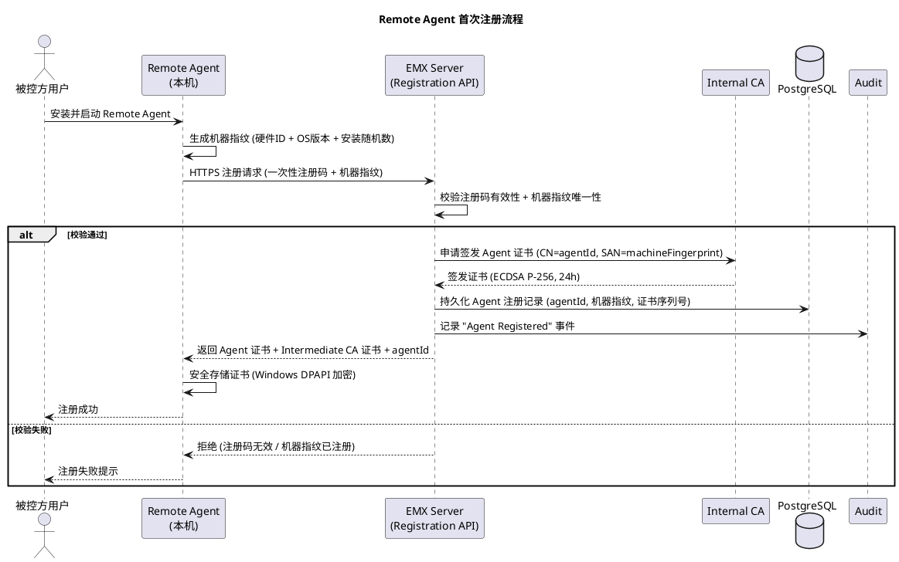

**注册要素**：

| 要素 | 说明 | 关联 spec |
|------|------|----------|
| 一次性注册码 | 由企业管理员预生成，绑定企业租户，使用后失效 | spec §6.3 安全性 |
| 机器指纹 | 硬件 ID + OS 版本 + 安装随机数，防止跨机器复用证书 | spec §7.5.2 规则 8 |
| 证书安全存储 | Windows DPAPI 加密存储，防止证书被复制到其他机器 | spec §6.3 |
| agentId | 全局唯一，与机器指纹绑定，记入审计 | spec §7.10.1 |

### 3.1.4 gRPC 控制通道接口定义

**protobuf 定义**（关联 §2.2.2 F 节）：

```protobuf
syntax = "proto3";
package emx.remote_agent.v1;

// 远程控制服务（Server → Agent 方向）
service RemoteAgentService {
    // 注册（首次安装）
    rpc Register(RegisterRequest) returns (RegisterResponse);
    // 心跳（保活 + 证书续签协商）
    rpc Heartbeat(HeartbeatRequest) returns (HeartbeatResponse);
    // 建立控制通道（双向流，控制指令下行 + 执行反馈上行）
    rpc OpenControlChannel(stream ControlFeedback) returns (stream ControlCommand);
    // 查询本机能力
    rpc QueryCapabilities(CapQuery) returns (CapReport);
    // 证书续签
    rpc RenewCertificate(RenewRequest) returns (RenewResponse);
}

message ControlCommand {
    string session_id = 1;
    oneof payload {
        MouseEvent mouse_event = 2;
        KeyboardEvent keyboard_event = 3;
        ClipboardOp clipboard_op = 4;
        FileTransferOp file_op = 5;
        AppLaunchOp app_op = 6;
        TerminateSignal terminate = 7;
    }
    PermissionSet required_permissions = 8; // 指令所需权限
}

message MouseEvent {
    enum Action { MOVE = 0; CLICK = 1; DOUBLE_CLICK = 2; RIGHT_CLICK = 3; SCROLL = 4; }
    Action action = 1;
    int32 monitor_index = 2; // 多显示器
    double x = 3; // 归一化坐标 [0.0, 1.0]
    double y = 4;
    int32 button = 5;
}

message KeyboardEvent {
    repeated int32 key_codes = 1; // Windows virtual-key codes
    bool ctrl = 2;
    bool alt = 3;
    bool shift = 4;
    bool win = 5;
}

message ControlFeedback {
    string session_id = 1;
    oneof payload {
        ExecResult exec_result = 2;
        CapReport cap_report = 3;
        Error error = 4;
    }
}
```

**接口约束**：
- 所有指令携带 `required_permissions`，Agent 沙箱校验当前会话 `grantedPermissions` 是否包含该权限，不包含则拒绝（关联 spec §7.5.2 规则 4）；
- 坐标采用归一化值 [0.0, 1.0]，适配多显示器不同分辨率；
- 键盘使用 Windows virtual-key codes，与 OS 原生 API 对齐。

### 3.1.5 控制通道建立与断开流程

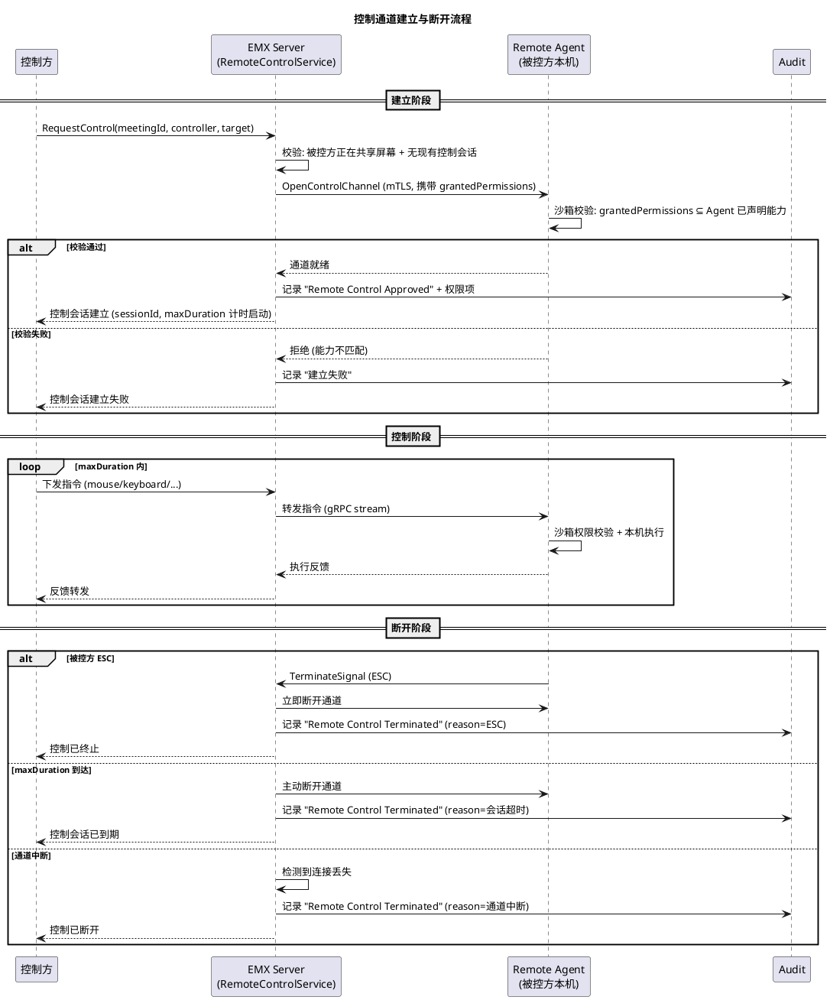

### 3.1.6 安全沙箱设计

Remote Agent 沙箱防止被滥用为通用后门（关联 spec §7.5.2 规则 13 禁止项）。

**沙箱约束**：

| 约束维度 | 策略 | 关联 spec |
|---------|------|----------|
| 指令权限边界 | 每条指令校验 `required_permissions ⊆ grantedPermissions`，越权拒绝 | spec §7.5.2 规则 4 |
| 会话绑定 | 控制通道绑定单一 `sessionId`，会话结束后通道关闭，不接受会话外指令 | spec §11.6 规则 2 |
| 跨会议禁止 | Agent 证书绑定 `agentId`，会话绑定 `meetingId`，禁止跨会议复用通道 | spec §7.5.2 规则 13 |
| 输入范围限制 | 鼠标坐标归一化 [0.0, 1.0]，禁止注入超范围坐标；键盘仅 virtual-key codes，禁止任意内存写入 | — |
| 系统级操作白名单 | `AppLaunch` 仅允许启动白名单内应用（由企业策略配置），禁止任意命令执行 | spec §7.5.2 规则 4 |
| 文件传输路径限制 | `FileTransferOp` 限制目标路径在企业指定目录白名单内，禁止任意路径读写 | spec §7.5.2 规则 13 |
| Ctrl-Alt-Win 隔离 | `CtrlAltWin` 权限独立勾选，默认 DENY，避免误授权系统级快捷键 | spec §7.5.3 |
| 单会话约束 | 同一 Agent 同一时刻仅一个控制通道，新请求排队或拒绝 | spec §7.5.2 规则 7 |
| 证书吊销即时生效 | Agent 心跳时校验 CRL，证书被吊销则立即断开所有通道 | spec §6.3 |
| 操作事件量审计 | Agent 计数操作事件量（不含具体内容），定期上报 Server 记入审计 | spec §11.6 规则 11、§7.5.2 规则 9 |

**沙箱实现策略**：
- Agent 以**低权限 Windows 服务**运行（非 Administrator），需要提升的操作通过 UAC 提示用户确认；
- 输入注入使用 Windows SendInput API，受沙箱进程权限约束；
- 系统级操作（如 Ctrl-Alt-Del）Windows 不允许程序模拟，天然隔离；
- Agent 不监听任何入站网络端口，仅主动出站连接 Server（mTLS），防止被外部直接访问。

### 3.1.7 信任边界与权限隔离

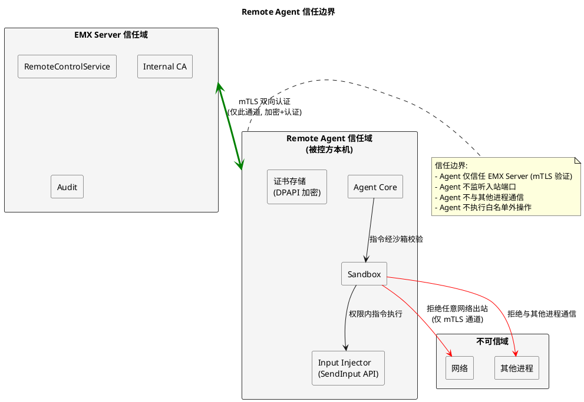

**信任边界总结**：

| 边界 | 信任关系 | 隔离机制 |
|------|---------|---------|
| Server ↔ Agent | 双向信任（mTLS） | 证书认证 + 通道加密 |
| Agent ↔ 本机其他进程 | 不信任 | 沙箱进程隔离，不通信 |
| Agent ↔ 网络 | 不信任 | 仅主动出站 mTLS，不监听入站 |
| Agent ↔ 本机操作 | 受限信任 | 权限白名单 + 路径白名单 + UAC |
| Server → Agent 指令 | 受限信任 | 每条指令校验 `grantedPermissions` |

### 3.1.8 设备身份生成与用户/机器绑定

PM Gate 要求明确 Remote Agent 的设备标识如何生成、如何绑定到具体用户/机器。mTLS 证书的 CN/SAN 仅是传输层身份，设备身份需在业务层独立建模（关联 spec §7.5.2 规则 8、§6.3 安全性）。

**设备身份三层模型**：

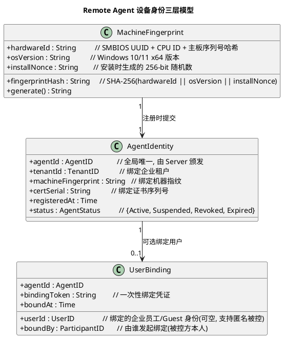

**设备身份生成流程**：

| 阶段 | 操作 | 输出 | 防伪机制 | 关联 spec |
|------|------|------|---------|----------|
| 指纹采集 | 读取 SMBIOS UUID + CPU ID + 主板序列号，拼接后 SHA-256 | `fingerprintHash` | 硬件特征难以跨机器伪造 | spec §6.3 |
| 安装随机数 | 首次安装时生成 256-bit CSPRNG 随机数，写入 Windows DPAPI 加密存储 | `installNonce` | 防止磁盘克隆复制证书 | spec §6.3 |
| 指纹哈希 | `SHA-256(hardwareId ‖ osVersion ‖ installNonce)` | `fingerprintHash` | 三因子联合，任一变化即失效 | — |
| 注册码校验 | 提交一次性注册码 + 指纹哈希至 Server | `agentId` | 注册码单次有效，绑定租户 | spec §6.3 |
| 证书签发 | Server 委托 CA 签发证书，CN=`agentId`，SAN=`fingerprintHash` | Agent 证书 | 证书与指纹绑定 | §3.1.3 |

**用户/机器绑定策略**：

| 绑定类型 | 触发方式 | 绑定强度 | 解绑方式 | 关联 spec |
|---------|---------|---------|---------|----------|
| 机器绑定（强制） | 注册时机器指纹 → agentId | 强（跨机器复用即失效） | 注销 Agent + 吊销证书 | spec §7.5.2 规则 8 |
| 用户绑定（可选） | 被控方在 Agent 端扫码/输入绑定码关联本人身份 | 弱（可重新绑定） | 解绑 + 重新绑定 | spec §4.1 |
| 会议绑定（临时） | 控制会话建立时 agentId ↔ targetParticipantId ↔ meetingId | 会话级（会话结束即解绑） | 会话终止自动解绑 | §3.1.10 |

**防克隆机制**：Agent 证书 + 机器指纹 + installNonce 三者绑定。若攻击者克隆磁盘到另一台机器：
1. 硬件 ID 不同 → 指纹哈希不匹配 → Server 拒绝；
2. 即使硬件 ID 相同（同型号机器），installNonce 由 DPAPI 按用户/机器密钥加密，跨机器无法解密 → Agent 启动失败；
3. Server 侧 agentId ↔ machineFingerprint 一一对应，重复注册被拒绝。

### 3.1.9 Agent 重连机制

PM Gate 要求明确网络中断后 Agent 如何重连、重连时的身份验证、会话恢复（关联 spec §6.2 规则 2"媒体断线 5s 内自动重连"）。

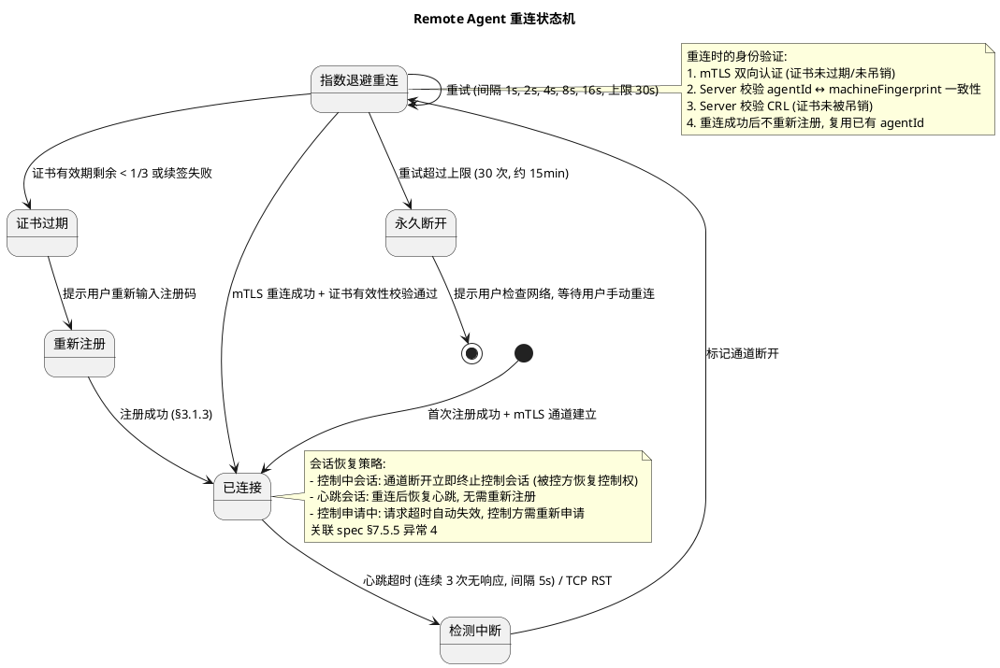

**重连参数**：

| 参数 | 默认值 | 说明 | 关联配置项 |
|------|--------|------|-----------|
| 心跳间隔 | 5s | Agent 每 5s 发送 Heartbeat | `remoteAgent.heartbeatInterval` |
| 心跳超时阈值 | 15s（3 次未响应） | 连续 3 次无响应判定断开 | `remoteAgent.heartbeatTimeout` |
| 重连初始间隔 | 1s | 指数退避起始间隔 | `remoteAgent.reconnectInitialBackoff` |
| 重连最大间隔 | 30s | 指数退避上限 | `remoteAgent.reconnectMaxBackoff` |
| 重连最大次数 | 30 次（约 15min） | 超过后进入永久断开 | `remoteAgent.reconnectMaxAttempts` |
| 证书续签阈值 | 有效期剩余 1/3（8h） | 剩余 8h 时自动续签 | `remoteAgent.mtlsCertValidity` |

**重连时身份验证流程**（关联 spec §6.3）：
1. Agent 使用现有证书发起 mTLS 连接；
2. Server 校验证书签名链（Intermediate CA → Root CA）；
3. Server 校验证书未过期（`notAfter > now`）；
4. Server 查询 CRL 确认证书未吊销；
5. Server 校验证书 CN（`agentId`）对应的注册记录中 `machineFingerprint` 与 Agent 上报的当前指纹一致（防克隆）；
6. 全部通过 → 重连成功，复用 `agentId`，不重新注册；
7. 任一失败 → 拒绝重连，Agent 根据失败原因进入"证书过期/被吊销/指纹不匹配"状态。

**会话恢复策略**（关联 spec §7.5.5 异常 4）：

| 会话类型 | 通道断开时行为 | 重连后行为 | 关联 spec |
|---------|-------------|-----------|----------|
| 控制中会话（控制中） | **立即终止**，被控方恢复完整控制权，审计记录"通道中断" | 不恢复，控制方需重新申请授权 | spec §7.5.5 异常 4 |
| 控制申请中（未授权） | 请求超时自动失效 | 不恢复，控制方需重新申请 | spec §7.5.2 规则 12 |
| 心跳会话（空闲） | 标记 Agent 离线 | 重连后恢复心跳，Agent 标记在线 | — |
| 注册会话（首次） | 注册失败 | 重新走注册流程 | §3.1.3 |

> **关键设计决策**：控制中会话在通道断开时**不尝试恢复**，而是立即终止。理由：远程控制是高风险操作，通道中断期间无法确认被控方是否仍同意控制，恢复控制可能违反被控方意愿。立即终止 + 重新申请授权是最安全策略（关联 spec §7.5.2 规则 5"被控方可随时单方面终止"）。

### 3.1.10 Agent 绑定 Remote Target

PM Gate 要求明确 Agent 如何关联到具体会议中的被控方参会者（关联 spec §7.5.2 规则 2"前提为屏幕共享"、§11.6"targetParticipantId"）。

**绑定关系**：一次远程控制涉及三方身份，必须严格区分：

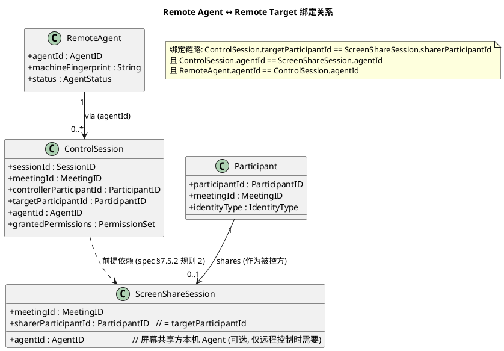

**绑定建立流程**：

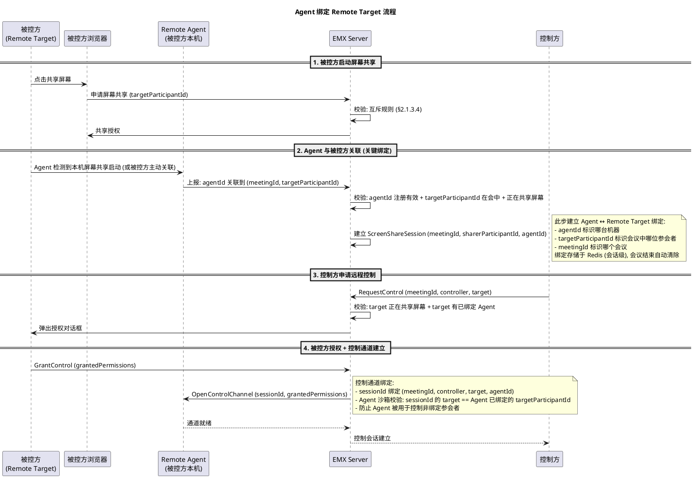

**绑定校验约束**（关联 spec §7.5.2 规则 13"禁止跨会议控制"）：

| 校验项 | 校验时机 | 失败行为 | 关联 spec |
|--------|---------|---------|----------|
| `ControlSession.agentId == ScreenShareSession.agentId` | 控制通道建立时 | 拒绝建立，审计"Agent 不匹配" | §3.1.10 |
| `ControlSession.targetParticipantId == ScreenShareSession.sharerParticipantId` | 控制通道建立时 | 拒绝建立 | spec §7.5.2 规则 2 |
| `ControlSession.meetingId == Agent 当前绑定 meetingId` | 每条指令执行前 | 拒绝执行，终止会话 | spec §7.5.2 规则 13 |
| `Agent.machineFingerprint == 注册时指纹` | 重连时 | 拒绝重连 | §3.1.8 |
| `Agent 证书未吊销` | 心跳时 + 每条指令前 | 立即断开所有通道 | spec §6.3 |

### 3.1.11 会议级授权与 Agent 身份分离

PM Gate 强调：**Agent 身份 ≠ 会议授权**，每次远程控制仍需被控方显式同意。这是安全架构的核心原则，必须在架构上强制分离两层授权（关联 spec §7.5.2 规则 1"默认关闭"、规则 3"显式授权"）。

**两层授权分离模型**：

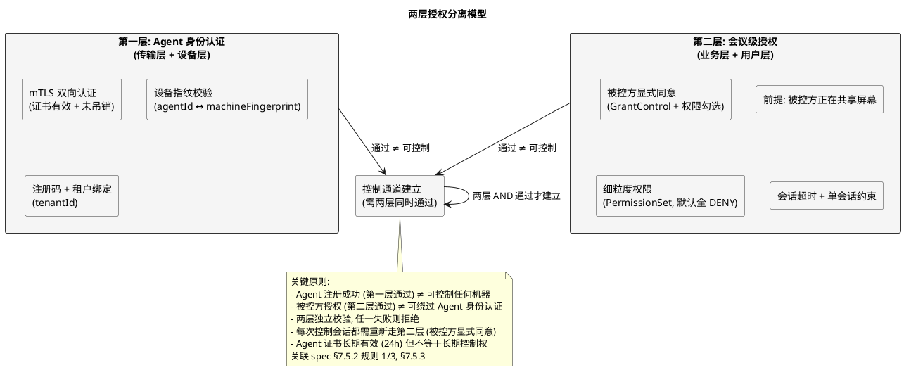

**分离约束矩阵**：

| 场景 | 第一层（Agent 身份） | 第二层（会议授权） | 结果 | 关联 spec |
|------|-------------------|------------------|------|----------|
| Agent 已注册 + 被控方授权 | ✅ 通过 | ✅ 通过 | 控制会话建立 | spec §7.5.2 规则 3 |
| Agent 已注册 + 被控方未授权 | ✅ 通过 | ❌ 未授权 | **拒绝控制**（默认 DENY） | spec §7.5.2 规则 1 |
| Agent 未注册 + 被控方授权 | ❌ 未注册 | ✅ 通过 | **拒绝控制**（无 Agent 通道） | spec §7.5.5 异常 1 |
| Agent 证书吊销 + 被控方授权 | ❌ 吊销 | ✅ 通过 | **拒绝控制**（通道不可建立） | spec §6.3 |
| Agent 已注册 + 上次授权已过期 | ✅ 通过 | ❌ 过期 | **拒绝控制**（需重新授权） | spec §7.5.2 规则 11 |
| Agent 已注册 + 会议已结束 | ✅ 通过 | ❌ 会议结束 | **拒绝控制**（会话不可跨会议） | spec §7.5.2 规则 13 |

**架构强制实现**：
1. **控制通道建立是原子操作**：`OpenControlChannel` RPC 同时校验第一层（mTLS + 指纹）和第二层（sessionId 对应的 GrantControl 记录 + 权限有效性），两层校验在同一事务内完成，不存在"先通过第一层再补第二层"的窗口；
2. **第二层授权不可缓存**：被控方的 GrantControl 仅对当前 sessionId 有效，新会话需重新授权；
3. **第一层证书不承载控制权**：Agent 证书 CN=`agentId`，仅标识设备身份，不包含任何会议/被控方/权限信息，控制权完全由第二层决定。

### 3.1.12 Agent 被盗/证书泄露后的失效机制

PM Gate 要求明确 Agent 被盗或证书泄露后的检测机制、吊销流程、影响范围控制（关联 spec §6.3 安全性、§7.5.2 规则 13 禁止项）。

**威胁场景与检测**：

| 威胁场景 | 检测机制 | 检测延迟 | 关联 spec |
|---------|---------|---------|----------|
| Agent 证书被复制到其他机器 | 机器指纹不匹配（§3.1.8 防克隆） | 即时（重连时） | spec §6.3 |
| Agent 证书泄露 + 同型号机器克隆 | installNonce 跨机器无法解密（DPAPI 绑定） | 即时（Agent 启动时） | §3.1.8 |
| Agent 被恶意软件劫持 | 沙箱权限校验 + 操作事件量异常检测 | 准实时（审计分析） | spec §7.5.2 规则 9 |
| 同一 agentId 从两个 IP 同时连接 | Server 检测到重复连接，拒绝第二个 + 告警 | 即时 | spec §6.3 |
| Agent 异常操作频率（指令量突增） | 操作事件量审计 + 阈值告警 | 准实时 | spec §11.6 规则 11 |
| 被控方报告未授权操作 | 用户举报 → 管理员吊销 | 人工 | spec §7.5.2 规则 5 |

**吊销流程**：

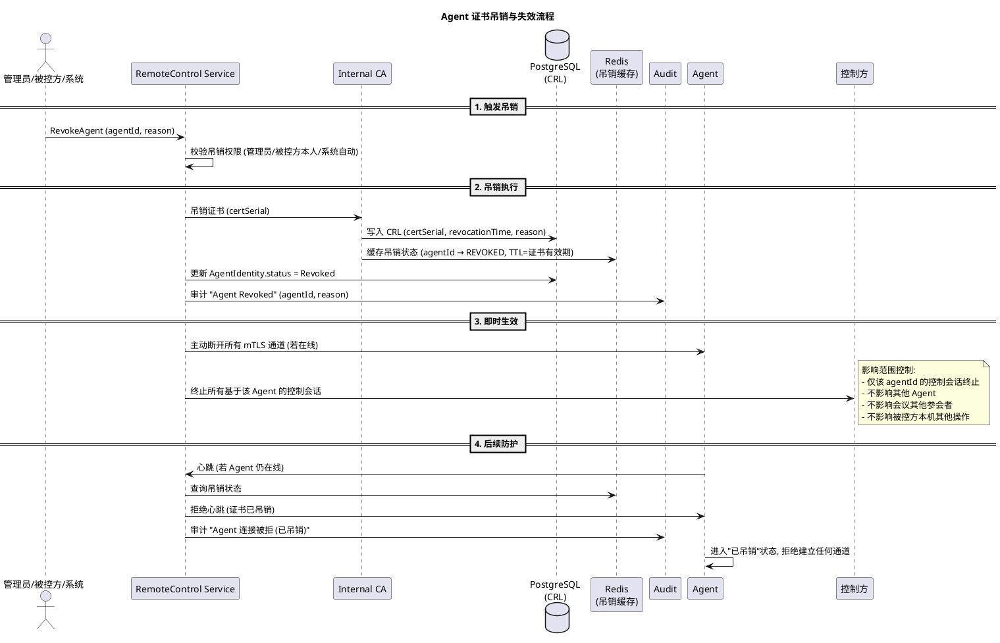

**吊销生效时间保证**：

| 路径 | 生效时间 | 机制 | 关联 spec |
|------|---------|------|----------|
| 在线 Agent 主动断开 | ≤ 1s（RPC 调用） | Server 主动关闭 mTLS 通道 | spec §6.3 |
| 离线 Agent 重连时拒绝 | 即时（重连校验） | CRL 查询 + Redis 吊销缓存 | §3.1.9 |
| 控制中会话终止 | ≤ 1s | 通道断开 → 控制会话立即终止 | spec §7.5.5 异常 4 |
| 新控制申请拒绝 | 即时 | Agent 状态 = Revoked，拒绝 OpenControlChannel | spec §7.5.2 规则 1 |

**影响范围控制**：

| 影响对象 | 影响 | 隔离机制 |
|---------|------|---------|
| 该 Agent 的控制会话 | 立即终止 | 通道断开 |
| 该 Agent 的注册记录 | 标记 Revoked，不可重新注册 | agentId 状态机 |
| 该机器的新 Agent 安装 | 允许（新 agentId + 新注册码） | 机器指纹可重新注册新 Agent |
| 其他 Agent | 不受影响 | agentId 独立 |
| 会议其他参会者 | 不受影响 | 控制会话独立于会议 |
| 被控方本机其他操作 | 不受影响 | Agent 仅控制远程控制通道 |
| 历史审计记录 | 保留（追溯证据） | append-only 不可删除 |

**自动吊销触发条件**（系统自动，无需人工）：

| 触发条件 | 检测方式 | 自动行为 | 关联 spec |
|---------|---------|---------|----------|
| 同一 agentId 多 IP 同时在线 | 连接管理 | 拒绝新连接 + 告警 | spec §6.3 |
| 操作事件量超阈值（如 > 10000 次/min） | 审计分析 | 吊销 + 告警 + 通知被控方 | spec §11.6 规则 11 |
| Agent 尝试越权指令 ≥ 3 次 | 沙箱审计 | 吊销 + 告警 | spec §7.5.2 规则 13 |
| 证书指纹不匹配 ≥ 1 次 | 重连校验 | 拒绝重连 + 告警（不自动吊销，可能是硬件变更） | §3.1.8 |

## 3.2 D-02 — Whiteboard CRDT / OT / LWW 协同模型

### 3.2.1 决策背景与关联需求

白板支持多人实时协作，并发操作下需保证最终一致（关联 spec §7.4.2 规则 2、§6.2 规则 4、§11.5）。三种主流协同方案需比较裁决：

- **CRDT（Conflict-free Replicated Data Type）**：无冲突复制数据类型；
- **OT（Operational Transformation）**：操作变换；
- **LWW（Last-Write-Wins）**：最后写入胜出。

### 3.2.2 三种方案比较

| 维度 | CRDT | OT | LWW |
|------|------|----|-----|
| **冲突解决能力** | 数学保证无冲突，自动合并 | 需中央服务器变换，依赖操作顺序 | 简单覆盖，后写覆盖前写 |
| **一致性保证** | 强最终一致（SEC） | 强一致（需中央协调） | 弱一致，可能丢失操作 |
| **网络容忍性** | 离线编辑可合并，P2P 友好 | 需在线中央服务器，离线不可用 | 离线可合并但丢操作 |
| **中央服务器依赖** | 可去中心化（P2P）或半中心 | 强依赖中央服务器 | 可去中心化 |
| **实现复杂度** | 中（成熟库可用） | 高（变换函数易出错） | 低 |
| **性能（合并开销）** | 中（元数据开销） | 中（变换计算） | 低 |
| **元数据开销** | 较高（逻辑时钟/ tombstone） | 低 | 极低 |
| **撤销/重做支持** | 支持（需 tombstone） | 支持 | 不支持（覆盖丢失历史） |
| **对象删除冲突** | tombstone 保证一致删除 | 需特殊处理 | 后删覆盖前删，可能复活 |
| **白板适用性** | 高（对象序列、离线编辑、多人并发） | 中（需中央，离线差） | 低（丢失并发绘制） |
| **成熟库** | Yjs / Automerge（生产级） | ShareDB / 自研（易错） | 自研（简单但弱） |

### 3.2.3 选择 CRDT 的详细理由

**裁决**：采用 CRDT。

**理由**：

1. **白板场景特性匹配**：白板是对象序列（pen/highlighter/arrow/rectangle/circle/text/sticky/image），多人并发绘制不同对象时互不覆盖（spec §7.4.2 规则 2："A 与 B 同时绘制 → 两对象均保留、互不覆盖、最终一致"），CRDT 天然支持对象级合并；

2. **离线编辑支持**：白板文档会后可独立编辑（spec §7.4.2 规则 1："会议结束后允许保存白板成果"，§11.5："可在会后独立编辑"），CRDT 支持离线编辑后合并，OT 需中央服务器无法离线；

3. **网络容忍性**：参会者网络抖动/断线重连场景下（spec §6.2 规则 2），CRDT 可在重连后合并，不丢失操作；OT 在断线期间操作可能丢失；

4. **撤销/重做**：白板需 undo/redo（spec §7.4.2 规则 1），CRDT 通过 tombstone 支持，LWW 不支持；

5. **删除冲突**：白板禁止单方删除他人对象（spec §7.4.2 规则 4），CRDT tombstone 保证删除一致，LWW 可能导致对象复活；

6. **实现成本可控**：成熟 CRDT 库（Yjs/Automerge）生产级可用，避免自研 OT 变换函数的高错误率；

7. **性能满足指标**：白板同步延迟 ≤ 100ms P95（spec §6.1 指标 6），CRDT 合并开销在对象级操作下可满足。

**拒绝 OT 的理由**：强依赖中央服务器，离线编辑不支持，变换函数实现复杂且易出错，与白板会后独立编辑需求冲突。

**拒绝 LWW 的理由**：并发绘制会丢失对象（违反 spec §7.4.2 规则 2），不支持 undo/redo（违反规则 1），删除冲突可能导致对象复活（违反规则 4）。

### 3.2.4 CRDT 实现选型：Yjs

**候选**：Yjs / Automerge / 自研。

| 候选 | 语言 | 成熟度 | 性能 | 生态 | 选型 |
|------|------|--------|------|------|------|
| Yjs | TypeScript/JavaScript | 生产级（广泛用于 Notion/Linear 等） | 高（二进制编码，增量同步） | 丰富（y-websocket, y-leveldb, y-redis） | ✅ 选用 |
| Automerge | TypeScript/Rust | 生产级 | 中（JSON 编码，开销较大） | 中等 | ❌ 性能不及 Yjs |
| 自研 | Go/TS | — | — | — | ❌ 重复造轮子，违反 spec §1.5 不自研原则 |

**选型理由**：
- Yjs 是 CRDT 领域最成熟的生产级实现，性能优异（二进制编码、增量同步）；
- 前端使用 React + TypeScript（PREFERENCE_1/PREFERENCE_8），Yjs 原生 TypeScript 支持；
- Yjs 提供 `Y.Map`（对象序列）、`Y.Array`（有序对象）、`UndoManager`（撤销/重做）开箱即用；
- 后端 Go 可通过 y-redis/y-websocket 协议对接，或通过 Automerge 的 Rust FFI 桥接（Yjs 有社区 Go 端口）；
- 满足 spec §1.5"不自研"原则。

### 3.2.5 白板对象序列的 CRDT 合并机制

**数据结构映射**：

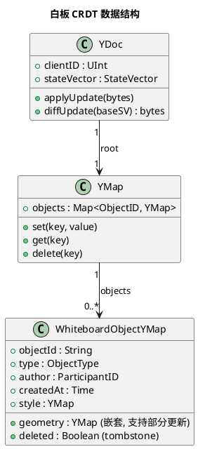

**合并机制**：
1. 每个参会者持有本地 `YDoc` 副本，`clientID` 唯一（= participantId）；
2. 参会者绘制对象 → 本地 `YMap.set(objectId, objectYMap)` → 生成 `update` 二进制增量；
3. 增量经 WebSocket 广播至 Server → Server 转发给其他参会者；
4. 其他参会者 `YDoc.applyUpdate(update)` → 本地副本合并 → UI 渲染；
5. Yjs CRDT 数学保证：所有副本最终一致（强最终一致 SEC）。

**对象删除与 tombstone**：
- 删除对象 → `YMap.delete(objectId)` → Yjs 内部标记 tombstone；
- tombstone 在所有副本间同步，保证删除一致（不会因并发操作复活）；
- 删除权限校验：仅 author 或主持人可删除（spec §7.4.2 规则 4），在应用层校验，CRDT 层不区分。

**激光笔特殊处理**：
- 激光笔为瞬时指示，不进入白板文档对象序列（spec §7.4.2 规则 3）；
- 激光笔位置通过 WebSocket 信令广播（非 CRDT），松开后消失，不持久化。

### 3.2.6 并发绘制冲突解决示例

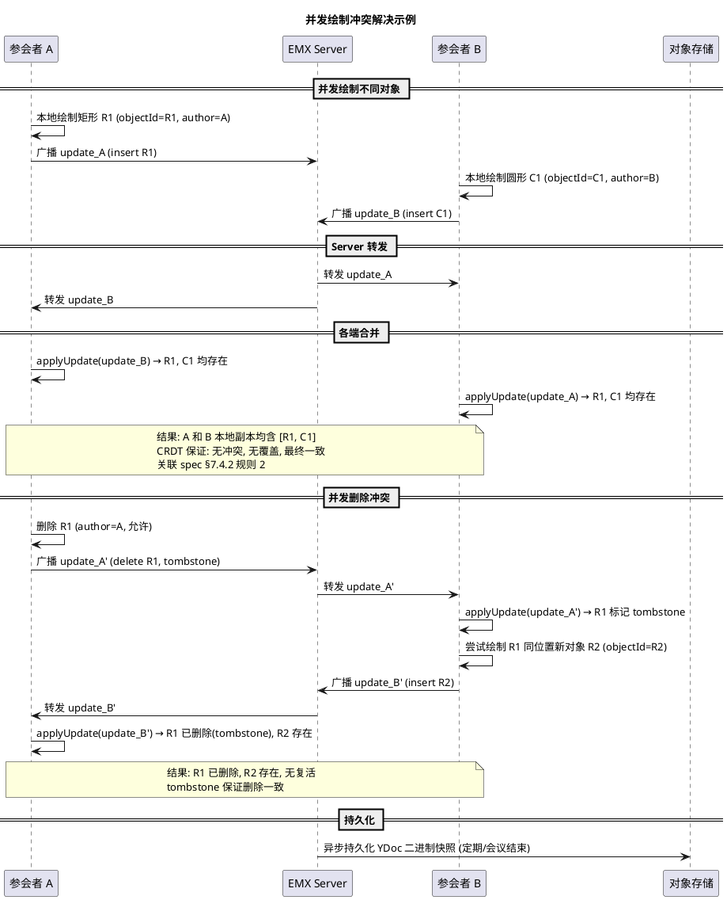

### 3.2.7 持久化与加载流程

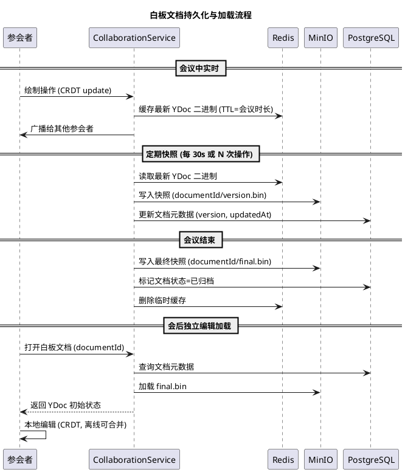

**持久化策略**：

| 阶段 | 存储 | 内容 | 触发时机 |
|------|------|------|---------|
| 会议中实时 | Redis | YDoc 二进制缓存 | 每次操作 |
| 会议中快照 | MinIO + PostgreSQL | YDoc 快照 + 元数据 | 每 30s 或 N 次操作 |
| 会议结束 | MinIO + PostgreSQL | 最终快照 + 归档标记 | 会议结束 |
| 会后编辑 | MinIO + PostgreSQL | 增量快照 | 编辑保存时 |

**加载一致性保证**：Yjs CRDT 保证从任意快照加载后，应用增量 update 可恢复到最新状态，无需全量重放。

### 3.2.8 版本号机制

PM Gate 要求明确版本号如何生成、如何比较、如何用于冲突检测（关联 spec §11.5 WhiteboardDocument.version、§7.4.2 规则 2"最终一致"）。Yjs 内置两种版本机制，EMX 复用而非自研。

**Yjs 内置版本机制**：

| 机制 | 类型 | 用途 | 生成方式 | 比较方式 | 关联 spec |
|------|------|------|---------|---------|----------|
| State Vector（状态向量） | `Map<clientID, clock>` | 增量同步边界 | 每次本地操作递增对应 clientID 的 clock | 偏序比较（逐 clientID 比较） | spec §11.5 version |
| Lamport Clock（逻辑时钟） | `UInt` | 操作全序标记 | `max(localClock, receivedClock) + 1` | 数值比较 | §2.2.2 WhiteboardOp.ClientClock |
| Update 二进制 | `bytes` | 增量传输单元 | `YDoc.diffUpdate(baseStateVector)` | 不可直接比较，仅 applyUpdate | — |

**版本号生成与同步流程**：

```plantuml
@startuml
title 白板版本号生成与增量同步

participant "参会者 A\n(clientID=A)" as A
participant "EMX Server" as S
participant "参会者 B\n(clientID=B)" as B

== 初始状态 ==
A -> A : YDoc_A, SV_A = {A:0, B:0}
B -> B : YDoc_B, SV_B = {A:0, B:0}

== A 绘制矩形 R1 (第 1 次操作) ==
A -> A : YMap.set(R1, obj) → clock_A = 1
A -> A : SV_A = {A:1, B:0}
A -> A : update_A1 = YDoc_A.diffUpdate({A:0, B:0})  // 增量
A -> S : 广播 update_A1 + SV_A
S -> B : 转发 update_A1 + SV_A
B -> B : YDoc_B.applyUpdate(update_A1)
B -> B : SV_B = {A:1, B:0}  // 合并后 SV 更新

== B 绘制圆形 C1 (第 1 次操作) ==
B -> B : YMap.set(C1, obj) → clock_B = 1
B -> B : SV_B = {A:1, B:1}
B -> B : update_B1 = YDoc_B.diffUpdate({A:1, B:0})
B -> S : 广播 update_B1 + SV_B
S -> A : 转发 update_B1 + SV_B
A -> A : YDoc_A.applyUpdate(update_B1)
A -> A : SV_A = {A:1, B:1}

== 并发操作 (A 和 B 同时操作, 网络延迟) ==
A -> A : 删除 R1 → clock_A = 2, SV_A = {A:2, B:1}
B -> B : 绘制矩形 R2 → clock_B = 2, SV_B = {A:1, B:2}
A -> S : update_A2 (delete R1, tombstone)
B -> S : update_B2 (insert R2)
S -> A : 转发 update_B2 (A 收到 B 的并发操作)
S -> B : 转发 update_A2 (B 收到 A 的并发操作)
A -> A : applyUpdate(update_B2) → SV_A = {A:2, B:2}
B -> B : applyUpdate(update_A2) → SV_B = {A:2, B:2}

note over A, B
  最终: SV_A == SV_B == {A:2, B:2}
  CRDT 保证: 两端文档状态一致 (R1 已删除, R2 存在)
  版本号比较: SV 偏序比较用于增量同步边界计算
  关联 spec §7.4.2 规则 2, §11.5 version
end note
@enduml
```

**版本号在冲突检测中的作用**：

| 场景 | 版本号机制 | 冲突处理 | 关联 spec |
|------|-----------|---------|----------|
| A 和 B 同时绘制不同对象 | clientID 不同，objectId 不同，无冲突 | 两对象均保留 | spec §7.4.2 规则 2 |
| A 和 B 同时修改同一对象属性 | Yjs LWW（基于操作时钟）自动合并 | 后写胜出（Yjs 内置） | spec §7.4.2 规则 2 |
| A 删除对象 + B 修改同一对象 | tombstone 优先，修改操作作用于已删除对象被丢弃 | 对象保持删除 | §3.2.5 tombstone |
| 离线编辑后重连 | State Vector 比较计算缺失增量，diffUpdate 同步 | 增量合并，无冲突 | spec §6.2 规则 2 |
| 持久化加载 | 从快照加载 + 应用增量 update 至最新 SV | 无需全量重放 | §3.2.7 |

**版本号与持久化版本的关系**：

| 版本类型 | 存储位置 | 用途 | 关联 spec |
|---------|---------|------|----------|
| Yjs State Vector | Redis（实时）+ MinIO（快照） | 增量同步边界 | spec §11.5 |
| 文档快照版本号 | PostgreSQL（whiteboard_meta.version） | 快照管理，每次快照递增 | spec §11.5 |
| Lamport Clock | Yjs 内部（不单独持久化） | 操作排序 | — |

> **设计决策**：EMX 不自研版本号机制，完全复用 Yjs 内置 State Vector + Lamport Clock。自研版本号会引入与 CRDT 数学性质不一致的风险，违反 spec §1.5"不自研"原则。

### 3.2.9 白板操作回放

PM Gate 要求明确是否支持白板操作回放、如何实现（关联 spec §7.4.2 规则 1"会议结束后允许保存白板成果"）。V1 提供基础回放能力，不追求逐帧动画回放。

**回放能力分级**：

| 级别 | 能力 | V1 支持 | 实现复杂度 | 关联 spec |
|------|------|---------|-----------|----------|
| L0 静态快照回放 | 加载任意时间点快照，查看当时白板状态 | ✅ V1 | 低（复用持久化快照） | spec §7.4.2 规则 1 |
| L1 操作序列回放 | 按操作时序重放，查看绘制过程 | ✅ V1（基础） | 中（记录操作日志） | spec §7.4.2 |
| L2 逐帧动画回放 | 平滑动画展示绘制过程，可调速 | ❌ P1/V2 | 高（需插值动画） | spec §12.3 |
| L3 协作过程回放 | 含各参会者操作轨迹、时间轴、作者标注 | ❌ P2/V3 | 高（需多维度时序） | spec §12.3 |

**V1 回放实现方案**：

```plantuml
@startuml
title 白板操作回放 V1 实现流程

actor "用户" as U
participant "CollaborationService" as CS
database "PostgreSQL\n(whiteboard_op_log)" as PG
participant "MinIO\n(快照)" as MinIO
participant "Web Frontend\n(Yjs)" as WF

== 1. 会议中操作记录 (异步) ==
CS -> PG : 异步写入操作日志 (objectId, opType, author, timestamp, sv)
note right
  操作日志表 whiteboard_op_log:
  - documentId : DocumentID
  - objectId : String
  - opType : {insert, update, delete}
  - author : ParticipantID
  - timestamp : Time
  - stateVector : JSON
  - updateBytes : binary (Yjs update 增量)
  异步写入, 不阻塞实时协作
end note

== 2. 回放请求 ==
U -> CS : 请求回放 (documentId, fromTime, toTime)
CS -> PG : 查询操作日志 (documentId, fromTime ≤ timestamp ≤ toTime)
PG --> CS : 操作序列 [op1, op2, ..., opN] (按 timestamp 排序)
CS -> MinIO : 加载 fromTime 之前的最近快照
MinIO --> CS : 快照 binary (YDoc 状态)

== 3. 前端重放 ==
CS --> U : 返回 {初始快照, 操作序列}
U -> WF : 加载初始快照到 YDoc
loop 操作序列
    WF -> WF : applyUpdate(op_i.updateBytes)  // 逐步应用
    WF -> WF : 渲染当前白板状态 (停留 200ms 可配)
end
WF --> U : 回放完成
@enduml
```

**回放数据结构**：

| 数据 | 存储位置 | 保留期 | 大小估算（单会议） | 关联 spec |
|------|---------|--------|------------------|----------|
| 操作日志（whiteboard_op_log） | PostgreSQL | 与白板文档同生命周期 | ~500 操作 × 1KB = 500KB | spec §11.5 |
| 快照（YDoc binary） | MinIO | 与白板文档同生命周期 | 每 30s 快照 × ~500KB = ~1MB/h | §3.2.7 |
| 回放索引（时间 → 快照位置） | PostgreSQL | 同上 | ~100 条/h × 0.1KB | — |

**回放性能约束**：

| 指标 | V1 目标 | 说明 | 关联 spec |
|------|---------|------|----------|
| 回放加载时间 | ≤ 3s（P95） | 含快照加载 + 操作日志查询 | spec §6.1 |
| 回放操作间隔 | 200ms（可配） | 每步操作停留时间，用户可调速 | — |
| 回放操作上限 | ≤ 10000 操作/回放 | 超过则按快照分段回放 | — |
| 回放并发 | ≤ 5 并发回放/文档 | 防止 DB 过载 | — |

> **设计决策**：V1 回放基于"快照 + 操作日志重放"，不实现逐帧动画。理由：(1) 满足 spec §7.4.2 规则 1"会后独立编辑"的核心需求是查看白板成果，非动画展示；(2) 逐帧动画需插值计算，复杂度高，划入 P1/V2（spec §12.3）；(3) 操作日志异步写入，不影响实时协作性能。

## 3.3 D-03 — Capacity Model 详细容量计算

### 3.3.1 决策背景与关联需求

spec §6.1 指标 8 要求"单会议支持参会者 ≥ 50 人（V1 目标）"，但系统级并发会议数、硬件资源需求、媒体吞吐、存储容量需在 Design 阶段确定（spec §6.1 指标 8 后注："具体人数和并发指标在 EMX-002 Design 阶段通过容量模型确定"）。本节建立完整容量模型。

### 3.3.2 单会议 50 人资源需求计算

#### 3.3.2.1 媒体吞吐计算

**假设条件**（基于配置项 §2.1.2）：
- 视频单路码率上限：2.5 Mbps（`media.videoBitrateCeiling`）
- 音频单路码率上限：64 kbps（`media.audioBitrateCeiling`）
- 屏幕共享码率上限：4 Mbps（`media.screenShareBitrateCeiling`）
- 单会议参会者：50 人
- 视频布局：发言者 1 大 + 其余 49 小（画廊模式自适应）

**SFU 转发吞吐（SFU 出入带宽）**：

| 媒体类型 | 单路码率 | 发布者数 | SFU 入带宽 | 订阅者数/发布者 | SFU 出带宽 | 小计 |
|---------|---------|---------|-----------|---------------|-----------|------|
| 视频（发言者大流） | 2.5 Mbps | 1 | 2.5 Mbps | 49 | 122.5 Mbps | 125 Mbps |
| 视频（画廊小流，降级至 360p） | 0.5 Mbps | 49 | 24.5 Mbps | 49（每人看其他 49 人，但 SFU 按订阅转发，实际每人订阅约 8-12 路画廊） | 假设每人订阅 10 路 × 0.5 Mbps × 50 人 | 250 Mbps |
| 音频 | 64 kbps | 50 | 3.2 Mbps | 49（每人听其他 49 人，但混音可优化） | 假设 SFU 混音或选择性转发，3.2 Mbps × 49 | 160 Mbps |
| 屏幕共享 | 4 Mbps | 1 | 4 Mbps | 49 | 196 Mbps | 200 Mbps |

**单会议 SFU 总带宽估算**：

| 项目 | 估算值 | 说明 |
|------|--------|------|
| SFU 入带宽 | ~34 Mbps | 视频 + 音频 + 屏幕共享发布 |
| SFU 出带宽 | ~530 Mbps | 转发给所有订阅者 |
| SFU 总带宽 | ~564 Mbps | 入 + 出 |

> **优化说明**：实际部署中 SFU 采用 simulcast（多空间分辨率）+ SVC（可分层编码）+ 混音优化，可显著降低出带宽。上表为保守估算（无 simulcast 优化）。启用 simulcast + 混音后，单会议 SFU 出带宽可降至 ~200 Mbps。

**单会议 CPU 需求**：

| 组件 | CPU 需求 | 说明 |
|------|---------|------|
| SFU（LiveKit） | 2~4 vCPU | RTP 转发、simulcast、混音 |
| Meeting Service | 0.5 vCPU | 状态管理、信令广播 |
| Collaboration Service | 0.5 vCPU | 白板 CRDT 合并、PPT 同步 |
| WebSocket Signaling | 1 vCPU | 50 长连接信令广播 |
| **单会议合计** | **4~6 vCPU** | — |

**单会议内存需求**：

| 组件 | 内存需求 | 说明 |
|------|---------|------|
| SFU | 2~4 GB | Participant 状态、RTP 缓冲 |
| Meeting Service | 0.5 GB | 会议状态、参会者列表 |
| Collaboration Service | 1 GB | 白板 YDoc、PPT 页缓存 |
| WebSocket Signaling | 0.5 GB | 50 连接缓冲 |
| Redis（会议状态） | 0.2 GB | 实时状态、候机室 |
| **单会议合计** | **4~6 GB** | — |

**单会议端口需求**：
- SFU UDP 媒体端口：每 Participant 约 4 个端口（音/视频/屏幕/数据通道），50 人 × 4 = 200 个 UDP 端口；
- 端口段配置：`sfu.portRangeUdp = 50000-60000`（10000 个端口，可支持 ~50 个并发会议）。

### 3.3.3 系统级并发会议数与硬件资源关系

**三档规模规划**：

| 规模档 | 并发会议数 | 单会议人数 | 总参会者 | SFU 节点数 | 业务节点数 | 数据库 | 缓存 | 存储 |
|--------|-----------|-----------|---------|-----------|-----------|--------|------|------|
| 小型 | 10 | 50 | 500 | 2（主备） | 1（模块化单体） | PostgreSQL 单实例 | Redis 单实例 | MinIO 单节点 |
| 中型 | 50 | 50 | 2500 | 4（集群） | 2（负载均衡） | PostgreSQL 主从 | Redis 主从 | MinIO 3 节点 |
| 大型 | 200 | 50 | 10000 | 16（集群+负载均衡） | 4（负载均衡） | PostgreSQL 主从+读副本 | Redis 集群 | MinIO 4+ 节点 |

**硬件资源估算（中型规模，50 并发会议）**：

| 组件 | 实例数 | 单实例规格 | 总资源 | 说明 |
|------|--------|-----------|--------|------|
| SFU（LiveKit） | 4 | 8 vCPU / 16 GB | 32 vCPU / 64 GB | 每节点承载 ~12 会议，带宽 ~2.4 Gbps |
| 业务服务（Go 模块化单体） | 2 | 8 vCPU / 16 GB | 16 vCPU / 32 GB | Meeting/Collab/Recording/Audit/Signaling |
| Nginx Gateway | 2 | 2 vCPU / 4 GB | 4 vCPU / 8 GB | 反向代理 + TLS 终止 + 负载均衡 |
| PostgreSQL | 2（主从） | 4 vCPU / 16 GB / 500 GB SSD | 8 vCPU / 32 GB / 1 TB | 主写从读 |
| Redis | 2（主从） | 4 vCPU / 8 GB | 8 vCPU / 16 GB | 实时状态 + 候机室 + 信令路由 |
| MinIO | 3 | 4 vCPU / 8 GB / 2 TB HDD | 12 vCPU / 24 GB / 6 TB | 录制 + 演示文档 + 白板快照 |
| TURN（coturn） | 2 | 2 vCPU / 4 GB | 4 vCPU / 8 GB | NAT 穿透中继 |
| Internal CA | 1 | 1 vCPU / 1 GB | 1 vCPU / 1 GB | Remote Agent 证书签发 |
| **合计** | — | — | **85 vCPU / 185 GB RAM / 7 TB 存储** | 中型规模 |

### 3.3.4 媒体吞吐计算（系统级）

**中型规模（50 并发会议）系统级媒体吞吐**：

| 项目 | 单会议 | 50 并发会议 | 说明 |
|------|--------|------------|------|
| SFU 入带宽 | 34 Mbps | 1.7 Gbps | 所有会议发布流 |
| SFU 出带宽（无优化） | 530 Mbps | 26.5 Gbps | 保守估算 |
| SFU 出带宽（simulcast+混音优化） | 200 Mbps | 10 Gbps | 实际部署优化后 |
| TURN 中继带宽 | ~10% 媒体 | ~1 Gbps | 仅 NAT 后参会者经 TURN |

**网络规划建议**：
- SFU 节点需万兆网卡（10 Gbps）或双千兆绑定；
- 企业内网骨干需 ≥ 10 Gbps；
- 公网出口带宽 ≥ 2 Gbps（外部 Guest 入会媒体）。

### 3.3.5 录制吞吐与存储容量计算

**单会议录制吞吐**：
- 录制内容：1 路发言者大视频（2.5 Mbps）+ 1 路屏幕共享（4 Mbps）+ 混音音频（64 kbps）；
- 录制合成后码率：~6.5 Mbps ≈ 0.8 MB/s ≈ 2.9 GB/h；
- 单会议 1 小时录制文件：~2.9 GB（加密后略增，AES-256-GCM 开销 < 1%）。

**系统级录制存储容量**：

| 规模 | 并发录制会议 | 平均时长 | 日录制量 | 保留期（默认 90 天） | 存储容量 |
|------|------------|---------|---------|---------------------|---------|
| 小型 | 5 | 1h | 14.5 GB/天 | 90 天 | ~1.3 TB |
| 中型 | 25 | 1h | 72.5 GB/天 | 90 天 | ~6.5 TB |
| 大型 | 100 | 1h | 290 GB/天 | 90 天 | ~26 TB |

### 3.3.6 Redis 内存占用估算

**单会议 Redis 占用**：

| 数据 | 大小 | 说明 |
|------|------|------|
| 会议实时状态 | ~10 KB | meetingId/status/host/locked 等 |
| 参会者在线状态 | 50 × 1 KB = 50 KB | participantId/status/mediaPermissions |
| 候机室队列 | ~5 KB | Guest 等待列表 |
| 白板 YDoc 缓存 | ~500 KB | CRDT 二进制快照 |
| 信令路由表 | 50 × 0.5 KB = 25 KB | participantId → WebSocket 连接映射 |
| 密码重试计数 | ~1 KB | IP → 失败次数 |
| **单会议合计** | **~600 KB** | — |

**系统级 Redis 内存**：

| 规模 | 并发会议 | Redis 内存占用 | 建议规格 |
|------|---------|---------------|---------|
| 小型 | 10 | ~6 MB | 4 GB（含余量 + 非会议数据） |
| 中型 | 50 | ~30 MB | 8 GB |
| 大型 | 200 | ~120 MB | 16 GB |

> Redis 内存占用远低于规格，主要消耗在连接缓冲、Pub/Sub、非会议缓存。规格按连接数和峰值预留。

### 3.3.7 PostgreSQL 数据量估算

**单会议 PostgreSQL 数据量**：

| 表 | 行数 | 单行大小 | 小计 |
|----|------|---------|------|
| meetings | 1 | ~1 KB | 1 KB |
| participants | 50 | ~0.5 KB | 25 KB |
| guest_tokens | ~10（假设 20% Guest） | ~0.5 KB | 5 KB |
| audit_events | ~500（全生命周期事件） | ~1 KB | 500 KB |
| control_sessions | ~2（假设少量远程控制） | ~1 KB | 2 KB |
| whiteboard_meta | 1 | ~0.5 KB | 0.5 KB |
| slide_deck_meta | 1 | ~1 KB | 1 KB |
| recording_meta | 1 | ~0.5 KB | 0.5 KB |
| **单会议合计** | — | — | **~535 KB** |

**系统级 PostgreSQL 数据量**：

| 规模 | 日会议数 | 日数据量 | 保留期（审计 365 天，其他 90 天） | 数据库容量 |
|------|---------|---------|----------------------------------|-----------|
| 小型 | 50 | ~27 MB/天 | 审计 365 天 + 其他 90 天 | ~15 GB |
| 中型 | 250 | ~134 MB/天 | — | ~70 GB |
| 大型 | 1000 | ~535 MB/天 | — | ~280 GB |

> 审计日志占主要数据量（~94%），append-only + 哈希链，需独立表空间或分区表优化查询。

### 3.3.8 容量规划表格汇总

| 维度 | 小型（10 并发） | 中型（50 并发） | 大型（200 并发） |
|------|----------------|----------------|-----------------|
| 总参会者 | 500 | 2500 | 10000 |
| CPU | ~20 vCPU | ~85 vCPU | ~340 vCPU |
| 内存 | ~45 GB | ~185 GB | ~740 GB |
| 存储（含录制 90 天） | ~2 TB | ~7 TB | ~27 TB |
| 网络带宽（SFU 出） | ~2 Gbps | ~10 Gbps | ~40 Gbps |
| 公网出口 | ~500 Mbps | ~2 Gbps | ~8 Gbps |
| SFU 节点 | 2 | 4 | 16 |
| 业务节点 | 1 | 2 | 4 |
| PostgreSQL | 单实例 | 主从 | 主从+读副本 |
| Redis | 单实例 | 主从 | 集群 |
| MinIO | 单节点 | 3 节点 | 4+ 节点 |

### 3.3.9 水平扩展策略

```plantuml
@startuml
title EMX 水平扩展策略

skinparam rectangle {
    BackgroundColor #F5F5F5
    BorderColor #333333
}

rectangle "无状态层 (可水平扩展)" as Stateless {
    rectangle "Nginx Gateway\n(负载均衡)" as GW
    rectangle "Meeting Service\n(多实例)" as MS
    rectangle "Collaboration Service\n(多实例)" as CS
    rectangle "WebSocket Signaling\n(粘性会话)" as WS
    rectangle "Recording Service\n(多实例)" as RS
    rectangle "SFU Cluster\n(按会议分片)" as SFU
}

rectangle "有状态层 (主从/集群)" as Stateful {
    rectangle "PostgreSQL\n(主从+读副本)" as PG
    rectangle "Redis\n(主从/集群)" as Redis
    rectangle "MinIO\n(分布式)" as MinIO
}

GW --> MS : 轮询
GW --> CS : 轮询
GW --> WS : 粘性 (meetingId hash)
GW --> SFU : 按 meetingId 分片
MS --> PG : 读写分离
MS --> Redis : 哈希分片
CS --> MinIO : S3 分布式
@enduml
```

**扩展策略**：

| 组件 | 扩展方式 | 分片键 | 约束 |
|------|---------|--------|------|
| Nginx Gateway | 水平扩展（无状态） | — | 前置 LB（企业硬件 LB 或 Keepalived） |
| Meeting/Collaboration Service | 水平扩展（无状态） | — | 共享 PostgreSQL/Redis |
| WebSocket Signaling | 粘性会话（meetingId hash） | meetingId | 同会议信令落同一实例 |
| SFU Cluster | 按会议分片 | meetingId | 同会议媒体落同一 SFU 节点 |
| Recording Service | 水平扩展（任务队列） | recordingId | 录制合成异步 |
| PostgreSQL | 主从 + 读副本 | — | 写单点（主），读可扩展（副本） |
| Redis | 主从 / 集群 | meetingId 哈希 | 集群模式分片 |
| MinIO | 分布式（纠删码） | — | 容量线性扩展 |

**扩展触发阈值**：
- SFU 节点 CPU > 70% 或带宽 > 80% → 新增 SFU 节点；
- 业务节点 CPU > 70% → 新增业务实例；
- PostgreSQL 主库 CPU > 70% 或连接数 > 80% → 读写分离 + 读副本；
- Redis 内存 > 70% → 扩容或集群分片；
- MinIO 容量 > 80% → 新增节点。

### 3.3.10 TURN 带宽详细估算

PM Gate 要求明确 NAT 穿透的带宽需求估算（关联 spec §10.1"必须提供 TURN/NAT Traversal 能力"）。TURN 仅在 UDP 直连失败时中继，非所有参会者都经 TURN。

**TURN 中继比例假设**：

| 参会者网络类型 | 占比（企业典型） | 是否需 TURN | 说明 |
|--------------|---------------|------------|------|
| 企业内网（同子网/可直达 SFU） | ~60% | ❌ 不需要 | UDP 直连 SFU |
| 企业内网（跨 NAT/防火墙） | ~20% | ✅ 需要 | 经 TURN 中继 |
| 外部 Guest（家庭网络） | ~15% | ❌ 多数不需要 | 多数家庭路由支持 UDP |
| 外部 Guest（严格 NAT/企业网络） | ~5% | ✅ 需要 | 经 TURN 中继 |
| **合计需 TURN 中继** | **~25%** | — | — |

**单会议 TURN 带宽估算**（50 人，25% 经 TURN = 12.5 人）：

| 媒体类型 | 单路码率 | TURN 中继人数 | TURN 入带宽 | TURN 出带宽 | 小计 |
|---------|---------|-------------|------------|------------|------|
| 视频（发言者大流） | 2.5 Mbps | 12 | 12 × 2.5 = 30 Mbps | 12 × 2.5 = 30 Mbps（转发给各端） | 60 Mbps |
| 视频（画廊小流） | 0.5 Mbps | 12 | 12 × 0.5 = 6 Mbps | 12 × 10 × 0.5 = 60 Mbps（每人看 10 路） | 66 Mbps |
| 音频 | 64 kbps | 12 | 12 × 64k = 0.77 Mbps | 12 × 49 × 64k = 3.8 Mbps | 4.6 Mbps |
| 屏幕共享 | 4 Mbps | 12 | 12 × 4 = 48 Mbps | 12 × 4 = 48 Mbps | 96 Mbps |

> **注**：上表为保守估算（TURN 中继所有媒体）。实际部署中 TURN 仅中继无法直连的媒体，且 SFU simulcast 可降低中继码率。启用优化后单会议 TURN 带宽约 ~50 Mbps。

**系统级 TURN 带宽**：

| 规模 | 并发会议 | 经 TURN 会议 | 单会议 TURN 带宽 | 系统 TURN 总带宽 | TURN 节点规格 |
|------|---------|------------|----------------|-----------------|-------------|
| 小型 | 10 | 10 | 50 Mbps | 500 Mbps | 2 节点 × 2 vCPU/4GB，千兆网卡 |
| 中型 | 50 | 50 | 50 Mbps | 2.5 Gbps | 2 节点 × 4 vCPU/8GB，万兆网卡 |
| 大型 | 200 | 200 | 50 Mbps | 10 Gbps | 4 节点 × 8 vCPU/16GB，万兆网卡 |

**TURN 部署约束**：
- TURN 需公网 IP（或 NAT 映射），用于中继媒体；
- TURN 端口：3478（TCP+UDP）、5349（TLS），媒体中继端口范围需额外规划（默认 49152-65535）；
- TURN 与 SFU 同机部署可减少跳数，但生产环境建议独立部署以隔离媒体负载。

### 3.3.11 WebSocket 连接数计算

PM Gate 要求明确信令并发的连接数计算（关联 spec §6.1 指标 3"信令端到端延迟 ≤ 500ms"）。

**单会议 WebSocket 连接数**：

| 连接类型 | 连接数/会议 | 说明 | 关联 spec |
|---------|-----------|------|----------|
| 参会者信令连接 | 50（每人 1 个 WSS） | 会议状态同步、信令广播 | spec §6.1 指标 3 |
| 白板 CRDT 连接 | 复用信令连接 | Yjs update 经信令通道传输 | §3.2.5 |
| PPT 翻页连接 | 复用信令连接 | 翻页指令经信令广播 | spec §7.4.1 |
| 聊天消息连接 | 复用信令连接 | 聊天经信令通道 | EMX-R011 |
| Remote Agent 连接 | 0~1（仅被控方） | mTLS gRPC，非 WebSocket | §3.1 |
| **单会议 WebSocket 合计** | **50** | — | — |

**系统级 WebSocket 连接数**：

| 规模 | 并发会议 | 单会议连接 | 系统 WebSocket 总连接 | 单实例连接数（粘性会话） | 实例数 | 关联 spec |
|------|---------|-----------|---------------------|----------------------|--------|----------|
| 小型 | 10 | 50 | 500 | 500 | 1 | spec §6.1 指标 8 |
| 中型 | 50 | 50 | 2500 | 1250 | 2（粘性） | — |
| 大型 | 200 | 50 | 10000 | 2500 | 4（粘性） | — |

**WebSocket 连接资源消耗**：

| 资源 | 单连接消耗 | 2500 连接（中型单实例） | 说明 |
|------|-----------|----------------------|------|
| 内存 | ~100 KB（缓冲 + 状态） | ~250 MB | Goroutine + 缓冲 |
| CPU | 低（事件驱动） | ~0.5 vCPU | 非高频 CPU |
| 文件描述符 | 1 FD/连接 | 2500 FD | 需调高 `ulimit -n` 至 ≥ 65535 |
| 网络带宽 | ~10 KB/s（信令） | ~25 MB/s = 200 Mbps | 信令广播峰值 |

**连接管理约束**：

| 约束 | 阈值 | 说明 | 关联 spec |
|------|------|------|----------|
| 单 IP 连接数限制 | 50 连接/IP | 防止 DDoS | §3.4.4 限流 |
| 单会议连接数上限 | 50（配置可调） | 容量保护 | spec §6.1 指标 8 |
| 粘性会话 | meetingId hash → 实例 | 同会议信令落同一实例 | §3.3.9 |
| 心跳间隔 | 30s | 检测断线 | spec §6.2 规则 2 |
| 心跳超时 | 90s（3 次未响应） | 判定断线，触发重连 | spec §6.2 规则 2 |
| 连接空闲超时 | 10min（无活动） | 自动断开，释放资源 | — |

### 3.3.12 V1 目标容量及瓶颈边界

PM Gate 要求明确 V1 的容量目标，以及系统瓶颈在哪里（关联 spec §6.1 指标 8"单会议 ≥ 50 人"、§12.1 V1 核心场景）。

**V1 容量目标（设计目标）**：

| 维度 | V1 目标 | 依据 | 关联 spec |
|------|---------|------|----------|
| 单会议参会者 | ≥ 50 人 | spec §6.1 指标 8 | EMX-R001~R018 |
| 并发会议数 | ≥ 10（小型）/ 50（中型） | 企业私有化典型场景 | spec §10 |
| 单会议 SFU 带宽 | ≤ 200 Mbps（simulcast 优化后） | §3.3.2 | spec §6.1 指标 4 |
| 信令延迟 | ≤ 500ms P95 | spec §6.1 指标 3 | — |
| 媒体延迟 | ≤ 200ms P95 | spec §6.1 指标 4 | — |
| 白板同步延迟 | ≤ 100ms P95 | spec §6.1 指标 6 | — |
| 远程控制延迟 | ≤ 80ms P95 | spec §6.1 指标 9 | — |
| 录制吞吐 | ≤ 6.5 Mbps/会议 | §3.3.5 | EMX-R014 |
| 系统可用性 | ≥ 99.5% | spec §6.2 规则 1 | — |

**系统瓶颈分析**：

| 瓶颈点 | 瓶颈原因 | 触发条件 | V1 缓解策略 | 长期优化方向 |
|--------|---------|---------|------------|------------|
| **SFU 媒体带宽** | 50 人视频转发是 O(N²) 复杂度 | 单会议 > 50 人 或 视频码率超限 | simulcast + SVC + 混音优化 | SFU 集群分片 + 大规模会议用 MCU |
| **SFU UDP 端口** | 每参会者约 4 个 UDP 端口 | 端口段耗尽 | 端口段 50000-60000（10000 端口，~50 会议） | 扩大端口段 + 多 SFU 节点 |
| **WebSocket 连接数** | 单实例 FD/Goroutine 上限 | 单实例 > 5000 连接 | 粘性会话多实例 + 连接数监控 | 水平扩展 WebSocket 实例 |
| **PostgreSQL 写入** | 审计 append-only 高频写入 | 审计写入 > 1000 TPS | 异步批量写入 + 分区表 | 读写分离 + 审计独立库 |
| **Redis 内存** | 会议实时状态 + 白板 YDoc 缓存 | 并发会议 > 200 | Redis 集群分片 | 集群扩容 |
| **MinIO 存储** | 录制文件 90 天保留 | 存储容量 > 80% | 扩容 MinIO 节点 | 纠删码 + 异地备份 |
| **TURN 带宽** | NAT 中继媒体 | 严格 NAT 参会者占比高 | TURN 节点扩容 | SFU + TURN 同机减少跳数 |
| **Remote Agent 通道** | mTLS 连接数 | 并发远程控制会话 | 单 Agent 单会话约束 | — |

**V1 瓶颈边界声明**：

> **V1 容量边界**：
> 1. **单会议 50 人是 V1 设计上限**，超过 50 人需 P1 优化（MCU 混流、视频布局优化）；
> 2. **SFU 媒体带宽是首要瓶颈**，50 人全视频约 200 Mbps（优化后），单 SFU 节点建议 ≤ 12 会议；
> 3. **并发会议数受 SFU 节点数限制**，非业务服务（业务服务无状态可扩展）；
> 4. **审计写入是次要瓶颈**，高频审计需异步批量 + 分区表优化；
> 5. **V1 不追求单会议 > 50 人**，超过需回到 spec 修订容量指标。

### 3.3.13 容量目标 vs 实际验证容量

PM Gate 要求明确区分**设计目标**与**需要通过测试验证的容量**。设计目标是架构设计的理论估算，实际容量需通过容量测试验证（关联 spec §14 验收原则 REQ → DESIGN → TASK → CODE → TEST → EVIDENCE → ACCEPTANCE）。

**容量分类矩阵**：

| 容量类型 | 定义 | V1 状态 | 验证方式 | 关联 spec |
|---------|------|---------|---------|----------|
| **设计目标（Design Target）** | 架构设计理论估算值，作为容量规划输入 | ✅ 已定义（§3.3.1~§3.3.12） | 架构评审 | spec §6.1 |
| **测试验证容量（Verified Capacity）** | 通过容量测试实际测得的稳定承载值 | ⏳ 待 Task 阶段测试 | 容量测试（EMX-003 Task） | spec §14 |
| **生产运行容量（Runtime Capacity）** | 生产环境实际运行的容量，受硬件/网络/配置影响 | ⏳ 待部署后观测 | 监控 + 压测 | spec §6.4 |
| **降级容量（Degraded Capacity）** | 故障/降级场景下的容量（如 SFU 节点故障） | ⏳ 待 HA 测试 | 故障注入测试 | spec §6.2 |

**V1 容量验证计划**（待 EMX-003 Task 阶段执行，此处仅声明验证项）：

| 验证项 | 设计目标 | 验证方法 | 通过标准 | 关联 spec |
|--------|---------|---------|---------|----------|
| 单会议 50 人音视频 | 50 人并发，媒体延迟 ≤ 200ms P95 | 50 客户端压测 + 媒体延迟统计 | P95 ≤ 200ms，无媒体中断 | spec §6.1 指标 4/8 |
| 单会议 50 人白板 | 50 人并发绘制，同步延迟 ≤ 100ms P95 | 50 客户端并发白板操作 | P95 ≤ 100ms，最终一致 | spec §6.1 指标 6 |
| 并发 10 会议（小型） | 10 会议 × 50 人 = 500 参会者 | 500 客户端分布式压测 | 全部会议正常，CPU < 80% | spec §6.1 指标 8 |
| 信令延迟 | ≤ 500ms P95 | 信令延迟埋点统计 | P95 ≤ 500ms | spec §6.1 指标 3 |
| 远程控制延迟 | ≤ 80ms P95（同地域） | 控制指令延迟统计 | P95 ≤ 80ms | spec §6.1 指标 9 |
| 录制吞吐 | 单会议 ≤ 6.5 Mbps | 录制文件大小/时长统计 | ≤ 2.9 GB/h | §3.3.5 |
| 审计写入 | ≥ 1000 TPS | 审计写入压测 | TPS ≥ 1000，无丢失 | spec §7.10.2 |
| 故障切换 | SFU/Redis/PG 故障切换 ≤ 5s | 故障注入测试 | 切换时间 ≤ 5s，会议不中断 | spec §6.2 |

> **关键声明**：本节（§3.3）所有容量数值均为**设计目标**，非已验证容量。实际容量需在 EMX-003 Task 阶段通过容量测试验证，并在 EMX-004 Implementation 阶段通过生产观测确认。设计目标与实际容量的偏差需在 Architecture Gate 评审时声明。

## 3.4 D-04 — 故障边界与高可用策略

### 3.4.1 决策背景与关联需求

spec §6.2 可靠性要求：系统可用性 ≥ 99.5%（V1，单实例维护窗口除外）、媒体断线 5s 内自动重连、录制断线续录、会议状态最终一致、单参会者异常不影响其他、主持人异常断线会议不立即结束。本节识别单点故障并设计高可用策略。

### 3.4.2 单点故障识别

| 组件 | 故障影响 | 是否单点 | V1 高可用策略 | 关联 spec |
|------|---------|---------|-------------|----------|
| Nginx Gateway | 全站不可访问 | 是（单实例） | Keepalived VIP 主备 / 企业硬件 LB 前置 | spec §6.2 规则 1 |
| Meeting Service | 会议创建/控制不可用 | 否（无状态多实例） | 多实例负载均衡 | spec §6.2 规则 5 |
| Collaboration Service | 白板/PPT 协作中断 | 否（无状态多实例） | 多实例负载均衡 + CRDT 状态可恢复 | spec §6.2 规则 4 |
| WebSocket Signaling | 信令断开 | 否（粘性多实例） | 客户端自动重连至任意实例 | spec §6.2 规则 2 |
| SFU（LiveKit） | 媒体中断 | 否（集群分片） | 集群分片 + 单节点故障仅影响其上会议 | spec §6.2 规则 2 |
| TURN（coturn） | NAT 穿透失败 | 否（多实例） | 多实例 + 客户端备选 | spec §10.1 |
| Redis | 实时状态/候机室不可用 | 是（单实例） | 主从 + Sentinel 自动故障转移 | spec §6.2 规则 4 |
| PostgreSQL | 业务数据不可写 | 是（单实例） | 主从 + 流复制 + 自动故障转移 | spec §6.2 规则 4 |
| MinIO | 录制/文档不可存 | 否（分布式） | 3+ 节点纠删码，单节点故障容忍 | spec §7.8.4 异常 1 |
| Internal CA | Agent 证书签发不可用 | 是（单实例） | 离线 Root CA + 在线 Intermediate（可短期容忍，证书 24h 有效） | — |

### 3.4.3 服务降级策略

```plantuml
@startuml
title 故障降级决策流程

start
:检测到组件故障;
if (故障组件?) then (SFU 节点)
    :受影响会议: 媒体中断;
    :客户端 5s 内自动重连至其他 SFU 节点;
    :重连成功 → 恢复媒体;
    :重连失败 → 该参会者标记断线, 会议继续;
elseif (Redis 主节点) then
    :Sentinel 提升从节点为主;
    :切换期间 (≤3s): 信令降级为只读;
    :候机室操作暂缓, 已在会参会者不受影响;
elseif (PostgreSQL 主库) then
    :流复制 + 自动故障转移;
    :切换期间 (≤5s): 写操作暂缓, 读操作走从库;
    :会议进行中状态由 Redis 维持, 不中断;
elseif (MinIO 节点) then
    :纠删码容忍单节点故障;
    :录制降级本地缓冲 (按策略), 重连后续录;
    :文档上传暂缓, 已上传文档可访问;
elseif (Nginx Gateway) then
    :Keepalived VIP 切换至备节点;
    :切换期间 (≤1s): 短暂不可访问;
else (业务服务实例)
    :负载均衡移除故障实例;
    :请求路由至健康实例;
    :WebSocket 客户端自动重连;
endif
:告警通知运维;
stop
@enduml
```

**降级策略详表**：

| 故障场景 | 影响范围 | 降级行为 | 恢复条件 | 关联 spec |
|---------|---------|---------|---------|----------|
| SFU 节点故障 | 该节点上所有会议媒体 | 客户端 5s 内重连至其他节点；重连失败标记断线 | 节点恢复或客户端重连成功 | spec §6.2 规则 2 |
| Redis 主节点故障 | 实时状态/候机室 | Sentinel 故障转移（≤3s）；切换期信令只读 | 从节点提升为主 | spec §6.2 规则 4 |
| PostgreSQL 主库故障 | 业务数据写入 | 流复制故障转移（≤5s）；切换期写暂缓，会议状态由 Redis 维持 | 从库提升为主 | spec §6.2 规则 4 |
| MinIO 节点故障 | 录制/文档存储 | 纠删码容忍；录制降级本地缓冲续录 | 节点恢复 | spec §7.8.4 异常 1、§6.2 规则 3 |
| Nginx Gateway 故障 | 全站访问 | Keepalived VIP 切换（≤1s） | 备节点接管 | spec §6.2 规则 1 |
| 业务服务实例故障 | 该实例上会议 | LB 移除实例；客户端重连至健康实例 | 实例恢复或新实例启动 | spec §6.2 规则 5 |
| Remote Agent 通道中断 | 远程控制会话 | 立即终止控制会话，被控方恢复控制权 | 需重新申请授权 | spec §7.5.5 异常 4 |
| 审计写入失败（Low-Risk 事件） | 审计记录 | 业务可继续，Durable Queue 异步补写 + 运维告警 | 存储恢复后补写 | spec §7.10.4 异常 1 |
| 审计写入失败（Security-Critical 事件） | 审计记录 + 对应安全业务效果 | **Fail-Closed**：对应安全业务效果**不得发生**（如 Remote Control Approved 失败 → MUST NOT establish Control Session；Guest Approved 失败 → MUST NOT 签发 Guest Token；Participant Removed 失败 → MUST NOT 执行移除；权限/策略变更失败 → MUST NOT 生效） + 运维告警 | Audit Store 恢复后重新发起业务操作 | spec §6.3 规则 6、§7.5.2 规则 9、§4.1 |

### 3.4.4 熔断与限流

| 保护对象 | 熔断/限流策略 | 阈值 | 关联 spec |
|---------|-------------|------|----------|
| 会议创建接口 | 令牌桶限流 | 100 req/s（中型规模） | spec §6.1 指标 1 |
| Guest 入会接口 | IP 级限流 + 密码重试锁定 | 单 IP 5 次密码错误锁定 10min | spec §7.2.1 规则 6 |
| WebSocket 连接 | 单 IP 连接数限制 | 50 连接/IP | 防止 DDoS |
| SFU Room 创建 | 系统级并发会议数限制 | 由容量模型决定（§3.3） | spec §6.1 指标 8 |
| Remote Agent 注册 | 一次性注册码 + 机器指纹去重 | 注册码单次有效 | spec §6.3 |
| 远程控制会话 | 单被控方单会话 + maxDuration 上限 | 30min（策略可配） | spec §7.5.2 规则 7/11 |
| 审计写入（Low-Risk） | 异步队列 + 背压 | 队列满则告警，业务可继续 | spec §7.10.4 |
| 审计写入（Security-Critical） | Transactional Outbox + Fail-Closed | Outbox/Audit Store/Hash Chain/ACK 任一失败 → 对应安全业务效果不得发生 | spec §6.3 规则 6、§7.5.2 规则 9、§4.1 |
| PostgreSQL 连接 | 连接池 + 最大连接数 | 100 连接/实例 | 防止连接耗尽 |
| Redis 连接 | 连接池 + 最大连接数 | 200 连接/实例 | — |

**熔断器模式**：
- 对外部依赖（企业邮件、身份系统）采用熔断器（如 sony/gobreaker）；
- 连续失败 N 次开启熔断，熔断期间快速失败不调用；
- 半开状态试探恢复，成功则关闭熔断。

### 3.4.5 高可用部署拓扑

```plantuml
@startuml
title EMX 高可用部署拓扑（中型规模）

skinparam rectangle {
    BackgroundColor #F5F5F5
    BorderColor #333333
}

cloud "企业内网 / 公网" as Net

rectangle "边缘层 (主备)" as Edge {
    rectangle "Nginx Gateway A\n(Active)" as GWA
    rectangle "Nginx Gateway B\n(Standby)" as GWB
    rectangle "Keepalived VIP" as VIP
}

rectangle "业务层 (多实例 LB)" as Biz {
    rectangle "Meeting Service\n(实例 1..N)" as MS
    rectangle "Collaboration Service\n(实例 1..N)" as CS
    rectangle "WebSocket Signaling\n(实例 1..N, 粘性)" as WS
    rectangle "Recording Service\n(实例 1..N)" as RS
    rectangle "Audit Service\n(实例 1..N)" as AS
    rectangle "RemoteControl Service\n(实例 1..N)" as RCS
}

rectangle "媒体层 (集群分片)" as Media {
    rectangle "SFU Node 1..N\n(按 meetingId 分片)" as SFU
    rectangle "TURN 1..N\n(多实例)" as TURN
}

rectangle "数据层 (主从/分布式)" as Data {
    rectangle "PostgreSQL Primary" as PGP
    rectangle "PostgreSQL Replica\n(流复制)" as PGR
    rectangle "Redis Master" as RM
    rectangle "Redis Slave\n(Sentinel)" as RS_
    rectangle "MinIO Node 1..3\n(纠删码)" as MinIO
}

Net --> VIP
VIP --> GWA : Active
VIP --> GWB : Standby (故障切换)
GWA --> Biz
GWB --> Biz
Biz --> Media
Biz --> Data
PGP ..> PGR : 流复制
RM ..> RS_ : 主从同步
@enduml
```

**高可用组件清单**：

| 组件 | 高可用方式 | 故障切换时间 | 数据一致性 | 关联 spec |
|------|-----------|------------|-----------|----------|
| Nginx Gateway | Keepalived VIP 主备 | ≤ 1s | 无状态 | spec §6.2 规则 1 |
| 业务服务 | 多实例负载均衡 | 即时 | 无状态 | spec §6.2 规则 5 |
| SFU Cluster | 集群分片 + 客户端重连 | ≤ 5s | 会议级（非跨节点） | spec §6.2 规则 2 |
| TURN | 多实例 + 客户端备选 | 即时 | 无状态 | spec §10.1 |
| PostgreSQL | 主从 + 流复制 + 自动故障转移 | ≤ 5s | 强一致（同步流复制） | spec §6.2 规则 4 |
| Redis | 主从 + Sentinel 自动故障转移 | ≤ 3s | 最终一致（异步复制） | spec §6.2 规则 4 |
| MinIO | 分布式纠删码 | 即时 | 强一致（写入 quorum） | spec §7.8.4 |

### 3.4.6 故障恢复流程

```plantuml
@startuml
title 故障恢复流程

start
:监控检测到组件故障;
:告警通知运维 (Prometheus AlertManager);
if (自动故障转移?) then (是)
    :Sentinel/流复制自动切换主从;
    :服务自动重连新主;
    :验证服务恢复;
else (否, 需人工介入)
    :运维定位故障原因;
    :修复/替换故障组件;
    :验证数据一致性;
    :恢复服务;
endif
:故障组件恢复后;
if (原主库数据完整?) then (是)
    :作为新从库加入集群;
else (否)
    :从备份恢复数据;
    :一致性校验;
    :作为新从库加入;
endif
:审计记录故障与恢复事件;
stop
@enduml
```

**RTO/RPO 目标**：

| 故障场景 | RTO（恢复时间目标） | RPO（恢复点目标） | 说明 |
|---------|-------------------|-------------------|------|
| Nginx 故障 | ≤ 1s | 0 | 无状态 |
| 业务实例故障 | 即时 | 0 | 无状态 |
| SFU 节点故障 | ≤ 5s | ≤ 5s 媒体 | 客户端重连，可能丢 5s 媒体 |
| Redis 主故障 | ≤ 3s | ≤ 1s | 异步复制可能丢 1s 状态 |
| PostgreSQL 主故障 | ≤ 5s | 0 | 同步流复制 |
| MinIO 节点故障 | 即时 | 0 | 纠删码 |
| 整机房故障 | 需灾备（V1 不要求，spec §12.2 不做全球多区域灾备） | — | V1 不要求 |

### 3.4.7 故障三态矩阵

PM Gate 要求明确每种故障的**可恢复性**、**会议是否中断**、**数据是否丢失**三态。这是 HA 设计的核心交付物（关联 spec §6.2 可靠性全部规则）。

**三态定义**：

| 状态 | 定义 | 关联 spec |
|------|------|----------|
| 可恢复（Recoverable） | 故障消除后，系统自动或人工恢复至正常服务，无需数据修复 | spec §6.2 规则 2/4 |
| 会议中断（Meeting Interrupted） | 该故障导致会议无法继续进行（媒体/信令/控制丢失） | spec §6.2 规则 5 |
| 数据丢失（Data Lost） | 故障导致数据不可恢复地丢失（违反最终一致/审计完整） | spec §6.2 规则 3/4 |

**故障三态矩阵**：

| 故障场景 | 可恢复 | 会议中断 | 数据丢失 | 恢复方式 | 中断范围 | 丢失范围 | RTO | RPO | 关联 spec |
|---------|--------|---------|---------|---------|---------|---------|-----|-----|----------|
| **SFU 单节点故障** | ✅ 可恢复 | ⚠️ 部分中断 | ❌ 不丢失 | 客户端 5s 内重连至其他 SFU 节点 | 该节点上所有会议媒体中断 ≤ 5s | 无（重连后媒体恢复） | ≤ 5s | ≤ 5s 媒体 | spec §6.2 规则 2 |
| **SFU 全集群故障** | ⚠️ 需人工 | ✅ 全部中断 | ⚠️ 录制中断 | 重启/替换 SFU 集群 | 全部会议媒体中断 | 录制断线续录，可能丢 ≤ 5s 媒体 | 人工 | ≤ 5s | spec §6.2 规则 3 |
| **TURN 单节点故障** | ✅ 可恢复 | ⚠️ 部分中断 | ❌ 不丢失 | 客户端备选其他 TURN 节点 | 经该 TURN 的参会者媒体中断 ≤ 5s | 无 | ≤ 5s | 0 | spec §10.1 |
| **TURN 全部故障** | ⚠️ 需人工 | ⚠️ 部分中断 | ❌ 不丢失 | 重启 TURN | 严格 NAT 参会者无法连接 | 无（非严格 NAT 可直连） | 人工 | 0 | spec §10.1 |
| **Gateway 单节点故障** | ✅ 可恢复 | ❌ 不中断 | ❌ 不丢失 | Keepalived VIP 切换至备节点 | 全站 ≤ 1s 不可访问 | 无 | ≤ 1s | 0 | spec §6.2 规则 1 |
| **Gateway 全部故障** | ⚠️ 需人工 | ✅ 全部中断 | ❌ 不丢失 | 重启 Gateway | 全站不可访问 | 无 | 人工 | 0 | spec §6.2 规则 1 |
| **PostgreSQL 主库故障** | ✅ 可恢复 | ❌ 不中断 | ❌ 不丢失 | 流复制 + 自动故障转移 | 会议进行中状态由 Redis 维持，不中断 | 无（同步流复制） | ≤ 5s | 0 | spec §6.2 规则 4 |
| **PostgreSQL 全部故障** | ⚠️ 需人工 | ⚠️ 部分中断 | ⚠️ 审计延迟 / 安全操作被拒 | 从备份恢复 | 写操作暂缓，会议进行中由 Redis 维持 | Low-Risk 审计异步补写；Security-Critical 审计 Fail-Closed（对应安全业务效果不得发生） | 人工 | ≤ 1h | spec §7.10.4、§4.1 |
| **Redis 主节点故障** | ✅ 可恢复 | ⚠️ 短暂降级 | ⚠️ ≤ 1s 状态 | Sentinel 自动故障转移 | 候机室操作暂缓 ≤ 3s，已在会参会者不受影响 | 异步复制可能丢 ≤ 1s 实时状态（可重建） | ≤ 3s | ≤ 1s | spec §6.2 规则 4 |
| **Redis 全部故障** | ⚠️ 需人工 | ⚠️ 部分中断 | ⚠️ 实时状态 | 从 RDB 快照恢复 | 实时状态丢失，会议状态由 PostgreSQL 重建 | 实时状态（候机室/在线状态）可重建 | 人工 | 实时状态 | — |
| **MinIO 单节点故障** | ✅ 可恢复 | ❌ 不中断 | ❌ 不丢失 | 纠删码容忍单节点故障 | 无 | 无 | 即时 | 0 | spec §7.8.4 |
| **MinIO 全部故障** | ⚠️ 需人工 | ❌ 不中断 | ⚠️ 录制/文档 | 从异地备份恢复 | 录制/文档上传暂缓，会议不中断 | 录制降级本地缓冲，可能丢未上传部分 | 人工 | ≤ 4h | spec §7.8.4 |
| **业务服务单实例故障** | ✅ 可恢复 | ❌ 不中断 | ❌ 不丢失 | LB 移除实例，请求路由至健康实例 | 该实例上会议信令短暂断开，客户端重连 | 无 | 即时 | 0 | spec §6.2 规则 5 |
| **业务服务全部故障** | ⚠️ 需人工 | ✅ 全部中断 | ❌ 不丢失 | 重启业务服务 | 全部会议信令断开 | 无（状态在 Redis/PG） | 人工 | 0 | spec §6.2 规则 5 |
| **Remote Agent 断线** | ✅ 可恢复 | ❌ 不中断 | ❌ 不丢失 | Agent 指数退避重连（§3.1.9） | 远程控制会话立即终止，被控方恢复控制权 | 无（控制会话记录保留） | ≤ 15min | 0 | spec §7.5.5 异常 4 |
| **Remote Agent 证书吊销** | ⚠️ 需重新注册 | ❌ 不中断 | ❌ 不丢失 | 重新注册 + 重新授权 | 该 Agent 控制会话终止 | 无 | 人工 | 0 | §3.1.12 |
| **网络抖动（非中断）** | ✅ 自动 | ❌ 不中断 | ❌ 不丢失 | 媒体自适应降级 + 重连 | 媒体质量下降，会议继续 | 无 | 即时 | 0 | spec §6.2 规则 2 |
| **单参会者异常退出** | ✅ 可恢复 | ❌ 不中断 | ❌ 不丢失 | 该参会者标记断线 | 仅该参会者退出，其他不受影响 | 无 | 即时 | 0 | spec §6.2 规则 5 |
| **主持人异常断线** | ✅ 可恢复 | ❌ 不中断 | ❌ 不丢失 | 会议进入"待重连"状态，超时后系统回收 | 会议保持 ≤ 5min（reconnectWindow） | 无 | ≤ 5min | 0 | spec §6.2 规则 6 |
| **审计写入失败（Low-Risk 事件）** | ✅ 可恢复 | ❌ 不中断 | ⚠️ 审计延迟 | Durable Queue 异步补写 + 运维告警 | 无 | 审计延迟，存储恢复后补写 | 异步 | 0（补写） | spec §7.10.4 |
| **审计写入失败（Security-Critical 事件）** | ✅ 可恢复 | ⚠️ 对应业务效果不发生 | ❌ 不丢失（Fail-Closed） | **Fail-Closed**：对应安全业务效果**不得发生**（Remote Control Approved → MUST NOT establish Control Session；Guest Approved → MUST NOT 签发 Token；Participant Removed → MUST NOT 执行移除；权限/策略变更 → MUST NOT 生效） + 运维告警 | 仅对应安全操作被拒，会议其他流程不中断 | 无（操作未发生，无审计缺失） | 同步拒绝 | 0 | spec §6.3 规则 6、§7.5.2 规则 9、§4.1 |
| **Internal CA 故障** | ✅ 可恢复 | ❌ 不中断 | ❌ 不丢失 | CA 重启 | Agent 证书续签暂缓（24h 有效期内可容忍） | 无 | ≤ 24h | 0 | §3.1.2 |
| **整机房故障** | ❌ V1 不支持 | ✅ 全部中断 | ⚠️ 取决于备份 | 需灾备（V1 不要求） | 全部服务中断 | 取决于备份恢复 | — | — | spec §12.2 |

**关键结论**：

| 结论 | 说明 | 关联 spec |
|------|------|----------|
| **V1 无单点故障导致全站不可恢复** | 所有单点均有主备/集群/降级策略 | spec §6.2 规则 1 |
| **会议级!全局级故障隔离** | 单 SFU 节点/单业务实例故障仅影响其上会议，非全部 | spec §6.2 规则 5 |
| **媒体可中断但状态不丢** | SFU 故障导致媒体中断，但会议状态（Redis/PG）不丢，重连后恢复 | spec §6.2 规则 2/4 |
| **审计分级处理（Low-Risk + Security-Critical）** | Low-Risk 事件审计失败 → Durable Queue 异步补写，业务可继续；Security-Critical 事件审计失败 → **Fail-Closed**，对应安全业务效果不得发生（详见 §4.1 Audit Failure Policy） | spec §7.10.4、§6.3 规则 6、§7.5.2 规则 9 |
| **录制断线续录** | 录制中断不产生不可恢复丢失，重连后续录 | spec §6.2 规则 3 |
| **远程控制故障安全失效** | Agent 断线/证书吊销 → 控制会话立即终止，被控方恢复控制权（安全失效） | spec §7.5.2 规则 5 |
| **V1 不要求整机房灾备** | 整机房故障需灾备，V1 不做全球多区域灾备（spec §12.2） | spec §12.2 |

## 3.5 D-05 — Debian 私有化部署拓扑

### 3.5.1 决策背景与关联需求

spec §10 要求部署目标为 Debian Server，第一阶段拓扑为 `Internet → HTTPS → EMX Gateway → 各服务`。spec §10.1 强制要求 WebRTC 连通 + TURN/NAT + UDP/TCP 媒体。spec §10.2 明确端口/拓扑/防火墙策略由 EMX-002 Design 确定。本节给出完整部署拓扑。

### 3.5.2 完整部署架构图

```plantuml
@startuml
title EMX Debian 私有化部署架构（中型规模）

skinparam rectangle {
    BackgroundColor #F5F5F5
    BorderColor #333333
}

cloud "公网 / 企业内网" as Net

rectangle "企业防火墙" as FW

rectangle "Debian Server 集群" as Cluster {

    rectangle "边缘节点 (2 台, 主备)" as Edge {
        rectangle "Nginx Gateway\n:443 HTTPS\n:8443 WSS" as GW
        rectangle "Keepalived\nVIP" as VIP
        rectangle "Web Frontend\n(React 静态资源)" as WF
    }

    rectangle "业务节点 (2 台, LB)" as Biz {
        rectangle "Meeting Service\n:8081 gRPC" as MS
        rectangle "Collaboration Service\n:8082 gRPC" as CS
        rectangle "RemoteControl Service\n:8083 gRPC" as RCS
        rectangle "Recording Service\n:8084 gRPC" as RS
        rectangle "Audit Service\n:8085 gRPC" as AS
        rectangle "WebSocket Signaling\n:8086 WSS" as WS
        rectangle "Identity Adapter\n:8087" as IA
        rectangle "Invite Service\n:8088" as IS
        rectangle "GuestToken Service\n:8089" as GTS
    }

    rectangle "媒体节点 (4 台, 集群)" as Media {
        rectangle "LiveKit SFU\n:7880 API\n:7881 WebRTC\n:50000-60000 UDP" as SFU
        rectangle "TURN (coturn)\n:3478 TCP/UDP\n:5349 TLS" as TURN
    }

    rectangle "数据节点" as Data {
        rectangle "PostgreSQL Primary\n:5432" as PGP
        rectangle "PostgreSQL Replica\n:5432" as PGR
        rectangle "Redis Master\n:6379" as RM
        rectangle "Redis Slave\n:6379" as RSL
        rectangle "MinIO 1..3\n:9000 API\n:9001 Console" as MinIO
    }

    rectangle "安全节点" as Sec {
        rectangle "Internal CA (step-ca)\n:9002" as CA
    }
}

rectangle "外部基础设施 (企业既有)" as Ext {
    rectangle "企业邮件\nSMTP:25/587\nIMAP:143/993" as Mail
    rectangle "企业身份\nAD/LDAP:389/636" as Identity
}

Net --> FW
FW --> GW : 443/8443
FW --> SFU : 50000-60000 UDP
FW --> TURN : 3478/5349

GW --> MS
GW --> CS
GW --> RCS
GW --> RS
GW --> AS
GW --> WS
GW --> WF

WS --> SFU : Room 编排
RS --> SFU : 录制订阅
SFU --> TURN : NAT 穿透

MS --> PGP
MS --> RM
CS --> RM
CS --> MinIO
RS --> MinIO
AS --> PGP
RCS --> PGP

PGP ..> PGR : 流复制
RM ..> RSL : 主从

MS --> Mail : SMTP
MS --> Identity : LDAP
RCS --> CA : 证书签发
@enduml
```

### 3.5.3 网络配置与端口规划

| 端口 | 协议 | 用途 | 暴露范围 | 关联 spec |
|------|------|------|---------|----------|
| 443 | TCP/HTTPS | Nginx Gateway REST API | 公网/内网 | spec §10 |
| 8443 | TCP/WSS | WebSocket Signaling | 公网/内网 | spec §6.1 指标 3 |
| 3478 | TCP+UDP | TURN (coturn) | 公网 | spec §10.1 |
| 5349 | TCP/TLS | TURN TLS | 公网 | spec §10.1 |
| 50000-60000 | UDP | SFU WebRTC 媒体 | 公网/内网 | spec §10.1 |
| 7880 | TCP/HTTP | LiveKit API (内部) | 内网 only | — |
| 7881 | TCP/WebRTC | LiveKit WebRTC (内部) | 内网 only | — |
| 5432 | TCP | PostgreSQL (内部) | 内网 only | — |
| 6379 | TCP | Redis (内部) | 内网 only | — |
| 9000 | TCP/HTTP | MinIO S3 API (内部) | 内网 only | — |
| 9001 | TCP/HTTP | MinIO Console (内部) | 内网 only | — |
| 9002 | TCP/HTTP | Internal CA (内部) | 内网 only | — |
| 8081-8089 | TCP/gRPC | 业务服务间通信 (内部) | 内网 only | — |

**防火墙策略**：
- 公网仅开放 443/8443/3478/5349/50000-60000；
- 内网开放全部内部端口；
- SFU UDP 端口段 50000-60000 需在防火墙放行（spec §10.1 UDP 媒体传输必须支持）；
- TURN TCP 3478/5349 用于 UDP 受阻时回退（spec §10.1 TCP 媒体传输必须支持）。

### 3.5.4 Docker Compose / systemd 编排方案

**编排选型**：Docker Compose（V1 私有化交付）+ systemd（生产部署）。

**选型理由**：
- Docker Compose 适合 V1 单机/小规模私有化交付，编排简单（spec §10 私有化目标）；
- systemd 适合生产部署，原生 Debian 服务管理，资源隔离；
- 不引入 Kubernetes（V1 私有化运维复杂度过高，spec §12.2 不做全球多区域灾备）；
- 满足用户偏好 PREFERENCE_15 Python 部署脚本 + PREFERENCE_16 PowerShell Windows 部署。

**Docker Compose 编排结构**（示例拓扑，非完整文件）：

```text
docker-compose.yml
├── nginx-gateway        (边缘层, 挂载 TLS 证书 + 静态资源)
├── meeting-service      (业务层, 依赖 postgres + redis)
├── collaboration-service
├── remotecontrol-service
├── recording-service
├── audit-service
├── websocket-signaling
├── livekit-sfu          (媒体层, host 网络模式 for UDP)
├── coturn               (TURN, host 网络模式)
├── postgres             (数据层, 挂载数据卷)
├── redis                (数据层, 挂载数据卷)
├── minio                (数据层, 挂载存储卷)
├── step-ca              (安全层, 内部 CA)
├── prometheus           (监控)
├── grafana              (监控可视化)
└── alertmanager         (告警)
```

**systemd 部署模式**（生产）：
- 每个服务一个 systemd unit（`emx-meeting.service`、`emx-sfu.service` 等）；
- 依赖关系通过 `Requires=` / `After=` 声明；
- 资源限制通过 `MemoryLimit=` / `CPUQuota=`；
- 日志通过 journald 收集；
- 部署脚本使用 Python（PREFERENCE_15）管理配置生成 + 滚动重启。

### 3.5.5 存储挂载与数据目录规划

| 目录路径 | 挂载点 | 用途 | 备份策略 | 保留期 | 关联 spec |
|---------|--------|------|---------|--------|----------|
| `/var/lib/postgresql/` | 独立 LV/SSD | PostgreSQL 数据 | 每日全量 + WAL 归档 | 按策略 | spec §11 |
| `/var/lib/redis/` | 独立 LV | Redis 持久化（AOF） | RDB 快照 | 实时状态可重建 | — |
| `/var/lib/minio/` | 独立 LV/HDD | MinIO 对象存储 | MinIO 纠删码 + 跨节点 | 录制 ≥90 天，审计 ≥365 天 | spec §7.8.1/§6.3 |
| `/var/lib/emx/recordings/` | MinIO 后端 | 录制文件（加密） | MinIO 纠删码 | ≥ 90 天 | spec §7.8.1 规则 6 |
| `/var/lib/emx/documents/` | MinIO 后端 | PPT/白板文档 | MinIO 纠删码 | 按策略 | spec §7.4 |
| `/var/log/emx/` | 独立 LV | 结构化日志 | 日志轮转 + 归档 | 30 天 | spec §6.4 规则 1 |
| `/etc/emx/` | 配置目录 | 环境变量 + 配置文件 | 版本管理 | — | spec §6.4 规则 4 |
| `/var/lib/emx/ca/` | 独立 LV | Internal CA 数据 | 离线备份 | — | — |

### 3.5.6 环境变量与配置管理

**配置分层**：

| 层级 | 内容 | 变更方式 | 关联 spec |
|------|------|---------|----------|
| 环境变量（`.env`） | 数据库连接、端口、密钥种子 | 部署时注入 | spec §6.4 规则 4 |
| 配置文件（`/etc/emx/config.yaml`） | 安全等级默认值、保留期、超时阈值 | 在线调整（热加载） | spec §6.4 规则 4 |
| 数据库策略表 | 企业级策略（录制保留期、远程控制 maxDuration） | 管理员 API 调整 | spec §7.5.2 规则 11 |

**关键环境变量**：

| 变量 | 说明 | 示例 | 关联配置项 |
|------|------|------|-----------|
| `EMX_DB_HOST` | PostgreSQL 主库地址 | `pg-primary.internal` | — |
| `EMX_REDIS_HOST` | Redis 主节点地址 | `redis-master.internal` | — |
| `EMX_MINIO_ENDPOINT` | MinIO 端点 | `minio.internal:9000` | — |
| `EMX_SFU_API_KEY` | LiveKit API Key | (secret) | — |
| `EMX_TURN_SECRET` | TURN 共享密钥 | (secret) | — |
| `EMX_CA_ENDPOINT` | Internal CA 端点 | `ca.internal:9002` | — |
| `EMX_MAIL_SMTP_HOST` | 企业邮件 SMTP | `smtp.corp.com:587` | spec §7.9 |
| `EMX_IDENTITY_LDAP_URL` | 企业身份 LDAP | `ldap.corp.com:636` | spec §8 |
| `EMX_TLS_CERT_PATH` | Server TLS 证书路径 | `/etc/emx/tls/` | spec §6.3 规则 1 |

### 3.5.7 运维监控与告警

**监控选型**：Prometheus + Grafana + AlertManager（开源，私有化，无 SaaS 依赖）。

**选型理由**：
- Prometheus + Grafana 是云原生监控事实标准，开源私有化部署；
- 满足数据主权（spec §9）；
- Go 后端原生支持 Prometheus client（PREFERENCE_11/PREFERENCE_12）；
- 不引入外部 SaaS 监控。

**监控指标**（关联 spec §6.4 规则 2）：

| 指标类别 | 指标 | 采集方式 | 告警阈值 |
|---------|------|---------|---------|
| 会议指标 | 在线会议数 | Meeting Service Prometheus | 容量 80% |
| 会议指标 | 参会者数 | Meeting Service | — |
| 媒体指标 | 媒体码率 | SFU Prometheus | — |
| 媒体指标 | 入会成功率 | Meeting Service | < 95% |
| 录制指标 | 录制吞吐 | Recording Service | — |
| 远程控制 | 远程控制会话数 | RemoteControl Service | — |
| 系统指标 | CPU/内存/磁盘 | node_exporter | CPU > 80%, 磁盘 > 90% |
| 系统指标 | 网络带宽 | node_exporter | 带宽 > 90% |
| 数据库 | 连接数/慢查询 | postgres_exporter | 连接 > 80% |
| Redis | 内存/命中率 | redis_exporter | 内存 > 80% |
| 业务 | 信令延迟 P95 | WebSocket Signaling | > 500ms (spec §6.1 指标 3) |
| 业务 | 媒体延迟 P95 | SFU | > 200ms (spec §6.1 指标 4) |
| 业务 | 白板同步延迟 P95 | Collaboration Service | > 100ms (spec §6.1 指标 6) |

**Grafana Dashboard**：
- 平台总览（会议数/参会者数/带宽/告警）；
- 单会议详情（参会者/媒体/协作/录制）；
- 基础设施（CPU/内存/磁盘/数据库/Redis）；
- 安全审计（入会失败/密码锁定/远程控制/审计写入）。

**告警通道**：
- AlertManager → 企业邮件 / 企业 IM Webhook（不依赖外部 SaaS）；
- 告警分级：P0（立即）= 服务不可用 / P1（1h 内）= 容量预警 / P2（工作日）= 趋势预警。

### 3.5.8 备份与恢复流程

| 备份对象 | 备份方式 | 频率 | 保留 | 恢复 RTO | 关联 spec |
|---------|---------|------|------|---------|----------|
| PostgreSQL | pg_dump 全量 + WAL 归档 | 每日全量 + 实时 WAL | 30 天 | ≤ 1h | spec §6.4 |
| Redis | RDB 快照 | 每小时 | 24h | 实时状态可重建 | — |
| MinIO | 跨节点纠删码 + 定期 mc mirror 异地 | 实时纠删码 + 每日异地 | 录制 90 天，审计 365 天 | ≤ 4h | spec §7.8.1/§6.3 |
| Internal CA | 离线备份 Root CA | 签发后 | 永久 | — | — |
| 配置文件 | Git 版本管理 | 每次变更 | 永久 | 即时 | spec §6.4 规则 4 |

**恢复流程**：

```plantuml
@startuml
title 数据恢复流程

start
:触发恢复 (故障/误删/审计调阅);
if (恢复对象?) then (PostgreSQL)
    :停止业务服务;
    :从最新全量备份恢复;
    :重放 WAL 至故障点;
    :一致性校验;
    :启动业务服务;
elseif (MinIO 录制) then
    :从纠删码恢复 (单节点故障);
    :或从异地 mc mirror 恢复 (整目录丢失);
elseif (Redis) then
    :从 RDB 快照恢复;
    :实时状态由业务重建 (会议状态);
else (审计日志)
    :审计 append-only, 不可删除;
    :仅支持从备份调阅历史;
endif
:验证恢复完整性;
    :审计记录恢复事件;
stop
@enduml
```

### 3.5.9 多网络环境路径差异

PM Gate 要求明确内网/公网/NAT/受限网络环境的部署差异（关联 spec §10.1"必须覆盖 UDP/TCP 媒体传输及受限网络环境下的连接建立"）。不同网络环境下参会者的媒体路径不同，部署拓扑需适配。

**四种网络环境分类**：

```plantuml
@startuml
title 四种网络环境下的媒体路径

skinparam rectangle {
    BackgroundColor #F5F5F5
    BorderColor #333333
}

rectangle "EMX Server\n(SFU + TURN + Gateway)" as Server

rectangle "1. 企业内网参会者\n(同子网/可直达 SFU)" as Net1 {
    rectangle "浏览器" as B1
}
B1 --> Server : UDP 直连 SFU\n(无需 TURN, 最低延迟)

rectangle "2. 企业内网跨 NAT\n(防火墙后)" as Net2 {
    rectangle "浏览器" as B2
}
B2 --> Server : 经 TURN 中继\n(UDP 或 TCP 回退)

rectangle "3. 外部 Guest 家庭网络\n(多数支持 UDP)" as Net3 {
    rectangle "浏览器" as B3
}
B3 --> Server : 公网 → Gateway(HTTPS/WSS)\n→ SFU(UDP 直连 或 TURN)

rectangle "4. 外部 Guest 受限网络\n(严格 NAT/UDP 受阻)" as Net4 {
    rectangle "浏览器" as B4
}
B4 --> Server : 公网 → Gateway(HTTPS/WSS)\n→ TURN(TCP/TLS 443 回退)\n→ SFU(经 TURN 中继)

note bottom
  关联 spec §10.1:
  - UDP 媒体传输必须支持 (场景 1/3)
  - TCP 媒体传输必须支持 (场景 4 回退)
  - TURN/NAT Traversal 必须支持 (场景 2/4)
  - 受限网络连接建立必须支持 (场景 4)
end note
@enduml
```

**各网络环境部署配置差异**：

| 网络环境 | 参会者类型 | Gateway 路径 | SFU 媒体路径 | TURN 依赖 | 配置要点 | 关联 spec |
|---------|-----------|-------------|-------------|----------|---------|----------|
| **企业内网（直达）** | 企业员工 | 内网 HTTPS | UDP 直连 SFU | ❌ 不需要 | SFU 内网 IP 可达，UDP 端口段内网放行 | spec §10 |
| **企业内网（跨 NAT）** | 企业员工 | 内网 HTTPS | UDP 经 TURN 中继 | ✅ 需要 | TURN 内网部署，员工 NAT 后经 TURN | spec §10.1 |
| **公网（UDP 可达）** | 外部 Guest | 公网 HTTPS | UDP 直连 SFU（公网 IP） | ❌ 多数不需要 | SFU 公网 IP + UDP 端口段公网放行 | spec §5 |
| **公网（严格 NAT）** | 外部 Guest | 公网 HTTPS | UDP 经 TURN 或 TCP/TLS 回退 | ✅ 需要 | TURN 公网 IP + TCP 443/5349 回退 | spec §10.1 |
| **受限网络（UDP 受阻）** | 外部 Guest | 公网 HTTPS | TCP/TLS 经 TURN 443 回退 | ✅ 必须 | TURN TCP 443 端口（伪装为 HTTPS），ICE-TCP 优先 | spec §10.1 |

**部署拓扑适配**：

| 部署场景 | SFU 部署 | TURN 部署 | Gateway 部署 | 公网暴露 | 关联 spec |
|---------|---------|---------|------------|---------|----------|
| **纯内网部署**（无外部 Guest） | 内网 IP，UDP 端口内网放行 | 可选（仅跨 NAT 员工需要） | 内网 IP | ❌ 不暴露公网 | spec §10 |
| **混合部署**（内网 + 外部 Guest） | 内网 IP + 公网 NAT 映射 | 公网 IP（必须） | 公网 IP（必须） | ✅ 443/8443/3478/5349/UDP 端口段 | spec §5/§10.1 |
| **公网部署**（全部公网） | 公网 IP | 公网 IP | 公网 IP | ✅ 全部端口 | spec §10.1 |

**受限网络（UDP 受阻）回退策略**（关联 spec §10.1"TCP 媒体传输必须支持，用于受限网络回退"）：

```plantuml
@startuml
title 受限网络 UDP 受阻回退流程

participant "Guest 浏览器" as G
participant "SFU" as SFU
participant "TURN\n(TCP 443)" as TURN

== 1. ICE 协商 (UDP 优先) ==
G -> SFU : STUN UDP 探测
note right: UDP 受阻, 探测超时

== 2. ICE 回退 (TCP) ==
G -> TURN : TURN Allocate (TCP 443, 伪装 HTTPS)
TURN --> G : 中继地址 (TCP)
G -> SFU : 经 TURN TCP 中继建立 DTLS
SFU --> G : DTLS 握手成功

== 3. 媒体传输 (TCP 中继) ==
G <-> TURN : SRTP over TCP (TURN 中继)
TURN <-> SFU : SRTP over UDP (TURN → SFU 内网)

note over G, SFU
  受限网络回退:
  - UDP 受阻时自动回退至 TCP
  - TURN TCP 443 端口伪装为 HTTPS, 穿透防火墙
  - 延迟略增 (TCP vs UDP), 但保证连通
  关联 spec §10.1
end note
@enduml
```

### 3.5.10 Firewall/TURN 设计原则

PM Gate 要求不硬编码端口，但定义暴露面和防火墙策略原则（关联 spec §10.2"禁止在 EMX-001 硬编码具体端口号"、§6.3 规则 1"TLS 1.3"）。

**端口分配原则**（不硬编码，定义原则）：

| 原则 | 说明 | 关联 spec |
|------|------|----------|
| **最小暴露面原则** | 公网仅暴露必须的端口，内网端口不对外 | spec §6.3 |
| **端口分离原则** | 信令/媒体/数据/管理端口分离，便于独立防火墙策略 | spec §10.1 |
| **端口段预留原则** | UDP 媒体端口段预留足够容量（每参会者 ~4 端口），可配置 | spec §10.1 |
| **回退端口原则** | 受限网络回退端口（TURN TCP 443）伪装为 HTTPS，穿透防火墙 | spec §10.1 |
| **内部端口隔离原则** | 数据库/Redis/CA 等内部端口仅内网可达，公网不可访问 | spec §6.3 |
| **端口可配置原则** | 所有端口通过环境变量配置，不硬编码（关联 §3.5.6） | spec §6.4 规则 4 |

**防火墙策略矩阵**：

| 端口分类 | 协议 | 默认端口 | 公网暴露 | 内网暴露 | 防火墙策略 | 关联 spec |
|---------|------|---------|---------|---------|-----------|----------|
| **Gateway HTTPS** | TCP | 443 | ✅ 必须 | ✅ | 公网放行，TLS 1.3 | spec §6.3 规则 1 |
| **Gateway WSS** | TCP | 8443 | ✅ 必须 | ✅ | 公网放行，TLS 1.3 | spec §6.1 指标 3 |
| **TURN TCP** | TCP | 3478 | ✅ 必须 | ✅ | 公网放行，NAT 穿透 | spec §10.1 |
| **TURN TLS** | TCP | 5349 | ✅ 必须 | ✅ | 公网放行，TLS 1.3 | spec §10.1 |
| **TURN TCP 回退（受限网络）** | TCP | 443（可配置） | ✅ 必须 | ✅ | 公网放行，伪装 HTTPS | spec §10.1 |
| **SFU UDP 媒体** | UDP | 50000-60000（可配置） | ✅ 必须 | ✅ | 公网放行，端口段预留 | spec §10.1 |
| **SFU API（内部）** | TCP | 7880 | ❌ 禁止 | ✅ | 内网 only | — |
| **SFU WebRTC（内部）** | TCP | 7881 | ❌ 禁止 | ✅ | 内网 only | — |
| **PostgreSQL** | TCP | 5432 | ❌ 禁止 | ✅ | 内网 only，IP 白名单 | spec §6.3 |
| **Redis** | TCP | 6379 | ❌ 禁止 | ✅ | 内网 only，IP 白名单 | spec §6.3 |
| **MinIO API** | TCP | 9000 | ❌ 禁止 | ✅ | 内网 only | spec §6.3 |
| **MinIO Console** | TCP | 9001 | ❌ 禁止 | ✅ | 内网 only，管理访问 | — |
| **Internal CA** | TCP | 9002 | ❌ 禁止 | ✅ | 内网 only | §3.1.2 |
| **业务服务 gRPC** | TCP | 8081-8089 | ❌ 禁止 | ✅ | 内网 only，服务间通信 | — |
| **监控（Prometheus）** | TCP | 9090 | ❌ 禁止 | ✅ | 内网 only，运维访问 | §3.5.7 |
| **监控（Grafana）** | TCP | 3000 | ❌ 禁止 | ✅ | 内网 only，运维访问 | §3.5.7 |

**防火墙规则模板**（iptables/nftables 示例原则，非具体命令）：

| 规则优先级 | 规则 | 说明 |
|-----------|------|------|
| 1 | 允许已建立/相关连接 | ESTABLISHED,RELATED |
| 2 | 允许公网 → Gateway 443/8443 | HTTPS/WSS 入口 |
| 3 | 允许公网 → TURN 3478/5349/443 | TURN 穿透 |
| 4 | 允许公网 → SFU UDP 50000-60000 | 媒体端口段 |
| 5 | 允许内网 → 所有内部端口 | 内网全通 |
| 6 | 拒绝公网 → 所有其他端口 | 默认拒绝 |

**TURN 部署设计原则**：

| 原则 | 说明 | 关联 spec |
|------|------|----------|
| **TURN 公网 IP 必须** | TURN 需公网 IP 用于 NAT 穿透中继 | spec §10.1 |
| **TURN 与 SFU 同机可选** | 小规模可同机减少跳数，大规模独立部署隔离负载 | §3.3.10 |
| **TURN 端口段预留** | TURN 媒体中继端口段（默认 49152-65535）需预留 | spec §10.1 |
| **TURN 共享密钥** | TURN 与 SFU 之间用共享密钥认证（`EMX_TURN_SECRET`） | §3.5.6 |
| **TURN 多实例** | 生产环境多实例 + 客户端备选，单节点故障不影响 | §3.4.2 |
| **TURN TCP 443 回退** | 受限网络 UDP 受阻时，TURN TCP 443（伪装 HTTPS）回退 | spec §10.1 |

> **设计原则声明**：本节所有端口号均为**默认值**，可通过环境变量配置（§3.5.6）。企业部署时可根据自身网络环境调整端口分配，但必须遵循最小暴露面原则和端口分离原则。关联 spec §10.2"禁止在 EMX-001 硬编码具体端口号"。

## 3.6 D-06 — 外部供应商/客户零安装参会链路

### 3.6.1 决策背景与关联需求

spec §5"外部客户接入"是 EMX 核心需求之一，要求外部人员不因参会被强制创建企业账户（spec §5 开篇、§7.2.1 规则 2）。spec §5.3 零安装原则要求 Guest 通过浏览器即可获得完整会议闭环体验（音视频/白板/PPT/聊天/屏幕共享）。spec §6.5 兼容性要求微信内置浏览器引导跳转。本节给出完整链路设计。

### 3.6.2 Guest 浏览器入会完整链路图

```plantuml
@startuml
title Guest 浏览器入会完整链路（含 DNS/TLS/WebRTC/SFU）

actor "Guest\n(浏览器)" as G
participant "DNS" as DNS
participant "Nginx Gateway\n(TLS 1.3)" as GW
participant "Web Frontend\n(React+antd)" as WF
participant "Meeting Service" as MS
participant "GuestAccess Service" as GAS
participant "WebSocket Signaling" as WS
participant "SFU (LiveKit)" as SFU
participant "TURN" as TURN
participant "Redis\n(候机室)" as Redis
database "PostgreSQL" as PG
participant "主持人" as H

== 1. DNS 解析 + 页面加载 ==
G -> DNS : 解析 meet.xxx.com
DNS --> G : 企业公网 IP
G -> GW : HTTPS GET /j/{MeetingCode} (TLS 1.3)
GW -> WF : 返回入会页 (React SPA)
WF --> G : 渲染入会表单 (姓名+密码)

== 2. Guest 入会提交 (进入候机室) ==
G -> GW : POST /api/v1/guest/join {meetingCode, password, name, ip}
GW -> GAS : GuestJoin()
GAS -> PG : 查询会议 (meetingCode)
GAS -> GAS : 校验: 会议存在/未结束/未锁定
GAS -> GAS : 校验密码 + 重试次数 (Redis)
alt 密码正确且未锁定
    GAS -> Redis : 加入候机室队列
    GAS -> PG : 记录 Guest 入会 (候机室)
    GAS -> PG : 审计 "Guest Joined" (候机室)
    GAS --> G : 返回候机室页 (WaitingRoomToken)
    G -> G : 渲染候机室 (等待主持人批准)
else 密码错误
    GAS -> Redis : 累计密码重试次数
    GAS --> G : 401 EMX-E-GUEST-003
end

== 3. 主持人批准 + 颁发 Guest Token ==
H -> GW : GET 候机室列表
GW -> MS : 查询候机室
MS -> Redis : 读取候机室队列
MS --> H : 候机室列表 (姓名/来源/进入时间)
H -> GW : POST /api/v1/guest/approve {guestWaitingId}
GW -> GAS : ApproveGuest()
GAS -> GAS : 签发 Guest Token (JWT, Ed25519)
GAS -> PG : 持久化 GuestToken (meetingId, participantId, validFrom/To, permissions)
GAS -> Redis : 移出候机室
GAS -> PG : 审计 "Guest Approved"
GAS --> G : 推送 Guest Token + 入会凭证 (WebSocket)

== 4. 信令建立 + 媒体协商 ==
G -> GW : WSS Upgrade (携带 Guest Token)
GW -> WS : 建立 WebSocket (Token 校验)
WS -> PG : 校验 Guest Token 有效性 (时间窗/权限/吊销)
WS -> SFU : 创建/加入 Room (LiveKit Token 签发)
SFU --> WS : 返回 SFU Participant Token
WS --> G : 返回 SFU Token + ICE 配置

== 5. WebRTC 媒体建立 ==
G -> SFU : DTLS + ICE 协商 (SDP)
alt UDP 直连成功
    G <-> SFU : SRTP 媒体 (UDP)
else UDP 受阻, 经 TURN
    G -> TURN : TURN Allocate (TCP/TLS)
    TURN --> G : 中继地址
    G <-> SFU : SRTP 经 TURN 中继
end
G -> SFU : 发布音频/视频/屏幕共享 Track
SFU --> G : 转发其他参会者媒体

== 6. 会议中协作 ==
G <-> WS : 白板 CRDT / PPT 翻页 / 聊天 (WSS)
G <-> SFU : 媒体流 (WebRTC)

note over G, SFU
  全程零安装:
  - 仅浏览器, 无客户端安装
  - TLS 1.3 全链路加密
  - Guest Token 限定单一会议/时间窗/权限
  关联 spec §5.3.1, §6.3, §11.3
end note
@enduml
```

### 3.6.3 微信内置浏览器检测与跳转策略

spec §6.5 规则 3 要求"微信内置浏览器检测到微信环境时引导在系统浏览器中打开"。

**检测策略**：

```go
// 微信内置浏览器 User-Agent 检测
func IsWeChatInAppBrowser(userAgent string) bool {
    // 微信内置浏览器 UA 包含 MicroMessenger
    return strings.Contains(userAgent, "MicroMessenger")
}
```

**跳转策略**：

```plantuml
@startuml
title 微信内置浏览器跳转策略

actor "Guest" as G
participant "微信内置浏览器" as WX
participant "Nginx Gateway" as GW
participant "Web Frontend" as WF

G -> WX : 点击会议链接 (微信消息)
WX -> GW : HTTPS GET /j/{code} (UA: MicroMessenger)
GW -> WF : 返回入会页
WF -> WF : 检测 UA 含 MicroMessenger
alt 是微信内置浏览器
    WF -> WF : 渲染跳转引导页 (Landing Page)
    WF --> G : 显示"在系统浏览器中打开"提示
    note right
      微信内置浏览器 WebRTC 受限:
      - iOS 微信: 不支持 WebRTC
      - Android 微信: 部分支持但不稳定
      策略: 引导用户点击右上角
      "在浏览器中打开"
    end note
    G -> G : 点击"在浏览器中打开"
    G -> GW : 系统浏览器打开同一链接
    GW -> WF : 返回入会页 (正常浏览器)
    WF --> G : 正常入会流程 (WebRTC 可用)
else 非微信内置浏览器
    WF --> G : 正常入会流程
end
@enduml
```

**跳转引导页内容**：
- 标题："为获得最佳会议体验，请在系统浏览器中打开"；
- 操作指引："点击右上角 ··· → 在浏览器中打开"；
- 自动尝试：`document.location.href = 'weixin://redirect?url=' + currentUrl`（部分微信版本支持）；
- 兜底：显示二维码供用户扫码在系统浏览器打开。

### 3.6.4 邮件邀请投递完整链路

```plantuml
@startuml
title 邮件邀请投递完整链路

actor "企业员工" as E
participant "Meeting Service" as MS
participant "Invite Service" as IS
participant "企业邮件\n(SMTP/IMAP)" as Mail
participant "Guest 邮箱" as Inbox
participant "Audit" as A

== 1. 创建会议后发起邀请 ==
E -> MS : 创建会议 (含邀请名单)
MS -> MS : 生成会议链接/密码/会议号
MS --> E : 返回会议信息
E -> IS : 发起邀请 (邮箱列表, 通道=邮件)
IS -> IS : 生成邀请内容 (主题/时间/链接/密码/Guest 说明)

== 2. 邀请内容生成 ==
IS -> IS : 渲染邮件模板 (HTML + 纯文本)
note right
  邀请内容包含 (spec §7.9.1 规则 2):
  - 会议主题
  - 会议时间
  - 会议链接 (https://meet.xxx.com/j/{code})
  - 会议号 (6 位)
  - 密码 (当 ≥ L1)
  - Guest 入会说明 (无需安装, 支持浏览器)
  禁止暴露 (spec §7.9.1 规则 4):
  - 数据库自增 ID
  - 企业内部敏感信息
end note

== 3. 邮件投递 ==
IS -> Mail : SMTP 投递 (TLS)
alt 投递成功
    Mail -> Inbox : 邮件到达 Guest 邮箱
    IS -> A : 审计 "Guest Invited" (成功)
    IS --> E : 邀请已发出
else 投递失败
    IS -> IS : 标记投递失败, 保留邀请记录
    IS -> A : 审计 "Guest Invited" (失败)
    IS --> E : EMX-E-INVITE-001 (可重试)
end

== 4. Guest 点击链接入会 ==
Inbox -> Inbox : Guest 打开邮件, 点击链接
Inbox -> MS : 跳转 https://meet.xxx.com/j/{code}
note right: 后续进入 §3.6.2 Guest 浏览器入会流程
@enduml
```

**邮件内容模板要素**（关联 spec §7.9.1 规则 2）：

| 要素 | 内容 | 必含 |
|------|------|------|
| 会议主题 | subject | ✅ |
| 会议时间 | scheduledStart ~ scheduledEnd | ✅ |
| 会议链接 | https://meet.xxx.com/j/{meetingCode} | ✅ |
| 会议号 | meetingCode（6 位，便于口头传递） | ✅ |
| 密码 | password（当 securityLevel ≥ L1） | 条件必含 |
| Guest 入会说明 | "无需安装客户端，点击链接即可在浏览器中入会" | ✅ |
| 企业署名 | 邀请方企业名称 | ✅ |
| 禁止暴露 | 数据库自增 ID、内部敏感信息 | ❌（spec §7.9.1 规则 4） |

### 3.6.5 候机室与 Guest Token 签发流程

```plantuml
@startuml
title 候机室与 Guest Token 签发详细流程

actor "Guest" as G
participant "GuestAccess Service" as GAS
participant "Redis\n(候机室队列)" as WQ
participant "主持人" as H
participant "GuestToken Service" as GTS
database "PostgreSQL" as PG
participant "Audit" as A

== 候机室阶段 ==
G -> GAS : GuestJoin (meetingCode, password, name)
GAS -> WQ : 加入候机室 (guestWaitingId, name, source, joinTime, meetingIdentity)
WQ --> GAS : 候机室令牌 (短期, 仅候机室可见)
GAS --> G : 进入候机室 (不可见/不可听/不可发送媒体)

note right of G
  候机室约束 (spec §7.2.1 规则 3):
  - 不可见: 其他参会者看不到
  - 不可听: 无音频
  - 不可发送媒体/协作内容
  - 仅主持人可见等待状态
end note

== 主持人查看候机室 ==
H -> GAS : 查询候机室列表
GAS -> WQ : 读取候机室队列
WQ --> GAS : 列表 (姓名/来源/进入时间/会议身份)
GAS --> H : 候机室列表 (spec §7.2.1 规则 7)

== 主持人批准 + Guest Token 签发 ==
H -> GAS : ApproveGuest (guestWaitingId)
GAS -> GTS : IssueGuestToken (meetingId, participantId, permissions)
GTS -> GTS : 生成 JWT (Ed25519 签名)
note right
  JWT Payload (spec §11.3):
  {
    "meetingId": "...",
    "participantId": "...",
    "permissions": {
      "camera": true, "mic": true,
      "screenShare": false, "recording": false
    },
    "validFrom": "会议开始前 30min",
    "validTo": "会议结束后 30min",
    "revoked": false
  }
  签名: Ed25519 (guestToken.signingAlgorithm)
end note
GTS -> PG : 持久化 GuestToken
GTS -> A : 审计 "Guest Approved" + Token 签发
GTS -> WQ : 移出候机室
GTS --> G : 推送 Guest Token (WebSocket)
G -> G : 进入会议 (建立信令 + 媒体)
@enduml
```

**Guest Token JWT 结构**（关联 spec §11.3、配置项 `guestToken.signingAlgorithm = EdDSA (Ed25519)`）：

```json
{
  "header": {
    "alg": "EdDSA",
    "typ": "JWT",
    "kid": "guest-token-key-1"
  },
  "payload": {
    "iss": "emx-guest-token-service",
    "sub": "participantId",
    "meetingId": "uuid",
    "participantId": "uuid",
    "identityType": "Guest",
    "displayName": "张三",
    "permissions": {
      "camera": true,
      "microphone": true,
      "screenShare": false,
      "recording": false,
      "manage": false
    },
    "validFrom": "2026-09-20T09:30:00Z",
    "validTo": "2026-09-20T11:30:00Z",
    "iat": 1695206400,
    "exp": 1695213600
  },
  "signature": "Ed25519(payload)"
}
```

**Token 验证流程**：
1. 解析 JWT header/payload/signature；
2. 验证签名（Ed25519 公钥）；
3. 验证 `meetingId` 与当前请求会议一致（限定单一会议）；
4. 验证 `validFrom ≤ now ≤ validTo`（时间窗限定，默认会议前 30min ~ 后 30min）；
5. 验证 `revoked == false`（查询 PostgreSQL/Redis 吊销状态）；
6. 验证请求权限 ⊆ `permissions`（细粒度权限）。

### 3.6.6 浏览器能力检测与降级策略

```plantuml
@startuml
title 浏览器能力检测与降级策略

start
:Guest 浏览器加载入会页;
:Web Frontend 执行能力检测;
if (WebRTC 支持?) then (否)
    :降级: 提示"浏览器不支持, 请升级浏览器";
    :显示支持的浏览器列表 (Chrome/Edge/Safari/Firefox 近 2 版本);
    stop
else (是)
endif
if (getUserMedia 支持?) then (否)
    :降级: 仅观看模式 (无音视频发送);
    :可接收其他参会者媒体 + 协作;
else (是)
endif
if (getDisplayMedia 支持?) then (否)
    :降级: Guest 不可屏幕共享;
    :可观看他人屏幕共享;
else (是)
endif
if (WebSocket 支持?) then (否)
    :降级: 不可入会 (信令必需);
    :提示升级浏览器;
    stop
else (是)
endif
if (微信内置浏览器?) then (是)
    :跳转引导 (§3.6.3);
    stop
else (否)
endif
:全部能力检测通过, 正常入会;
stop
@enduml
```

**浏览器能力检测清单**（关联 spec §6.5）：

| 能力 | 检测方式 | 不支持时降级 | 关联 spec |
|------|---------|-------------|----------|
| WebRTC | `window.RTCPeerConnection` | 拒绝入会，提示升级 | spec §6.5 规则 1/2 |
| getUserMedia | `navigator.mediaDevices.getUserMedia` | 仅观看模式 | spec §7.3.3 异常 1 |
| getDisplayMedia | `navigator.mediaDevices.getDisplayMedia` | 不可屏幕共享，可观看 | spec §7.3.1 |
| WebSocket | `window.WebSocket` | 拒绝入会 | spec §6.1 指标 3 |
| 微信内置浏览器 | UA 含 `MicroMessenger` | 跳转引导 | spec §6.5 规则 3 |
| 浏览器版本 | UA 解析 + 版本比对 | 提示升级（近 2 稳定版本） | spec §6.5 规则 1/2 |

### 3.6.7 零安装 ≠ Remote Control 零安装架构区分

PM Gate 要求明确区分"普通参会零安装"与"Remote Control 零安装"——两者**不是同一概念**，架构上必须分离（关联 spec §5.3.1 零安装适用范围、§5.3.2 Remote Control 需额外安装、§5.3.3 零安装原则声明）。

**两类能力架构对比**：

```plantuml
@startuml
title 零安装普通参会 vs Remote Control 需安装 Remote Agent

skinparam rectangle {
    BackgroundColor #F5F5F5
    BorderColor #333333
}

rectangle "零安装普通参会\n(spec §5.3.1)" as ZeroInstall {
    rectangle "Guest 浏览器" as ZB
    rectangle "音视频 / 白板 / PPT / 聊天 / 屏幕共享" as ZCap
    rectangle "无需安装任何客户端" as ZReq
}

rectangle "Remote Control 需安装\n(spec §5.3.2)" as NeedInstall {
    rectangle "被控方浏览器\n(会议参与)" as NB
    rectangle "被控方本机\nEMX Remote Agent\n(必须安装)" as NA
    rectangle "鼠标/键盘/多显示器/系统级操作" as NCap
    rectangle "Remote Agent 独立于浏览器" as NReq
}

ZB --> ZCap : 浏览器内完成
NB --> NCap : 仅浏览器不够, 需 Agent
NA --> NCap : Agent 执行本机操作

note bottom of ZeroInstall
  零安装适用范围 (spec §5.3.3):
  音视频 / 白板 / PPT / 聊天 / 屏幕共享
  全部在浏览器内完成, 无需任何客户端安装
end note

note bottom of NeedInstall
  Remote Control 不适用零安装 (spec §5.3.2):
  被控方本机必须安装并运行 EMX Remote Agent
  浏览器仅负责会议参与, 不执行系统级操作
  Remote Agent 独立于浏览器, 独立安装/升级/权限/安全
end note
@enduml
```

**架构分离原则**：

| 维度 | 零安装普通参会 | Remote Control | 分离原因 | 关联 spec |
|------|-------------|---------------|---------|----------|
| **运行环境** | 浏览器内 | 被控方本机（Agent） | 浏览器沙箱不允许系统级操作 | spec §7.5.2 规则 8 |
| **安装要求** | 无需安装 | 必须安装 Remote Agent | Agent 需系统级权限 | spec §5.3.2 |
| **能力范围** | 音视频/白板/PPT/聊天/屏幕共享 | 鼠标/键盘/多显示器/系统级操作 | 两种能力完全不同 | spec §5.3.3 |
| **安全边界** | 浏览器沙箱隔离 | Agent 沙箱 + mTLS + 显式授权 | 系统级操作需更强安全 | spec §7.5.3 |
| **升级管理** | 浏览器自动升级 | Agent 独立升级管理 | Agent 独立于浏览器 | spec §7.6 |
| **权限管理** | 浏览器权限（摄像头/麦克风） | Agent 权限 + 会议级授权 | 两层权限分离 | §3.1.11 |
| **审计** | 会议事件审计 | 控制事件 + 操作事件量审计 | 远程控制需更强审计 | spec §7.5.2 规则 9 |

**验收条件映射**（关联 spec §5.3.3）：

| 验收条件 | 架构实现 | 关联 spec |
|---------|---------|----------|
| [Guest 通过浏览器入会] → [音视频/白板/PPT/聊天/屏幕共享全部能力，无需安装] | §3.6.2 Guest 浏览器入会完整链路 | spec §5.3.3 |
| [Guest 作为被控方接受远程控制] → [本机必须安装 Remote Agent，否则不可建立] | §3.6.8 Remote Target 必经独立 Agent | spec §5.3.3 |
| [Remote Agent 未安装时申请远程控制] → [拒绝建立并提示安装] | §3.6.8 流程步骤 2 | spec §5.3.3 |

### 3.6.8 Remote Target 必须经过独立 Remote Agent

PM Gate 强调：被控方的安装要求是 Remote Control 的硬性前提，架构上必须强制（关联 spec §7.5.2 规则 8"Remote Agent 承担本机操作"、§7.6 Remote Agent 架构）。

**Remote Target 入会 + 远程控制完整链路**：

```plantuml
@startuml
title Remote Target 入会与远程控制完整链路

actor "Remote Target\n(被控方)" as T
participant "被控方浏览器" as TB
participant "Remote Agent\n(被控方本机)" as RA
participant "EMX Server" as S
actor "Remote Controller\n(控制方)" as C
participant "Audit" as A

== 1. 被控方零安装入会 (普通参会) ==
T -> TB : 点击会议链接
TB -> S : 浏览器入会 (§3.6.2 流程)
S --> TB : 入会成功 (音视频/白板/PPT/聊天/屏幕共享可用)
note right: 此阶段零安装, 仅浏览器

== 2. 被控方共享屏幕 ==
T -> TB : 点击共享屏幕
TB -> S : 申请屏幕共享
S -> S : 校验互斥规则 (§2.1.3.4)
S --> TB : 共享授权
note right: 屏幕共享仍在浏览器内, 零安装

== 3. 控制方申请远程控制 ==
C -> S : RequestControl (meetingId, controller, target)
S -> S : 校验: target 正在共享屏幕 + 无现有控制会话
S -> T : 弹出授权对话框 (权限勾选)

== 4. Remote Agent 前提检查 (关键) ==
T -> S : GrantControl (grantedPermissions)
S -> S : 查询: target 是否有已注册且在线的 Remote Agent
alt Remote Agent 已安装且在线
    S -> S : Business Authorization (权限集校验 + 会话状态机校验)
    S -> S : Transactional Outbox (业务状态 + outbox 同事务原子提交)
    S -> S : Audit Store Append (Remote Control Approved 事件)
    S -> S : Hash-Chain Commit (SHA-256 哈希链更新)
    S -> S : Audit ACK (审计可靠落盘确认)
    note right
      关联 §4.1 AR-02 Fail-Closed 策略:
      顺序: GrantControl → Business Authorization
      → Transactional Outbox → Durable → Audit Store Append
      → Hash-Chain Commit → Audit ACK
      → OpenControlChannel → 控制会话建立
      任意失败 (Outbox / Durable Queue / Audit Store /
      Hash Chain / Audit ACK) → MUST NOT establish
      Remote Control Session
    end note
    S -> RA : OpenControlChannel (mTLS, grantedPermissions)
    RA -> RA : 沙箱校验: grantedPermissions ⊆ Agent 能力
    RA --> S : 通道就绪
    S --> C : 控制会话建立 (sessionId, maxDuration 计时启动)
else Remote Agent 未安装
    S -> S : Audit "Remote Control Rejected (Agent 未安装)" (Low-Risk 异步补写)
    S --> T : 提示"需安装 EMX Remote Agent"
    S --> C : 提示"被控方需安装并运行 EMX Remote Agent"
    note right
      关联 spec §7.5.5 异常 1:
      Remote Agent 未安装/未运行 → 拒绝建立控制会话
      关联 spec §5.3.3:
      Remote Agent 未安装时申请远程控制 → 拒绝并提示安装
    end note
else Remote Agent 已安装但离线
    S -> S : Audit "Remote Control Rejected (Agent 离线)" (Low-Risk 异步补写)
    S --> T : 提示"请启动 EMX Remote Agent"
    S --> C : 提示"被控方 Remote Agent 未运行"
else Audit Store 不可达 (Fail-Closed)
    S -> S : 拒绝建立控制会话 (Fail-Closed)
    S --> T : "系统错误，请重试" (EMX-E-AUDIT-003)
    S --> C : "系统错误，请重试" (EMX-E-AUDIT-003)
    note right
      关联 §4.1.9 Audit Store 不可用时行为:
      Approved 事件审计不可写 → MUST NOT establish
      Remote Control Session + 返回 EMX-E-AUDIT-003 + 告警
    end note
end

== 5. 控制阶段 (Agent 承担本机操作) ==
loop maxDuration 内
    C -> S : 下发指令 (mouse/keyboard/...)
    S -> RA : 转发指令 (mTLS gRPC)
    RA -> RA : 沙箱权限校验 + 本机执行 (SendInput API)
    RA --> S : 执行反馈
    S --> C : 反馈转发
end

== 6. 终止 (被控方一键终止) ==
T -> RA : 按 ESC (本机 Agent 捕获)
RA -> S : TerminateSignal (ESC)
S -> RA : 立即断开通道 (安全优先, 被控方立即恢复控制权)
S -> S : Transactional Outbox + Audit Store Append "Remote Control Terminated" (reason=ESC)
note right
  关联 §4.1.3 Remote Control Terminated 特殊处理:
  - 通道立即断开 (安全优先, 不等 Audit ACK)
  - 终止事件进入 durable queue 重试直至落盘成功
  - 不得出现"控制已终止但无审计证据"
end note
S --> C : 控制已终止
@enduml
```

**Remote Agent 独立性约束**（关联 spec §7.6"Remote Agent 应独立于浏览器会议页面"）：

| 独立维度 | 实现方式 | 关联 spec |
|---------|---------|----------|
| **进程独立** | Remote Agent 是独立 Windows 服务，非浏览器扩展/插件 | spec §7.6 |
| **安装独立** | Agent 安装包独立于浏览器，独立安装/卸载 | spec §5.3.2 |
| **升级独立** | Agent 版本独立于 Web 前端，独立升级通道 | spec §7.6 |
| **权限独立** | Agent 权限独立于浏览器权限（摄像头/麦克风 vs 鼠标/键盘） | §3.1.11 |
| **安全策略独立** | Agent 安全策略（沙箱/白名单/证书）独立管理 | spec §7.6 |
| **生命周期独立** | Agent 可在浏览器关闭后继续运行（等待控制请求） | spec §7.6 |
| **通信独立** | Agent 与 Server 直接 mTLS 通信，不经过浏览器 | §3.1.2 |

**Remote Agent 未安装时的架构强制**：

```plantuml
@startuml
title Remote Agent 未安装时的拒绝流程

participant "控制方" as C
participant "EMX Server" as S
participant "被控方浏览器" as TB
participant "Audit" as A

C -> S : RequestControl (meetingId, controller, target)
S -> S : 校验前提: target 正在共享屏幕 ✅
S -> S : 查询 target 的 Remote Agent 状态
S -> S : Agent 状态 = 未注册/未安装
S -> A : 审计 "Remote Control Rejected" (reason=AgentNotInstalled)
S --> C : 拒绝 + 提示"被控方需安装并运行 EMX Remote Agent"
S -> TB : 推送提示给被控方"如需远程协助，请安装 EMX Remote Agent"
TB --> S : 被控方看到安装引导 (可选)

note right
  架构强制 (spec §7.5.5 异常 1):
  - Server 不尝试通过浏览器执行系统级操作
  - Server 不绕过 Agent 直接控制被控方
  - 拒绝是唯一合法行为, 无降级路径
  关联 spec §7.5.2 规则 8, §5.3.3
end note
@enduml
```

> **架构原则声明**（关联 spec §5.3.3）：**"零安装"适用于普通会议参与能力（音视频/白板/PPT/聊天/屏幕共享）；远程控制属于额外能力，被控设备必须安装并运行 EMX Remote Agent。** 浏览器**永远不**直接执行系统级鼠标/键盘/多显示器操作，所有系统级操作必须经独立 Remote Agent。这是架构层面的硬性约束，无例外、无降级。

## 3.7 D-07 — 安全模型与权限边界

### 3.7.1 决策背景与关联需求

spec §6.3 安全性要求覆盖 TLS、Token、Guest Token、权限隔离、Session 生命周期、Remote Control 授权、审计、数据访问控制、防止未授权入会。spec §7.10.2 规则 4 定义会议安全等级 L0~L6，V1 至少支持 L1/L2/L3。本节给出完整安全架构。

### 3.7.2 会议安全等级 L0~L6 实现架构

```plantuml
@startuml
title 会议安全等级实现架构

skinparam rectangle {
    BackgroundColor #F5F5F5
    BorderColor #333333
}

rectangle "SecurityLevelPolicy\n(扩展点, §2.1.3.5)" as SLP

rectangle "V1 实现" as V1 {
    rectangle "L0 公开\n(无密码, 无候机室)" as L0
    rectangle "L1 密码\n(6 位数字密码)" as L1
    rectangle "L2 候机室\n(密码 + 候机室 + Host 批准)" as L2
    rectangle "L3 邀请名单\n(密码 + 名单校验 + 候机室)" as L3
}

rectangle "后续版本扩展" as Future {
    rectangle "L4 企业账号+MFA\n(P1/V2)" as L4
    rectangle "L5 企业内部机密\n(P2/V3)" as L5
    rectangle "L6 端到端加密\n(P2/V3)" as L6
}

SLP --> V1 : V1 默认实现
SLP --> Future : 扩展点预留
@enduml
```

**安全等级实现矩阵**：

| 等级 | 密码 | 候机室 | 邀请名单 | 企业账号 | MFA | E2EE | V1 支持 | 关联 spec |
|------|------|--------|---------|---------|-----|------|---------|----------|
| L0 公开 | ❌ | ❌ | ❌ | ❌ | ❌ | ❌ | ✅ | spec §3 SecurityLevel |
| L1 密码 | ✅ | ❌ | ❌ | ❌ | ❌ | ❌ | ✅ | spec §7.10.2 规则 4 |
| L2 候机室 | ✅ | ✅ | ❌ | ❌ | ❌ | ❌ | ✅（默认） | spec §7.1.1 规则 4 |
| L3 邀请名单 | ✅ | ✅ | ✅ | ❌ | ❌ | ❌ | ✅ | spec §7.10.2 规则 5 |
| L4 企业账号+MFA | ✅ | ✅ | ✅ | ✅ | ✅ | ❌ | ❌ P1 | spec §12.3 |
| L5 企业内部机密 | ✅ | ✅ | ✅ | ✅ | ✅ | ❌ | ❌ P2 | spec §12.3 |
| L6 端到端加密 | ✅ | ✅ | ✅ | ✅ | ✅ | ✅ | ❌ P2 | spec §12.3 |

**等级裁决流程**（创建会议时）：

```plantuml
@startuml
title 安全等级裁决流程

start
:创建会议请求 (securityLevel);
if (securityLevel 显式指定?) then (否)
    :securityLevel = 默认值 L2 (配置项 security.defaultLevel);
else (是)
    :使用指定 securityLevel;
endif
if (securityLevel ∈ {L1, L2, L3}?) then (是)
    :V1 支持, 继续;
else (否)
    :拒绝创建, 提示"V1 不支持该安全等级";
    stop
endif
if (securityLevel ≥ L1?) then (是)
    if (password 提供?) then (否)
        :拒绝创建, 提示设置密码 (spec §7.1.1 规则 3);
        stop
    else (是)
        :校验密码 6 位数字;
    endif
endif
if (securityLevel == L3?) then (是)
    if (invitationList 非空?) then (否)
        :拒绝创建, L3 需邀请名单;
        stop
    else (是)
        :校验邀请名单;
    endif
endif
:持久化会议 (含 securityLevel);
stop
@enduml
```

### 3.7.3 RBAC 权限模型详细设计

```plantuml
@startuml
title EMX RBAC 权限模型

skinparam classAttributeIconSize 0

class Role {
    +roleId : RoleID
    +name : String
    +permissions : Set<Permission>
}

class Permission {
    +permissionId : PermissionID
    +resource : Resource
    +action : Action
}

class Participant {
    +participantId : ParticipantID
    +role : Role
    +mediaPermissions : MediaPermissionSet
}

class GuestToken {
    +permissions : GuestPermissionSet
}

note "角色层次 (spec §4.1)" as Note1

Role "EnterpriseAdmin" --|> Role
Role "MeetingHost" --|> Role
Role "CoHost" --|> Role
Role "Participant" --|> Role
Role "ExternalGuest" --|> Role
@enduml
```

**角色-权限矩阵**：

| 权限 | Enterprise Admin | Meeting Host | Co-host | Participant | External Guest | 关联 spec |
|------|-----------------|-------------|---------|------------|---------------|----------|
| 创建会议 | ✅ | ✅ | ❌ | ❌ | ❌ | spec §7.1.1 规则 1 |
| 结束会议 | ✅ | ✅ | ❌ | ❌ | ❌ | spec §7.1.1 规则 7 |
| 静音他人 | ✅ | ✅ | ✅ | ❌ | ❌ | spec §7.3.1 规则 2 |
| 关闭他人摄像头 | ✅ | ✅ | ✅ | ❌ | ❌ | spec §7.3.1 规则 3 |
| 批准/拒绝候机室 | ✅ | ✅ | ✅ | ❌ | ❌ | spec §7.2.1 规则 4 |
| 锁定会议 | ✅ | ✅ | ❌ | ❌ | ❌ | spec §7.1.1 规则 6 |
| 移交主持 | ✅ | ✅ | ❌ | ❌ | ❌ | spec §7.1.1 规则 5 |
| 移除参会者 | ✅ | ✅ | ✅ | ❌ | ❌ | spec §7.7 |
| 切换屏幕共享 | ✅ | ✅ | ✅ | ❌ | ❌ | spec §7.3.1 规则 4 |
| 控制录制 | ✅ | ✅ | ❌ | ❌ | ❌ | spec §7.8.1 规则 1 |
| 翻页（默认） | ✅ | ✅ | ✅ | ❌ | ❌ | spec §7.4.1 规则 2 |
| 翻页（被授权） | — | ✅ | ✅ | ✅（授权后） | ✅（授权后） | spec §7.4.1 规则 2 |
| 白板绘制 | ✅ | ✅ | ✅ | ✅ | ✅（Token 授权） | spec §7.4.2 |
| 删除他人白板对象 | ✅ | ✅ | ❌ | ❌ | ❌ | spec §7.4.2 规则 4 |
| 发送媒体 | ✅ | ✅ | ✅ | ✅ | ✅（Token 授权） | spec §7.3.1 规则 1 |
| 申请远程控制 | ✅ | ✅ | ✅ | ✅ | ✅ | spec §7.5.2 规则 3 |
| 查阅审计 | ✅ | ❌ | ❌ | ❌ | ❌ | spec §7.10.2 规则 3 |
| 策略配置 | ✅ | ❌ | ❌ | ❌ | ❌ | spec §7.7 |

**权限裁决流程**：

```plantuml
@startuml
title 权限裁决流程

start
:参会者发起操作请求;
:提取 (participantId, action, resource);
if (participant.role.permissions 包含 (action, resource)?) then (否)
    :拒绝 403;
    :审计记录越权尝试;
    stop
else (是)
endif
if (participant.identityType == Guest?) then (是)
    if (GuestToken.permissions 包含 action?) then (否)
        :拒绝 403 (Guest Token 权限不足);
        stop
    else (是)
    endif
endif
if (resource 有额外约束?) then (是)
    :校验额外约束 (如: 删除白板对象需 author 或 Host);
    if (约束满足?) then (否)
        :拒绝 403;
        stop
    else (是)
    endif
else (否)
endif
:允许操作;
stop
@enduml
```

### 3.7.4 Guest Token 签发与验证流程

详见 §3.6.5 候机室与 Guest Token 签发流程。此处补充**吊销机制**：

```plantuml
@startuml
title Guest Token 吊销流程

actor "主持人/管理员" as H
participant "GuestToken Service" as GTS
database "PostgreSQL" as PG
participant "Redis\n(吊销缓存)" as Redis
participant "Audit" as A

H -> GTS : RevokeGuestToken (tokenId, reason)
GTS -> PG : 更新 GuestToken.revoked = true
GTS -> Redis : 缓存吊销状态 (TTL = validTo)
GTS -> A : 审计 "Guest Token Revoked"
GTS -> GTS : 推送断开信号给该 Guest (WebSocket)
GTS --> H : 吊销成功

note right
  吊销后:
  - 该 Guest 立即被移出会议
  - WebSocket 连接断开
  - SFU Track 停止
  - 后续使用该 Token 入会被拒绝
  关联 spec §11.3 revoked 字段
end note
@enduml
```

### 3.7.5 远程控制授权与撤销机制实现

详见 §3.1.5 控制通道建立与断开流程、§2.1.3.3 远程控制会话状态机。此处补充**授权项与权限裁决**：

**细粒度权限裁决**（关联 spec §7.5.2 规则 4、§7.5.3）：

| 控制指令 | 所需权限 | 默认 | 授权后 | 越权处理 |
|---------|---------|------|--------|---------|
| 鼠标移动 | `MouseMove` | DENY | 由被控方勾选 | 拒绝 + 审计 |
| 鼠标点击 | `MouseClick` | DENY | 由被控方勾选 | 拒绝 + 审计 |
| 键盘输入 | `Keyboard` | DENY | 由被控方勾选 | 拒绝 + 审计 |
| Ctrl-Alt-Win 组合键 | `CtrlAltWin` | DENY | 由被控方勾选（独立） | 拒绝 + 审计 |
| 剪贴板读取 | `ClipboardRead` | DENY | 由被控方勾选 | 拒绝 + 审计 |
| 剪贴板写入 | `ClipboardWrite` | DENY | 由被控方勾选 | 拒绝 + 审计 |
| 文件传输 | `FileTransfer` | DENY | 由被控方勾选 | 拒绝 + 审计 |
| 应用启动 | `AppLaunch` | DENY | 由被控方勾选 | 拒绝 + 审计 |

**撤销机制**（关联 spec §7.5.2 规则 5/6、EMX-R018）：

| 撤销方 | 触发方式 | 响应延迟 | 审计原因 | 关联 spec |
|--------|---------|---------|---------|----------|
| 被控方 | ESC 键 | 立即（≤ 80ms） | `ESC` | spec §7.5.2 规则 5 |
| 被控方 | 关闭共享按钮 | 立即 | `关闭共享` | spec §7.5.2 规则 5 |
| 被控方 | 关闭屏幕共享 | 立即 | `关闭共享` | spec §7.5.2 规则 5 |
| 控制方 | 主动放弃 | 立即 | `主动放弃` | spec §7.5.2 规则 6 |
| 主持人 | Host 终止 | 立即 | `Host终止` | spec §7.7 |
| 系统 | maxDuration 到达 | 立即 | `控制会话超时` | spec §7.5.2 规则 11 |
| 系统 | 通道中断 | 立即 | `通道中断` | spec §7.5.5 异常 4 |

### 3.7.6 TLS / 加密 / 审计安全架构

```plantuml
@startuml
title EMX 安全架构总览

skinparam rectangle {
    BackgroundColor #F5F5F5
    BorderColor #333333
}

rectangle "传输安全" as Transport {
    rectangle "HTTPS TLS 1.3\n(Gateway)" as TLS1
    rectangle "WSS TLS 1.3\n(Signaling)" as TLS2
    rectangle "SRTP/DTLS\n(WebRTC 媒体)" as TLS3
    rectangle "mTLS TLS 1.3\n(Remote Agent)" as TLS4
}

rectangle "存储加密" as Storage {
    rectangle "录制 AES-256-GCM\n(MinIO SSE-S3/KMS)" as Enc1
    rectangle "审计 SHA-256 哈希链\n(append-only)" as Enc2
    rectangle "Agent 证书 DPAPI\n(Windows)" as Enc3
    rectangle "数据库 TDE\n(可选, PostgreSQL)" as Enc4
}

rectangle "认证授权" as Auth {
    rectangle "企业身份\n(AD/LDAP V1 基础)" as Auth1
    rectangle "Guest Token JWT Ed25519" as Auth2
    rectangle "mTLS 双向认证\n(Remote Agent)" as Auth3
    rectangle "RBAC + 细粒度权限" as Auth4
}

rectangle "审计" as Audit {
    rectangle "append-only 事件" as Aud1
    rectangle "SHA-256 哈希链\n(不可篡改)" as Aud2
    rectangle "保留期 ≥ 365 天" as Aud3
}

note over Transport, Audit
  全链路安全:
  - 传输: TLS 1.3 全覆盖 (spec §6.3 规则 1)
  - 存储: 加密 + 哈希链
  - 认证: 双向 + 细粒度
  - 审计: append-only + 不可篡改
end note
@enduml
```

**加密算法选型**：

| 用途 | 算法 | 选型理由 | 关联配置项 |
|------|------|---------|-----------|
| 传输加密 | TLS 1.3 | 工业标准，强制（spec §6.3 规则 1） | — |
| 录制加密 | AES-256-GCM | 对称加密 + 认证标签，防篡改 | `recording.encryptionAlgorithm` |
| 审计哈希链 | SHA-256 | 抗碰撞，哈希链保证不可篡改 | `audit.hashChainAlgorithm` |
| Guest Token 签名 | EdDSA (Ed25519) | 现代签名算法，性能优于 RSA，抗侧信道 | `guestToken.signingAlgorithm` |
| Agent 证书 | ECDSA P-256 | 现代椭圆曲线，性能优于 RSA | `remoteAgent.mtlsCertValidity` |
| Agent 证书存储 | Windows DPAPI | OS 级加密，绑定用户/机器 | — |

### 3.7.7 密码重试锁定实现

关联 spec §7.2.1 规则 6、配置项 `meeting.passwordRetryThreshold = 5`、`meeting.passwordLockDuration = 10min`。

```plantuml
@startuml
title 密码重试锁定流程

actor "Guest" as G
participant "GuestAccess Service" as GAS
participant "Redis\n(重试计数)" as Redis

G -> GAS : GuestJoin (meetingCode, password, ip)
GAS -> Redis : GET retryCount:{ip}:{meetingCode}
alt retryCount >= 5 (已锁定)
    GAS -> GAS : 检查锁定是否过期 (10min)
    alt 锁定未过期
        GAS --> G : 429 EMX-E-GUEST-004 (IP 锁定)
        stop
    else 锁定已过期
        GAS -> Redis : DEL retryCount:{ip}:{meetingCode}
    end
end
GAS -> GAS : 校验密码
alt 密码正确
    GAS -> Redis : DEL retryCount:{ip}:{meetingCode}
    GAS --> G : 进入候机室
else 密码错误
    GAS -> Redis : INCR retryCount:{ip}:{meetingCode} (TTL=10min)
    GAS -> Redis : GET retryCount:{ip}:{meetingCode}
    alt retryCount >= 5
        GAS -> Redis : SET lock:{ip}:{meetingCode} EX 600
        GAS --> G : 429 EMX-E-GUEST-004 (连续 5 次错误, 锁定 10min)
    else retryCount < 5
        GAS --> G : 401 EMX-E-GUEST-003 (密码错误, 剩余 {5-count} 次)
    end
end
@enduml
```

**锁定策略**：
- 锁定维度：IP + meetingCode（同一 IP 对同一会议的密码重试锁定）；
- 锁定阈值：连续 5 次错误（`meeting.passwordRetryThreshold`）；
- 锁定时长：10 分钟（`meeting.passwordLockDuration`）；
- 计数 TTL：10 分钟（超时自动清零）；
- 锁定期间：该 IP 对该会议的所有入会尝试均被拒绝。

### 3.7.8 内部/外部会议隔离机制

关联 spec §6.3 规则 8、§7.10.2 规则 6。

```plantuml
@startuml
title 内部/外部会议隔离机制

skinparam rectangle {
    BackgroundColor #F5F5F5
    BorderColor #333333
}

rectangle "内部会议 (Internal Meeting)" as Internal {
    rectangle "身份体系: 企业账号" as I1
    rectangle "入会路径: 企业身份校验 → 直接入会" as I2
    rectangle "权限: Participant 角色" as I3
    rectangle "Guest: 禁止入会" as I4
}

rectangle "外部会议 (External Meeting)" as External {
    rectangle "身份体系: Guest Identity" as E1
    rectangle "入会路径: 链接+密码+候机室 → Guest Token" as E2
    rectangle "权限: Guest Token 限定" as E3
    rectangle "企业账号: 可入会 (作为主持人/参会者)" as E4
}

rectangle "隔离机制" as Isolation {
    rectangle "身份隔离: Guest 不创建企业账号" as Iso1
    rectangle "权限隔离: Guest 不可获得企业账号能力" as Iso2
    rectangle "接口隔离: Guest 不可调用企业管理接口" as Iso3
    rectangle "审计隔离: Guest 操作独立审计标识" as Iso4
}

Internal ..> Isolation : 强制
External ..> Isolation : 强制
@enduml
```

**隔离规则**：

| 隔离维度 | 内部会议 | 外部会议 | 关联 spec |
|---------|---------|---------|----------|
| 身份体系 | 企业账号（AD/LDAP） | Guest Identity（链接+密码+姓名） | spec §8 |
| 入会路径 | 企业身份校验 → 直接入会 | 链接+密码+候机室+Host 批准+Guest Token | spec §7.1.1/§7.2.1 |
| Guest 入内部会议 | ❌ 拒绝 | — | spec §7.10.2 规则 6 |
| Guest 获得企业账号 | — | ❌ 不创建企业账号 | spec §7.2.1 规则 2 |
| Guest 调用企业管理接口 | — | ❌ 拒绝 | spec §7.10.2 规则 7 |
| Guest 获得主持人能力 | — | ❌ 拒绝 | spec §7.2.1 规则 8 |
| 审计标识 | actorType=企业员工 | actorType=Guest | spec §11.7 |

### 3.7.9 安全决策追溯矩阵

| 安全需求 | 实现设计位置 | 关联 spec |
|---------|------------|----------|
| TLS 1.3 全链路 | §3.7.6 | spec §6.3 规则 1 |
| 会议号不可枚举 | §2.2.2 CreateMeeting | spec §6.3 规则 2、§7.1.1 规则 2 |
| Guest Token 限定单一会议/时间窗/权限 | §3.6.5、§3.7.4 | spec §6.3 规则 3、§11.3 |
| 远程控制默认 DENY + 显式授权 | §2.1.3.3、§3.7.5 | spec §6.3 规则 4、§7.5.2 规则 1 |
| 录制加密存储 | §3.7.6、配置项 `recording.encryptionAlgorithm` | spec §6.3 规则 5、§7.8.1 规则 2 |
| 审计 append-only + 哈希链 | §2.2.2 G、§3.7.6 | spec §6.3 规则 6、§7.10.2 规则 2 |
| 密码重试锁定 | §3.7.7 | spec §6.3 规则 7、§7.2.1 规则 6 |
| 内部/外部会议隔离 | §3.7.8 | spec §6.3 规则 8、§7.10.2 规则 6 |
| 远程控制全程审计 | §2.1.3.3、§3.1.5 | spec §6.3 规则 9、§7.5.2 规则 9 |
| mTLS 双向认证 | §3.1.2 | spec §7.5.2 规则 8 |
| Remote Agent 沙箱 | §3.1.6 | spec §7.5.2 规则 13 |
| 安全等级 L1/L2/L3 | §3.7.2 | spec §7.10.2 规则 4 |
| RBAC 权限模型 | §3.7.3 | spec §4.1、§7.7 |
| Guest Token 吊销 | §3.7.4 | spec §11.3 revoked |

### 3.7.10 七者权限矩阵

PM Gate 要求覆盖 Meeting / Guest / Host / Co-host / Remote Controller / Remote Target / Agent **七者**权限边界。§3.7.3 已覆盖五角色（Enterprise Admin / Meeting Host / Co-host / Participant / External Guest），本节补充 Remote Controller / Remote Target / Agent 三者，形成完整七者矩阵（关联 spec §4.1 核心角色、§7.5.2 远程控制规则）。

**七者身份定义**：

| 角色 | 身份来源 | 生命周期 | 关联 spec |
|------|---------|---------|----------|
| Meeting Host | 会议创建者或被移交者 | 会议级 | spec §4.1 |
| Co-host | Host 授权 | 会议级 | spec §4.1 |
| Guest | 会议链接 + 密码 + 姓名 + Guest Token | 会议级（Token 时间窗） | spec §4.1 |
| Participant（普通参会者） | 企业员工或 Guest | 会议级 | spec §4.1 |
| Remote Controller | 发起远程控制的参会者 | 会话级（控制期间） | spec §7.5.2 规则 3 |
| Remote Target | 共享屏幕并授权的被控方参会者 | 会话级（控制期间） | spec §7.5.2 规则 2 |
| Remote Agent | 被控方本机独立程序 | 持久（注册后长期有效，证书 24h） | spec §7.6 |

**七者权限矩阵**（完整）：

| 权限/能力 | Host | Co-host | Guest | Participant | Remote Controller | Remote Target | Remote Agent | 关联 spec |
|----------|------|---------|-------|------------|-----------------|--------------|-------------|----------|
| 创建会议 | ✅ | ❌ | ❌ | ❌ | — | — | ❌ | spec §7.1.1 规则 1 |
| 结束会议 | ✅ | ❌ | ❌ | ❌ | — | — | ❌ | spec §7.1.1 规则 7 |
| 静音他人 | ✅ | ✅ | ❌ | ❌ | — | — | ❌ | spec §7.3.1 规则 2 |
| 批准候机室 | ✅ | ✅ | ❌ | ❌ | — | — | ❌ | spec §7.2.1 规则 4 |
| 锁定会议 | ✅ | ❌ | ❌ | ❌ | — | — | ❌ | spec §7.1.1 规则 6 |
| 移交主持 | ✅ | ❌ | ❌ | ❌ | — | — | ❌ | spec §7.1.1 规则 5 |
| 控制录制 | ✅ | ❌ | ❌ | ❌ | — | — | ❌ | spec §7.8.1 规则 1 |
| 发送媒体 | ✅ | ✅ | ✅(Token) | ✅ | — | — | ❌ | spec §7.3.1 规则 1 |
| 屏幕共享 | ✅ | ✅ | ✅(Token) | ✅ | — | ✅(前提) | ❌ | spec §7.3.1 规则 4 |
| 白板绘制 | ✅ | ✅ | ✅(Token) | ✅ | — | — | ❌ | spec §7.4.2 |
| PPT 翻页 | ✅ | ✅ | ✅(授权) | ✅(授权) | — | — | ❌ | spec §7.4.1 规则 2 |
| 会议聊天 | ✅ | ✅ | ✅(Token) | ✅ | — | — | ❌ | EMX-R011 |
| **申请远程控制** | ✅ | ✅ | ✅ | ✅ | ✅(发起方) | ❌ | ❌ | spec §7.5.2 规则 3 |
| **授权远程控制** | ❌ | ❌ | ❌ | ❌ | ❌ | ✅(被控方) | ❌ | spec §7.5.2 规则 3 |
| **执行本机输入** | ❌ | ❌ | ❌ | ❌ | ❌ | ❌ | ✅(经授权) | spec §7.5.2 规则 8 |
| **立即终止控制** | ✅(Host) | ❌ | ❌ | ❌ | ✅(放弃) | ✅(ESC) | ❌ | spec §7.5.2 规则 5/6 |
| 查阅审计 | ❌ | ❌ | ❌ | ❌ | ❌ | ❌ | ❌ | spec §7.10.2 规则 3 |
| 策略配置 | ✅(Admin) | ❌ | ❌ | ❌ | ❌ | ❌ | ❌ | spec §7.7 |
| **Agent 注册** | ❌ | ❌ | ❌ | ❌ | ❌ | ❌ | ✅(自身) | §3.1.3 |
| **Agent 心跳** | ❌ | ❌ | ❌ | ❌ | ❌ | ❌ | ✅(自身) | §3.1.9 |

**关键权限分离原则**：

| 分离原则 | 说明 | 架构强制 | 关联 spec |
|---------|------|---------|----------|
| **Screen Share ≠ Remote Control** | 共享屏幕不自动获得控制权 | §3.7.11 架构分离 | spec §7.3.1 规则 7 |
| **Remote Controller ≠ Remote Target** | 控制方与被控方角色互斥（同一会话中） | 会话状态机约束 | spec §7.5.2 规则 7 |
| **Remote Agent ≠ 会议授权** | Agent 身份 ≠ 控制权，需两层授权 | §3.1.11 两层分离 | spec §7.5.2 规则 1 |
| **Remote Target 授权 ≠ Remote Controller 权限** | 被控方授权 ≠ 控制方自动获得所有权限 | 细粒度权限勾选 | spec §7.5.2 规则 4 |
| **Host 终止 > 被控方终止 > 控制方放弃** | 终止优先级明确 | 终止信号优先级裁决 | spec §7.5.2 规则 5/6 |

### 3.7.11 Screen Share 与 Remote Control 架构分离

PM Gate 要求 Screen Share 与 Remote Control **彻底分离**，架构上如何保证（关联 spec §7.3.1 规则 7"Screen Share ≠ Remote Control"、§7.5.2 规则 1"默认关闭"）。

**架构分离设计**：

```plantuml
@startuml
title Screen Share 与 Remote Control 架构分离

skinparam rectangle {
    BackgroundColor #F5F5F5
    BorderColor #333333
}

rectangle "Screen Share 子系统\n(浏览器内)" as SS {
    rectangle "getDisplayMedia API" as GDM
    rectangle "SFU Track 发布" as SST
    rectangle "全体参会者可见屏幕画面" as SSV
    rectangle "无控制权传递" as SSC
}

rectangle "Remote Control 子系统\n(独立 Agent)" as RC {
    rectangle "Remote Agent (本机)" as RCA
    rectangle "mTLS 控制通道" as RCC
    rectangle "SendInput API (鼠标/键盘)" as RCI
    rectangle "显式授权 + 细粒度权限" as RCP
}

rectangle "分离边界" as Boundary {
    rectangle "Screen Share 仅传递画面" as B1
    rectangle "Remote Control 仅传递输入" as B2
    rectangle "两者通过 sessionId 关联, 但通道独立" as B3
}

SS --> Boundary : 画面流
RC --> Boundary : 输入流

note bottom
  架构分离保证:
  1. Screen Share 经 SFU 传输画面 (WebRTC 媒体)
  2. Remote Control 经 Agent mTLS 传输输入指令 (gRPC)
  3. 两者通道完全独立, 无共享状态
  4. Screen Share 建立不触发 Remote Control
  5. Remote Control 建立需 Screen Share 作为前提 (单向依赖)
  6. Remote Control 终止不影响 Screen Share (被控方可继续共享)
  关联 spec §7.3.1 规则 7, §7.5.2 规则 1/2
end note
@enduml
```

**分离约束矩阵**：

| 约束 | 实现方式 | 关联 spec |
|------|---------|----------|
| Screen Share 不自动建立 Remote Control | Remote Control 默认 DENY，需显式申请 + 授权 | spec §7.5.2 规则 1 |
| Screen Share 通道 ≠ Remote Control 通道 | SFU 媒体通道 vs Agent mTLS 通道，物理隔离 | spec §7.3.1 规则 7 |
| Screen Share 终止 ≠ Remote Control 终止 | 被控方关闭共享 → Remote Control 终止（单向依赖）；Remote Control 终止 → Screen Share 继续 | spec §7.5.2 规则 5 |
| Screen Share 权限 ≠ Remote Control 权限 | Guest Token 的 screenShare 权限 vs ControlSession 的 grantedPermissions，独立校验 | spec §11.3/§11.6 |
| Screen Share 审计 ≠ Remote Control 审计 | "Screen Share Started/Stopped" vs "Remote Control Requested/Approved/Terminated"，独立事件 | spec §7.10.1 |

**单向依赖关系**：Remote Control 依赖 Screen Share（前提），但 Screen Share 不依赖 Remote Control。这是唯一的关联，且是单向的：

```plantuml
@startuml
title Screen Share 与 Remote Control 单向依赖

(ScreenShare) --> (RemoteControl) : 前提依赖\n(被控方须正在共享屏幕)
(RemoteControl) -/-> (ScreenShare) : 无反向依赖\n(控制终止不终止共享)

note right of (RemoteControl)
  前提校验 (spec §7.5.2 规则 2):
  RequestControl 时校验:
  target 正在共享屏幕? 否 → 拒绝
end note
@enduml
```

### 3.7.12 Remote Control 默认 DENY 架构强制

PM Gate 要求 Remote Control 默认 DENY 在架构上如何强制（关联 spec §7.5.2 规则 1"默认关闭，不可隐式开启"、§7.5.3"Remote Control = DENY"）。

**架构强制实现**：

| 强制点 | 实现方式 | 关联 spec |
|--------|---------|----------|
| **配置项默认值** | `remoteControl.defaultPolicy = DENY`，且**不可改为隐式开启**（配置项注释明确禁止） | spec §7.5.2 规则 1 |
| **会话状态机初始状态** | ControlSession 初始状态为"未授权"，不存在"默认授权"状态 | §2.1.3.3 状态机 |
| **权限集默认值** | PermissionSet 所有字段默认 `false`（DENY），需被控方逐项勾选 | spec §7.5.3 |
| **接口前置条件** | `RequestControl` 前置条件包含"远程控制默认 DENY 已被显式申请覆盖" | §2.2.2 D 节 |
| **Agent 沙箱校验** | Agent 对每条指令校验 `required_permissions ⊆ grantedPermissions`，未授权指令拒绝 | §3.1.6 沙箱 |
| **无隐式建立路径** | 不存在"共享屏幕 → 自动控制"的代码路径，控制会话只能经 `GrantControl` 建立 | spec §7.5.2 规则 1 |
| **审计强制** | 任何控制会话建立必须先有 `Remote Control Requested` + `Remote Control Approved` 审计事件 | spec §7.5.2 规则 9 |

**默认 DENY 验证矩阵**：

| 场景 | 预期行为 | 架构保证 | 关联 spec |
|------|---------|---------|----------|
| 会议创建后立即尝试控制 | 拒绝（无授权） | ControlSession 不存在 | spec §7.5.2 规则 1 |
| 被控方共享屏幕后控制方尝试控制 | 拒绝（需显式申请 + 授权） | 需 RequestControl + GrantControl | spec §7.5.2 规则 3 |
| 任何隐式建立控制 | 拒绝（无此代码路径） | 架构无隐式建立路径 | spec §7.5.2 规则 1 |
| 被控方未勾选任何权限即授权 | 建立会话但所有指令被拒（权限集为空） | Agent 沙箱校验 | spec §7.5.3 |
| 配置项尝试设置 `defaultPolicy = ALLOW` | 拒绝（配置项不可改为隐式开启） | 配置校验 | spec §7.5.2 规则 1 |

### 3.7.13 30 分钟默认上限实现 + 企业策略可配置

PM Gate 要求 30 分钟默认上限的实现机制、企业策略可配置项清单（关联 spec §7.5.2 规则 11"默认 30 分钟，企业策略可配置"、§11.6 maxDuration 字段）。

**30 分钟上限实现**：

```plantuml
@startuml
title 控制会话超时实现机制

participant "控制方" as C
participant "RemoteControlService" as RCS
participant "Timer\n(maxDuration)" as Timer
participant "Audit" as A

== 1. 控制会话建立时启动计时器 ==
C -> RCS : GrantControl (grantedPermissions)
RCS -> RCS : 读取 maxDuration (企业策略, 默认 30min)
RCS -> RCS : 校验: maxDuration > 0 且 ≠ ∞ (spec §7.5.2 规则 13)
RCS -> Timer : 启动计时器 (maxDuration, sessionId)
Timer --> RCS : 计时器已启动

== 2. 控制中 (计时器运行) ==
loop maxDuration 内
    C -> RCS : 下发指令
    RCS -> RCS : 校验: 计时器未到期
    RCS --> C : 执行反馈
end

== 3. maxDuration 到达 (系统自动终止) ==
Timer -> RCS : maxDuration 到达通知
RCS -> RCS : 终止控制会话 (reason=控制会话超时)
RCS -> A : 审计 "Remote Control Terminated" (reason=控制会话超时)
RCS --> C : "控制会话已到期" 通知
RCS --> RCS : 被控方恢复完整控制权

note right
  关联 spec §7.5.2 规则 11:
  - 默认 maxDuration = 30min
  - 企业策略可配置 (如 60min)
  - 到期自动终止, 被控方恢复控制权
  - 控制方需重新申请授权方可再次建立
  关联 spec §7.5.2 规则 13:
  - maxDuration > 0 且 ≠ ∞
  - 禁止无限期授权
end note
@enduml
```

**企业策略可配置项清单**：

| 配置项 | 默认值 | 取值范围 | 配置方式 | 关联 spec |
|--------|--------|---------|---------|----------|
| `remoteControl.defaultPolicy` | DENY | {DENY}（不可改为 ALLOW） | 配置文件（不可改） | spec §7.5.2 规则 1 |
| `remoteControl.maxDuration` | 30min | > 0 且 ≠ ∞ | 数据库策略表（管理员 API） | spec §7.5.2 规则 11 |
| `remoteControl.requestTimeout` | 60s | > 0 | 数据库策略表 | spec §7.5.2 规则 12 |
| `remoteControl.allowedPermissions` | 全部允许勾选 | 子集于 8 项权限 | 数据库策略表 | spec §7.5.2 规则 4 |
| `remoteControl.appLaunchWhitelist` | 空 | 应用路径白名单 | 数据库策略表 | §3.1.6 沙箱 |
| `remoteControl.fileTransferPathWhitelist` | 空 | 目录路径白名单 | 数据库策略表 | §3.1.6 沙箱 |
| `security.defaultLevel` | L2 | {L1, L2, L3} | 配置文件 | spec §7.1.1 规则 4 |
| `guestToken.validWindowBefore` | 30min | > 0 | 配置文件 | spec §11.3 |
| `guestToken.validWindowAfter` | 30min | > 0 | 配置文件 | spec §11.3 |
| `meeting.passwordRetryThreshold` | 5 | > 0 | 配置文件 | spec §7.2.1 规则 6 |
| `meeting.passwordLockDuration` | 10min | > 0 | 配置文件 | spec §7.2.1 规则 6 |
| `recording.retentionDays` | 90 | ≥ 90 | 数据库策略表 | spec §7.8.1 规则 6 |
| `audit.retentionDays` | 365 | ≥ 365 | 配置文件 | spec §6.3 规则 6 |
| `meeting.maxParticipants` | 50 | > 0 | 数据库策略表 | spec §6.1 指标 8 |
| `meeting.codeLength` | 6 | ≥ 6 | 配置文件 | spec §7.1.1 规则 2 |

**配置层级**：

| 层级 | 配置方式 | 变更生效 | 关联 spec |
|------|---------|---------|----------|
| 环境变量（部署时） | `.env` 文件 | 重启生效 | spec §6.4 规则 4 |
| 配置文件（运行时） | `/etc/emx/config.yaml` | 热加载 | spec §6.4 规则 4 |
| 数据库策略表（管理员 API） | `enterprise_policy` 表 | 实时生效 | spec §7.5.2 规则 11 |

### 3.7.14 会议结束/授权过期后不得继续控制的强制

PM Gate 要求会议结束/授权过期后不得继续控制，架构上如何强制（关联 spec §7.5.2 规则 13"禁止在会议结束后继续保持控制"、§11.6 会话不可跨会议）。

**强制机制**：

| 场景 | 强制机制 | 实现方式 | 关联 spec |
|------|---------|---------|----------|
| **会议结束** | 控制会话随会议结束自动终止 | MeetingStateMachine "已结束"状态触发所有 ControlSession 终止 | spec §7.5.2 规则 13 |
| **授权过期（maxDuration 到达）** | 计时器到期自动终止 | §3.7.13 计时器机制 | spec §7.5.2 规则 11 |
| **Guest Token 过期** | Token 验证失败 → 信令断开 → 控制会话终止 | §3.6.5 Token 验证流程 | spec §11.3 |
| **被控方离开会议** | 参会者状态"已离开" → 控制会话终止 | ParticipantStateMachine 状态变更触发 | spec §7.5.2 规则 13 |
| **控制方离开会议** | 参会者状态"已离开" → 控制会话终止 | 同上 | spec §7.5.2 规则 13 |
| **跨会议控制** | 会话绑定 meetingId，指令校验 meetingId 一致 | §3.1.10 绑定校验 | spec §7.5.2 规则 13 |
| **Agent 证书过期** | mTLS 认证失败 → 通道断开 → 控制会话终止 | §3.1.9 重连机制 | spec §6.3 |
| **Agent 证书吊销** | CRL 校验失败 → 通道断开 → 控制会话终止 | §3.1.12 吊销机制 | spec §6.3 |

**会议结束触发控制终止流程**：

```plantuml
@startuml
title 会议结束触发控制会话终止

participant "主持人" as H
participant "MeetingService" as MS
participant "RemoteControlService" as RCS
participant "Remote Agent" as RA
participant "Audit" as A

H -> MS : EndMeeting (meetingId)
MS -> MS : 会议状态 → 已结束
MS -> RCS : 通知: 会议结束 (meetingId)
RCS -> RCS : 查询所有活跃 ControlSession (meetingId)
loop 每个活跃控制会话
    RCS -> RA : 断开控制通道 (sessionId)
    RCS -> A : 审计 "Remote Control Terminated" (reason=会议结束)
end
RCS -> MS : 所有控制会话已终止
MS -> A : 审计 "Meeting Ended"
MS --> H : 会议已结束

note right
  强制保证 (spec §7.5.2 规则 13):
  - 会议结束 → 所有控制会话立即终止
  - 不存在"会议结束后控制继续"的代码路径
  - MeetingStateMachine "已结束" 是终态, 不接受任何控制指令
end note
@enduml
```

**架构强制声明**：

> **架构强制**（关联 spec §7.5.2 规则 13）：以下场景**架构上不可能**继续控制，无例外、无降级：
> 1. 会议结束后：MeetingStateMachine "已结束"是终态，所有 ControlSession 终止，不接受新控制请求；
> 2. 授权过期后：maxDuration 计时器到期，会话自动终止，需重新申请授权；
> 3. 跨会议：ControlSession 绑定 meetingId，指令校验 meetingId 一致，跨会议指令拒绝；
> 4. 被控方/控制方离开：参会者状态"已离开"触发会话终止；
> 5. Agent 证书过期/吊销：mTLS 认证失败，通道断开。

### 3.7.15 14 类审计事件实现

PM Gate 要求全链路 Audit Event 14 类审计事件的实现（关联 spec §7.10.1 审计事件清单）。spec §7.10.1 列出 14 类事件，本节给出每类事件的实现细节。

**14 类审计事件清单与实现**：

| # | 事件类型 | 触发时机 | Actor | Payload 关键字段 | 关联需求 | 关联 spec |
|---|---------|---------|-------|-----------------|---------|----------|
| 1 | `Meeting Created` | 创建会议成功 | 企业员工 | meetingId, meetingCode, securityLevel, scheduledStart | EMX-R001 | spec §7.10.1 |
| 2 | `Guest Invited` | 发送邀请 | 企业员工 | meetingId, inviteChannel, recipient(脱敏), success | EMX-R004 | spec §7.9 |
| 3 | `Guest Joined` | Guest 进入候机室 | Guest | meetingId, participantId, displayName, sourceIP, waitingRoom | EMX-R003 | spec §7.2.1 |
| 4 | `Guest Approved` | 主持人批准候机室 Guest | Host | meetingId, guestParticipantId, tokenIssuedAt, tokenValidTo | EMX-R013 | spec §7.2.1 规则 4 |
| 5 | `Screen Share Started` | 参会者开始共享屏幕 | Participant | meetingId, participantId, sourceType(screen/window/tab) | EMX-R008 | spec §7.3.1 |
| 6 | `Screen Share Stopped` | 参会者停止共享屏幕 | Participant | meetingId, participantId, reason | EMX-R008 | spec §7.3.1 |
| 7 | `Recording Started` | 主持人开始录制 | Host | meetingId, startedBy, contentPolicy, notifiedParticipants | EMX-R014 | spec §7.8.1 |
| 8 | `Recording Stopped` | 主持人停止录制 | Host | meetingId, stoppedBy, duration, storageUri(脱敏) | EMX-R014 | spec §7.8.1 |
| 9 | `Remote Control Requested` | 控制方申请远程控制 | Remote Controller | meetingId, controllerId, targetId, requestId, expiresAt | EMX-R016 | spec §7.5.2 规则 3 |
| 10 | `Remote Control Approved` | 被控方授权 | Remote Target | meetingId, sessionId, grantedPermissions, agentId | EMX-R017 | spec §7.5.2 规则 4 |
| 11 | `Remote Control Rejected` | 被控方拒绝/请求超时 | Remote Target/系统 | meetingId, requestId, reason(拒绝/请求超时) | EMX-R016 | spec §7.5.5 异常 2 |
| 12 | `Remote Control Terminated` | 控制会话终止 | 被控方/控制方/Host/系统 | meetingId, sessionId, terminatedBy, reason, operationEventCount, duration | EMX-R018 | spec §7.5.2 规则 5/6/11 |
| 13 | `Participant Removed` | 参会者被移除/离开 | Host/Participant | meetingId, participantId, removedBy, reason | EMX-R012 | spec §7.7 |
| 14 | `Meeting Ended` | 会议结束 | Host/系统 | meetingId, endedBy, reason(主动/超时/末位离开), duration, participantCount | EMX-R012 | spec §7.1.1 规则 7 |

**审计事件实现架构**：

```plantuml
@startuml
title 14 类审计事件实现架构

skinparam rectangle {
    BackgroundColor #F5F5F5
    BorderColor #333333
}

rectangle "事件产生方\n(各业务服务)" as Producers {
    rectangle "MeetingService\n(事件 1/3/4/13/14)" as P1
    rectangle "InviteService\n(事件 2)" as P2
    rectangle "CollaborationService\n(事件 5/6)" as P3
    rectangle "RecordingService\n(事件 7/8)" as P4
    rectangle "RemoteControlService\n(事件 9/10/11/12)" as P5
}

rectangle "AuditService\n(统一审计入口)" as Audit

rectangle "审计存储" as Store {
    rectangle "PostgreSQL\naudit_events 表\n(append-only)" as PG
    rectangle "SHA-256 哈希链\n(不可篡改)" as Hash
}

Producers --> Audit : AppendEvent (内部 gRPC)
Audit -> PG : INSERT (append-only)
Audit -> Hash : 更新哈希链 (prevHash → currHash)
Audit --> Producers : Ack

note bottom
  审计保证 (spec §7.10.2):
  - append-only: 不可修改/删除
  - 哈希链: SHA-256, 任何篡改可检测
  - 保留期 ≥ 365 天
  - 分级写入 (§4.1 Audit Failure Policy):
    * Low-Risk 事件: Durable Queue 异步补写, 业务可继续
    * Security-Critical 事件: Transactional Outbox + Fail-Closed,
      对应安全业务效果在 Audit ACK 前不得发生
  - Payload 脱敏: 密码/Token 仅含哈希或前缀
end note
@enduml
```

**审计事件 Payload 脱敏规则**（关联 spec §11.7"不含敏感明文"）：

| 敏感字段 | 脱敏方式 | 示例 | 关联 spec |
|---------|---------|------|----------|
| 密码 | 不记录，仅记录校验结果 | `passwordCheck: "pass"` | spec §11.7 |
| Guest Token | 仅记录前 8 字符 + 哈希 | `tokenPrefix: "abc12345", tokenHash: "sha256:..."` | spec §11.7 |
| 存储地址 | 脱敏路径 | `storageUri: "minio://recordings/***"` | spec §11.7 |
| 收件人邮箱 | 脱敏（前 2 字符 + ***） | `recipient: "zh***@example.com"` | spec §7.9.1 规则 4 |
| 控制指令内容 | 不记录具体内容，仅记录事件量 | `operationEventCount: 1234` | spec §11.6 规则 11 |
| 源 IP | 完整记录（审计需要） | `sourceIP: "1.2.3.4"` | spec §7.2.1 规则 6 |

**审计事件哈希链实现**（关联 spec §6.3 规则 6、配置项 `audit.hashChainAlgorithm = SHA-256`）：

| 字段 | 说明 | 关联 spec |
|------|------|----------|
| `eventId` | UUID，事件唯一标识 | spec §11.7 |
| `prevHash` | 前一事件的 `currHash`（首事件为空） | spec §6.3 规则 6 |
| `currHash` | `SHA-256(prevHash ‖ eventId ‖ eventType ‖ actorId ‖ occurredAt ‖ payload)` | spec §6.3 规则 6 |
| `immutable` | 恒为 `true`，不可修改/删除 | spec §11.7 |

**审计写入失败处理**（关联 spec §7.10.4 异常 1、§4.1 Audit Failure Policy）：

```plantuml
@startuml
title 审计写入失败分级处理流程

participant "业务服务" as Biz
participant "AuditService" as Audit
participant "PostgreSQL\n(audit_events)" as PG
participant "Durable Queue\n(outbox 表)" as Queue
participant "告警" as Alert

Biz -> Audit : AppendEvent (event, riskLevel)
Audit -> PG : INSERT event

alt 写入成功
    PG --> Audit : OK
    Audit --> Biz : Ack

else 写入失败 (PG 不可达) + Low-Risk 事件
    PG --> Audit : Error
    Audit -> Queue : 入队异步补写 (event, status=PENDING)
    Audit -> Alert : 告警 "Low-Risk 审计写入失败"
    Audit --> Biz : Ack (业务可继续)
    note right
      Low-Risk 事件 (§4.1.2):
      Meeting Created / Guest Invited / Guest Joined 候机室 /
      Screen Share Started/Stopped / Recording Started/Stopped /
      Meeting Ended
      策略: Durable Queue 异步补写 + 运维告警
      关联 spec §7.10.4 异常 1
    end note

else 写入失败 (PG 不可达) + Security-Critical 事件
    PG --> Audit : Error
    Audit -> Alert : 告警 "Security-Critical 审计写入失败, Fail-Closed"
    Audit --> Biz : **Reject (Fail-Closed, 对应安全业务效果不得发生)**
    note right
      Security-Critical 事件 (§4.1.2):
      Remote Control Requested/Approved/Rejected/Terminated /
      Guest Approved / Participant Removed / 权限策略变更
      策略: Fail-Closed
      - Remote Control Approved → MUST NOT establish Control Session
      - Guest Approved → MUST NOT 签发 Guest Token
      - Participant Removed → MUST NOT 执行移除
      - 权限/策略变更 → MUST NOT 生效
      关联 spec §6.3 规则 6, §7.5.2 规则 9
    end note
end

== 异步补写 (仅 Low-Risk) ==
loop PG 恢复后
    Queue -> Audit : 重试写入 (按 created_at 顺序)
    Audit -> PG : INSERT event
    alt 成功
        PG --> Audit : OK
        Audit -> Queue : 出队 (status=DONE)
    else 失败
        Audit -> Queue : 保留, 继续重试 (指数退避)
    end
end
@enduml
```

**远程控制审计完整性**（关联 spec §7.5.2 规则 9"全程审计"）：

| 控制会话阶段 | 审计事件 | 必含字段 | 关联 spec |
|------------|---------|---------|----------|
| 申请 | `Remote Control Requested` | controllerId, targetId, requestId, expiresAt | spec §7.5.2 规则 9 |
| 授权 | `Remote Control Approved` | sessionId, grantedPermissions, agentId | spec §7.5.2 规则 9 |
| 拒绝/超时 | `Remote Control Rejected` | requestId, reason | spec §7.5.2 规则 9 |
| 终止 | `Remote Control Terminated` | sessionId, terminatedBy, reason, operationEventCount, duration | spec §7.5.2 规则 9 |

> **审计完整性声明**（关联 spec §7.5.2 规则 9）：任意控制会话的审计日志必须包含完整的生命周期事件（申请 → 授权/拒绝 → 终止），且 `operationEventCount` 记录操作事件量（不含具体内容）。审计日志不可篡改（SHA-256 哈希链）、不可删除（append-only）、保留期 ≥ 365 天。

---

> **第三章结束。EMX-002 架构设计文档 v0.3 DRAFT 已覆盖 12 项关键技术决策中的 7 项详细设计（D-01~D-07），依据 PM Architecture Review 裁决深度完善：D-01 补齐设备身份/重连/Agent 绑定 Target/身份分离/被盗失效机制（§3.1.8~§3.1.12）；D-02 补齐版本号机制/操作回放（§3.2.8~§3.2.9）；D-03 补齐 TURN 带宽/WebSocket 连接数/V1 容量瓶颈边界/目标 vs 验证区分（§3.3.10~§3.3.13）；D-04 补齐故障三态矩阵（§3.4.7）；D-05 补齐多网络路径差异/Firewall 设计原则（§3.5.9~§3.5.10）；D-06 补齐零安装 ≠ Remote Control 零安装架构区分/Remote Target 必经独立 Agent（§3.6.7~§3.6.8）；D-07 补齐七者权限矩阵/Screen Share 与 Remote Control 架构分离/Remote Control 默认 DENY 架构强制/30 分钟上限实现/企业策略可配置/会议结束不得继续控制/14 类审计事件实现（§3.7.10~§3.7.15）。其余 5 项（架构上下文图、总体架构、配置项、状态机、接口设计、数据模型）已在第一/二章完成。**

---

# 四、Architecture Review Gap Closure（AR-02 ~ AR-07）

> 本章依据 PM Architecture Review 一轮裁决 🟡 HOLD，闭合 AR-02~AR-07 六项 Gap。每项修正可追溯至 EMX-001 spec.md 具体需求，且**仅做架构设计 Gap Closure，不拆 Coding Task、不进入 Implementation、不授权编码**。
>
> **Gap 清单**：
> - AR-02 Security-Critical Audit Fail-Closed 策略（§4.1）
> - AR-03 Yjs Canonical Version Model 收敛（§4.2）
> - AR-04 Capacity Target / Verified Boundary 明确声明（§4.3）
> - AR-05 Single Node / Enterprise / HA Deployment Boundary 三层分层（§4.4）
> - AR-06 Screen Share → Remote Control 前置关系 ADR（§4.5）
> - AR-07 Remote Agent 技术栈与 Windows Boundary 收敛（§4.6）

## 4.1 AR-02 — Security-Critical Audit Fail-Closed 策略

### 4.1.1 问题陈述与关联需求

**问题**：v0.3 §3.7.15 与 §2.1.3.6 事务边界设计中，审计写入失败时采用"业务不阻塞 + 异步补写 + 运维告警"策略。该策略对普通业务事件可接受，但对**安全关键事件**存在完整性风险：

- spec §7.5.2 规则 9 要求"远程控制会话全程审计"；
- spec §6.3 规则 6 要求"审计日志 append-only，不可篡改、不可删除"；
- spec §7.10.1 要求"Remote Control 必须完整审计"。

**风险场景**：Remote Control Approved 事件审计写入失败但控制会话已建立 → 出现"高风险安全事件无可靠审计证据"的情况，违反 spec §6.3 规则 6 与 §7.5.2 规则 9。

**必须修正**：区分 Audit Event 风险等级，安全关键事件采用 Fail-Closed 策略，普通事件保留异步补写。

### 4.1.2 Audit Event 分级

将 spec §7.10.1 的 14 类审计事件按风险等级分为两类：

| 风险等级 | 事件类型 | 判定依据 | 关联 spec |
|---------|---------|---------|----------|
| **Security-Critical（安全关键）** | `Remote Control Requested` / `Remote Control Approved` / `Remote Control Rejected` / `Remote Control Terminated` | 远程控制是系统级操作，涉及被控方本机鼠标/键盘/系统级权限，安全风险最高；spec §7.5.2 规则 9 强制全程审计 | spec §7.5.2 规则 9、§7.10.1 |
| **Security-Critical（安全关键）** | `Guest Approved`（候机室批准 + Guest Token 签发） | 涉及外部身份进入企业会议边界，权限授予关键决策 | spec §7.2.1 规则 4、§6.3 规则 8 |
| **Security-Critical（安全关键）** | `Participant Removed`（主持人移除参会者） | 涉及会议控制权行使，可能引发争议，需可靠证据 | spec §7.7、§7.10.1 |
| **Security-Critical（安全关键）** | 权限/策略变更事件（`remoteControl.maxDuration` 调整、`remoteControl.appLaunchWhitelist` 变更、Agent 证书吊销） | 涉及安全策略边界变更，影响后续所有控制会话安全 | spec §7.5.2 规则 11、§3.1.12 |
| **Low-Risk（低风险）** | `Meeting Created` / `Guest Invited` / `Guest Joined`（候机室）/ `Screen Share Started` / `Screen Share Stopped` / `Recording Started` / `Recording Stopped` / `Meeting Ended` | UI/状态变更类事件，不涉及系统级操作，丢失可由业务日志/监控补全 | spec §7.10.1 |

**分级原则**：
1. 涉及**远程控制生命周期**（申请/授权/拒绝/终止）→ Security-Critical；
2. 涉及**身份边界跨越**（Guest 进入会议、参会者被移除）→ Security-Critical；
3. 涉及**安全策略变更**（maxDuration、白名单、证书吊销）→ Security-Critical；
4. 其余 UI/状态/通知类事件 → Low-Risk。

### 4.1.3 Security-Critical Audit Fail-Closed 策略

**核心原则**：安全关键事件**不得在无可靠审计证据时产生对应业务效果**。

| 事件 | Fail-Closed 行为 | 关联 spec |
|------|----------------|----------|
| `Remote Control Requested` | 必须可靠落盘/排队后才能向被控方转发授权对话框；落盘失败 → 拒绝请求 + 返回 `EMX-E-AUDIT-002` + 告警 | spec §7.5.2 规则 3/9 |
| `Remote Control Approved` | **必须可靠落盘/排队后才能建立控制会话**；落盘失败 → **不得建立控制通道** + 拒绝授权 + 返回 `EMX-E-AUDIT-003` + 告警 | spec §7.5.2 规则 4/9、§6.3 规则 6 |
| `Remote Control Rejected` | 必须可靠落盘/排队后才能向控制方返回拒绝结果；落盘失败 → 控制方收到"系统错误，请重试" + 告警 | spec §7.5.5 异常 2 |
| `Remote Control Terminated` | 必须可靠落盘/排队后才能完成终止流程；落盘失败 → **通道仍立即断开**（安全优先），但终止事件进入 durable queue 重试，直至落盘成功 | spec §7.5.2 规则 5/9 |
| `Guest Approved` | 必须可靠落盘/排队后才能签发 Guest Token；落盘失败 → 拒绝批准 + 返回 `EMX-E-AUDIT-004` + 告警 | spec §7.2.1 规则 4 |
| `Participant Removed` | 必须可靠落盘/排队后才能执行移除；落盘失败 → 拒绝移除 + 返回 `EMX-E-AUDIT-005` + 告警 | spec §7.7 |
| 权限/策略变更 | 必须可靠落盘/排队后才能生效；落盘失败 → 拒绝变更 + 返回 `EMX-E-AUDIT-006` + 告警 | spec §7.5.2 规则 11 |

**关键裁决**：`Remote Control Approved` 的 Fail-Closed 是本策略的核心。**不得在没有可靠审计证据时建立控制会话**——即使被控方已显式授权、Agent 已在线、前提全部满足，若审计事件未可靠落盘/排队，控制通道**不得建立**。理由：远程控制是系统级高风险操作，若无审计证据，事后无法追溯"谁在何时授权了什么权限给谁控制了哪台机器"，违反 spec §6.3 规则 6 与 §7.5.2 规则 9。

**`Remote Control Terminated` 的特殊处理**：终止事件落盘失败时，**控制通道仍立即断开**（安全优先，被控方立即恢复控制权），但终止审计事件进入 durable queue 重试直至落盘成功。理由：终止是安全降级操作，不能因审计问题延迟被控方恢复控制权；但终止事件本身必须最终落盘（durable queue 保证），否则"控制会话何时终止、由谁终止"无证据。

### 4.1.4 Transactional Outbox 模式

安全关键审计事件采用 **Transactional Outbox** 模式写入，保证业务状态与审计事件的原子性。

```plantuml
@startuml
title Transactional Outbox 模式（Security-Critical Audit）

skinparam rectangle {
    BackgroundColor #F5F5F5
    BorderColor #333333
}

rectangle "业务事务边界\n(单 PostgreSQL 事务)" as Tx {
    rectangle "1. 写入业务状态\n(control_session / guest_token / ...)" as S1
    rectangle "2. 写入 outbox 表\n(outbox_event, status=PENDING)" as S2
}

rectangle "Outbox Relay\n(独立 goroutine)" as Relay {
    rectangle "3. 轮询 outbox\n(status=PENDING)" as R1
    rectangle "4. 写入 audit_events\n(append-only + 哈希链)" as R2
    rectangle "5. 标记 outbox status=DONE" as R3
}

rectangle "Durable Queue\n(基于 outbox 表)" as Queue
rectangle "Audit Store\n(PostgreSQL audit_events)" as Audit

S1 --> S2 : 同事务原子提交
S2 --> Queue : 事务提交后可见
Queue --> R1 : Relay 轮询
R1 --> R2 : 写入审计
R2 --> R3 : 成功后标记
R3 --> Audit : 最终落盘

note bottom of Tx
  关键保证:
  - 业务状态与 outbox 原子提交 (同事务)
  - 若事务回滚, outbox 也不存在 (无孤儿审计)
  - 若事务提交但 Relay 未处理, outbox 持久化 (重启后继续)
  - 关联 spec §6.3 规则 6, §7.5.2 规则 9
end note
@enduml
```

**Outbox 表设计**（不包含完整 DDL，仅说明字段职责）：

| 字段 | 说明 | 关联 spec |
|------|------|----------|
| `outbox_id` | UUID，唯一标识 | — |
| `event_id` | UUID，与 audit_events.eventId 一致，用于去重 | spec §11.7 |
| `event_type` | 事件类型（Security-Critical 子集） | spec §7.10.1 |
| `payload` | 结构化事件内容（脱敏后） | spec §11.7 |
| `status` | {PENDING, DONE, FAILED} | — |
| `created_at` | 事件产生时间 | — |
| `processed_at` | Relay 处理完成时间 | — |
| `retry_count` | 重试次数 | — |
| `prev_hash` | 哈希链前驱（写入时锁定） | spec §6.3 规则 6 |

**Relay 工作流程**：
1. 独立 goroutine 每 100ms 轮询 `outbox WHERE status=PENDING ORDER BY created_at LIMIT N`；
2. 对每条记录，按 `created_at` 顺序获取哈希链前驱（保证因果顺序）；
3. 写入 `audit_events`（append-only + 哈希链）；
4. 写入成功 → 标记 `outbox.status=DONE`；
5. 写入失败 → `retry_count++`，按指数退避重试；
6. 重试超过阈值 → `status=FAILED` + 告警 + 人工介入。

**与 v0.3 §2.1.3.6 事务边界的修正关系**：v0.3 §2.1.3.6"审计写入"事务采用"写入失败异步补写 + 运维告警"，本节将其细化为：
- Security-Critical 事件 → Transactional Outbox + Fail-Closed（本节）；
- Low-Risk 事件 → 保留 v0.3 异步补写策略（§3.7.15）。

### 4.1.5 Durable Queue 与重启恢复

**Durable Queue 实现**：基于 PostgreSQL `outbox` 表实现，不引入外部 MQ（Kafka/RabbitMQ），理由：
1. 私有化部署不增加运维组件（spec §9 数据主权、§12.2 不做复杂依赖）；
2. PostgreSQL 已是 EMX 必备组件，复用其 ACID 特性保证 outbox 持久化；
3. 审计事件量级中等（单会议 ~500 事件，§3.3.7），无需 MQ 吞吐量。

**重启恢复流程**：

```plantuml
@startuml
title Audit Service 重启恢复流程

start
:Audit Service 启动;
:查询 outbox WHERE status=PENDING;
if (存在未完成记录?) then (是)
    :按 created_at 顺序读取;
    :重新计算哈希链前驱 (从 audit_events 最后一条);
    :逐条写入 audit_events;
    :写入成功 → 标记 DONE;
    :写入失败 → 保留 PENDING, 继续重试;
else (否)
    :正常启动;
endif
:启动 Relay goroutine 继续轮询;
stop

note right
  重启恢复保证:
  - outbox 持久化在 PostgreSQL, 重启不丢失
  - 哈希链从最后一条 audit_event 继续, 保证链连续
  - 未完成事件按 created_at 顺序补写, 保证因果顺序
  - 关联 spec §6.3 规则 6 (不可篡改/不可删除)
end note
@enduml
```

### 4.1.6 重复事件去重

**去重机制**：每条 Audit Event 携带全局唯一 `event_id`（UUID v4），`audit_events` 表对 `event_id` 建立 UNIQUE 约束。

| 去重场景 | 触发原因 | 处理方式 | 关联 spec |
|---------|---------|---------|----------|
| Relay 重试写入 | Outbox Relay 重试时重复写入 | `event_id` UNIQUE 约束 → 第二次写入失败 → 标记 DONE（幂等） | spec §11.7 |
| 服务重启补写 | 重启后 Relay 重复处理已 DONE 记录 | 查询 `audit_events` 已存在 `event_id` → 跳过 + 标记 DONE | — |
| 业务层重复调用 | 业务服务因超时重试 AppendEvent | 同 `event_id` → UNIQUE 约束拒绝 → 返回已存在 Ack | — |

**event_id 生成责任**：由**业务服务**在产生事件时生成（非 Audit Service 生成），保证业务重试时携带相同 `event_id`，实现幂等。

### 4.1.7 顺序保证（因果顺序）

**顺序约束**：同一会议的审计事件必须保持**因果顺序**（非全局严格顺序），即：
1. `Remote Control Requested` 必须在 `Remote Control Approved` 之前；
2. `Remote Control Approved` 必须在 `Remote Control Terminated` 之前；
3. `Guest Joined`（候机室）必须在 `Guest Approved` 之前。

**实现机制**：
- Outbox 表按 `created_at` 排序，Relay 按顺序处理，保证同一会议事件顺序；
- 哈希链前驱 `prev_hash` 在写入时锁定为当前 `audit_events` 最后一条的 `curr_hash`，保证链连续性；
- 跨会议事件无严格顺序要求，但哈希链仍全局连续。

### 4.1.8 哈希链并发写入一致性

**问题**：哈希链要求"前一条事件的哈希作为下一条的输入"，并发写入时若两条事件同时读取同一 `prev_hash`，会导致哈希链分叉。

**解决方案**：采用**单写入者 + 串行化**策略：

```plantuml
@startuml
title 哈希链并发写入一致性方案

skinparam rectangle {
    BackgroundColor #F5F5F5
    BorderColor #333333
}

rectangle "Outbox Relay\n(单实例, 串行处理)" as Relay {
    rectangle "获取 PG 行级锁\n(SELECT ... FOR UPDATE\nON audit_chain_lock)" as Lock
    rectangle "读取 prev_hash\n(audit_events 最后一条 curr_hash)" as Read
    rectangle "计算 curr_hash\n(SHA-256(prevHash ‖ eventId ‖ ...))" as Calc
    rectangle "写入 audit_events\n(单行 INSERT)" as Write
    rectangle "释放行级锁" as Unlock
}

Lock --> Read --> Calc --> Write --> Unlock

note bottom
  一致性保证:
  - 单 Relay 实例串行处理, 无并发写入
  - PG 行级锁防止多 Relay 实例竞争 (HA 场景)
  - 哈希链严格连续, 无分叉
  - 关联 spec §6.3 规则 6
end note
@enduml
```

**HA 场景处理**：若部署多 Relay 实例（§4.4 Tier 3），通过 PostgreSQL `SELECT ... FOR UPDATE` 行级锁串行化，同一时刻仅一个 Relay 写入 `audit_events`。`audit_chain_lock` 为单行锁表，保证全局哈希链顺序。

### 4.1.9 Audit Store 不可用时 Remote Control 的 Fail-Closed 行为

**明确声明**：当 Audit Store（PostgreSQL `audit_events` 表）不可用时，Remote Control 的行为如下：

| Remote Control 阶段 | Audit Store 不可用时行为 | 理由 | 关联 spec |
|--------------------|------------------------|------|----------|
| **新申请（Requested）** | **拒绝**新申请 + 返回 `EMX-E-AUDIT-002` + 告警 | 无法记录申请事件，事后无法追溯 | spec §7.5.2 规则 9 |
| **新授权（Approved）** | **拒绝建立控制会话** + 返回 `EMX-E-AUDIT-003` + 告警 | 无法记录授权事件，高风险操作无证据 | spec §7.5.2 规则 4/9 |
| **已建立会话（控制中）** | **不中断**已建立会话（其授权事件已落盘），但终止事件进入 outbox 等待恢复 | 已建立会话有审计证据，无需中断 | spec §6.2 规则 5 |
| **终止（Terminated）** | **通道立即断开**（安全优先），终止事件进入 outbox 重试 | 被控方恢复控制权不能延迟 | spec §7.5.2 规则 5 |

**关键裁决**：Audit Store 不可用时，**新远程控制申请/授权全部拒绝**（Fail-Closed），但**已建立会话不中断**（其审计证据已存在）。这是"安全关键事件 Fail-Closed"与"可用性"的平衡——新会话无证据则拒绝，旧会话有证据则保留。

### 4.1.10 Durable Queue 数据主权与加密

**数据主权**：Durable Queue 基于 PostgreSQL `outbox` 表，与 `audit_events` 同库，存储于企业控制的基础设施（spec §9），不依赖外部 SaaS MQ。

**加密策略**：

| 加密对象 | 加密方式 | 关联 spec |
|---------|---------|----------|
| outbox 表 `payload` 字段 | PostgreSQL TDE（透明数据加密，可选）或应用层加密 | spec §6.3 规则 5 |
| outbox 表传输 | PostgreSQL 连接强制 TLS（内网） | spec §6.3 规则 1 |
| audit_events 表 | 同 v0.3 §3.7.6，append-only + 哈希链 | spec §6.3 规则 6 |

**保留期**：outbox 记录在 `status=DONE` 后保留 7 天（可配置），用于排查 Relay 问题，超期清理。`audit_events` 保留期 ≥ 365 天（spec §6.3 规则 6）。

### 4.1.11 Audit Failure Policy 表格（完整）

**Audit Failure Policy**（覆盖所有事件类型在审计不可写时的行为）：

| 事件类型 | 风险等级 | 审计不可写时业务行为 | 用户感知 | 运维告警 | 关联 spec |
|---------|---------|---------------------|---------|---------|----------|
| `Meeting Created` | Low-Risk | 业务继续，异步补写 | 无感知 | ✅ 告警 | spec §7.10.4 |
| `Guest Invited` | Low-Risk | 业务继续，异步补写 | 无感知 | ✅ 告警 | spec §7.10.4 |
| `Guest Joined`（候机室） | Low-Risk | 业务继续，异步补写 | 无感知 | ✅ 告警 | spec §7.10.4 |
| `Guest Approved` | **Security-Critical** | **拒绝签发 Guest Token**，业务回滚 | 主持人收到"系统错误，请重试" | ✅ 告警 | spec §7.2.1 规则 4 |
| `Screen Share Started` | Low-Risk | 业务继续，异步补写 | 无感知 | ✅ 告警 | spec §7.10.4 |
| `Screen Share Stopped` | Low-Risk | 业务继续，异步补写 | 无感知 | ✅ 告警 | spec §7.10.4 |
| `Recording Started` | Low-Risk | 业务继续，异步补写 | 无感知 | ✅ 告警 | spec §7.10.4 |
| `Recording Stopped` | Low-Risk | 业务继续，异步补写 | 无感知 | ✅ 告警 | spec §7.10.4 |
| `Remote Control Requested` | **Security-Critical** | **拒绝转发授权对话框**，请求失败 | 控制方收到"系统错误，请重试" | ✅ 告警 | spec §7.5.2 规则 3/9 |
| `Remote Control Approved` | **Security-Critical** | **拒绝建立控制通道**，授权失败 | 双方收到"系统错误，请重试" | ✅ 告警 | spec §7.5.2 规则 4/9 |
| `Remote Control Rejected` | **Security-Critical** | **拒绝返回拒绝结果**，请求失败 | 控制方收到"系统错误，请重试" | ✅ 告警 | spec §7.5.5 异常 2 |
| `Remote Control Terminated` | **Security-Critical** | **通道立即断开**（安全优先），终止事件入队重试 | 双方收到"控制已终止" | ✅ 告警 | spec §7.5.2 规则 5/9 |
| `Participant Removed` | **Security-Critical** | **拒绝执行移除**，操作失败 | 主持人收到"系统错误，请重试" | ✅ 告警 | spec §7.7 |
| `Meeting Ended` | Low-Risk | 业务继续，异步补写 | 无感知 | ✅ 告警 | spec §7.10.4 |
| 权限/策略变更 | **Security-Critical** | **拒绝变更**，操作失败 | 管理员收到"系统错误，请重试" | ✅ 告警 | spec §7.5.2 规则 11 |

**错误码新增**：

| 错误码 | 含义 | HTTP 状态码 | 关联事件 |
|--------|------|------------|---------|
| `EMX-E-AUDIT-002` | 审计不可写，远程控制申请拒绝 | 503 | `Remote Control Requested` |
| `EMX-E-AUDIT-003` | 审计不可写，远程控制授权拒绝 | 503 | `Remote Control Approved` |
| `EMX-E-AUDIT-004` | 审计不可写，Guest 批准拒绝 | 503 | `Guest Approved` |
| `EMX-E-AUDIT-005` | 审计不可写，参会者移除拒绝 | 503 | `Participant Removed` |
| `EMX-E-AUDIT-006` | 审计不可写，策略变更拒绝 | 503 | 权限/策略变更 |

> **AR-02 闭合声明**：v0.4 已补充 Audit Event 分级、Security-Critical Fail-Closed 策略、Transactional Outbox、Durable Queue、重启恢复、去重、顺序保证、哈希链并发一致性、Audit Store 不可用时 Remote Control 行为、Queue 数据主权与加密、完整 Audit Failure Policy 表格。v0.5 Final Gap Closure 进一步统一全文 Audit Failure 语义：§2.1.3.6 事务边界、§2.2 AuditService 接口、§3.4.3 故障边界、§3.4.4 熔断限流、§3.4.7 故障三态矩阵、§3.6.8 Remote Control 时序图、§3.7.15 审计实现全部修正为 Low-Risk 异步补写 + Security-Critical Fail-Closed 双模型；§3.6.8 Remote Control Approved 时序严格改为 GrantControl → Transactional Outbox → Durable → Audit Store Append → Hash-Chain Commit → Audit ACK → OpenControlChannel → 控制会话建立，任意失败 MUST NOT establish Remote Control Session；禁止无条件的"audit failure → business not blocked → async retry"，Security-Critical 事件明确排除在该规则之外。可追溯至 spec §6.3 规则 6、§7.5.2 规则 9、§7.10.1/§7.10.4。

## 4.2 AR-03 — Yjs Canonical Version Model 收敛

### 4.2.1 问题陈述与关联需求

**问题**：v0.3 §3.2.8 同时出现三套版本机制：Yjs State Vector、Lamport Clock、EMX 业务层 revision（`WhiteboardDocument.version`）。若三者未明确主从关系，可能存在"三套互相不一致的版本真相"，导致协同冲突解决错误。

**必须裁决**：明确 Canonical Version（权威版本机制），其余版本机制仅作为辅助/元数据，不能成为第二套 CRDT 真相。

### 4.2.2 Canonical Version 裁决声明

> **裁决（AR-03 Canonical Version）**：
>
> 1. **Yjs Update / State Vector 是白板协作状态的 canonical synchronization mechanism（权威同步机制）**。所有客户端与服务端的白板状态同步、增量计算、冲突合并均以 Yjs State Vector 为基准。
>
> 2. **EMX 业务层 `revision`（`WhiteboardDocument.version`，spec §11.5）仅作为 business metadata / snapshot index**，用于：
>    - 快照版本管理（每次持久化快照递增）；
>    - 会后文档加载时标识快照版本；
>    - **不参与** CRDT 合并、冲突解决、增量同步决策。
>
> 3. **Lamport Clock** 是 Yjs 内部实现细节（操作全序标记），EMX 不直接暴露或依赖，仅由 Yjs 内部使用。
>
> 4. **禁止**在 EMX 业务层基于 `revision` 实现自定义冲突解决逻辑（如"revision 大者胜出"），这会与 Yjs CRDT 数学性质冲突，导致状态分叉。

**裁决理由**：
- Yjs 是生产级 CRDT 实现（v0.3 §3.2.4 选型），其 State Vector 是 CRDT 数学保证强最终一致（SEC）的核心；
- 自研版本号机制会引入与 CRDT 不一致的风险，违反 spec §1.5"不自研"原则；
- EMX `revision` 仅是持久化快照索引，与协同同步无关，两者职责分离。

**可追溯性**：spec §11.5 `WhiteboardDocument.version`（"支持 undo/redo 与最终一致合并"）、§7.4.2 规则 2（"最终一致"）、§6.2 规则 4（"会议状态最终一致"）。

### 4.2.3 重复操作处理

**问题**：同一操作（如白板绘制矩形 R1）因网络重传/客户端重试重复到达时，如何去重？

**裁决**：Yjs Update 自身携带 `clientID` + `clock`（State Vector 分量），Yjs `applyUpdate` **天然幂等**：

| 重复场景 | Yjs 处理 | 结果 | 关联 spec |
|---------|---------|------|----------|
| 同一 clientID + 同一 clock 的 Update 重复到达 | Yjs 检测到 State Vector 已包含该 (clientID, clock) → 丢弃 | 无重复应用 | spec §7.4.2 规则 2 |
| 同一 objectId 的 Insert 重复到达 | Yjs 按 (clientID, clock) 去重，不产生重复对象 | 单一对象 | spec §11.5 |
| 同一 objectId 的 Delete 重复到达 | tombstone 已存在 → 重复 Delete 幂等 | 保持删除 | §3.2.5 |

**EMX 业务层无需额外去重**：依赖 Yjs State Vector 的 (clientID, clock) 去重，不自建去重表。

### 4.2.4 Update 重放顺序与一致性

**问题**：Update 重放（如会后加载、断线重连补全）时，顺序是否影响最终状态？

**裁决**：Yjs CRDT 保证**重放顺序无关**（commutative + associative）：

| 重放场景 | 顺序要求 | 最终状态 | 关联 spec |
|---------|---------|---------|----------|
| 两个并发 Update 交换顺序到达 | 顺序无关 | 相同（CRDT 交换律） | spec §7.4.2 规则 2 |
| 快照 + 增量 Update 重放 | 先应用快照，后应用 Update（顺序无关增量间） | 相同 | §3.2.7 |
| 断线期间多个 Update 重连后补全 | 按 (clientID, clock) 去重后应用，顺序无关 | 相同 | spec §6.2 规则 2 |

**关键保证**：Yjs CRDT 的数学性质（交换律、结合律、幂等性）保证任意顺序应用相同 Update 集合，最终状态一致。EMX 无需保证 Update 传输顺序，仅需保证 Update 最终到达（可靠传输）。

### 4.2.5 Client 重连基于 State Vector 差量同步

**问题**：客户端断线重连后，如何高效同步缺失的 Update（非全量重传）？

**裁决**：基于 State Vector 差量同步（Yjs 原生支持）：

```plantuml
@startuml
title Client 重连 State Vector 差量同步

participant "客户端 A\n(断线前 SV_A = {A:5, B:3})" as A
participant "EMX Server\n(当前 SV_S = {A:5, B:7})" as S

== 1. 重连 ==
A -> S : Reconnect (携带 SV_A = {A:5, B:3})
S -> S : 计算 diff = SV_S - SV_A = {A:0, B:4} (B 缺失 4 个操作)

== 2. 差量 Update ==
S -> A : diffUpdate = YDoc_S.diffUpdate(SV_A) (仅 B 的 4 个操作)
A -> A : applyUpdate(diffUpdate)
A -> A : SV_A 更新为 {A:5, B:7}

== 3. 客户端本地新增操作同步 ==
A -> S : diffUpdate_A = YDoc_A.diffUpdate(SV_S_last_known) (A 断线期间的操作)
S -> S : applyUpdate(diffUpdate_A)
S -> S : 广播给其他客户端

note over A, S
  关键保证:
  - 仅传输差量, 非全量重传
  - State Vector 比较是偏序, 精确计算缺失
  - 重连后状态最终一致
  关联 spec §6.2 规则 2, §3.2.8
end note
@enduml
```

### 4.2.6 State Vector 不一致时的合并策略

**问题**：两个客户端 State Vector 不一致（各有对方缺失的操作）时，如何合并？

**裁决**：Yjs CRDT **双向差量交换**自动合并：

| 场景 | 客户端 A SV | 客户端 B SV | 合并方式 | 结果 | 关联 spec |
|------|------------|------------|---------|------|----------|
| A 有 B 缺失的操作 | {A:5, B:3} | {A:2, B:3} | A → B 发送 diff {A:3..5} | 双方 {A:5, B:3} | spec §7.4.2 规则 2 |
| B 有 A 缺失的操作 | {A:5, B:3} | {A:5, B:7} | B → A 发送 diff {B:4..7} | 双方 {A:5, B:7} | spec §7.4.2 规则 2 |
| 双方各有缺失 | {A:5, B:3} | {A:2, B:7} | 双向交换 diff | 双方 {A:5, B:7} | spec §6.2 规则 4 |

**合并保证**：Yjs CRDT 强最终一致（SEC）保证所有客户端最终 State Vector 收敛，且文档状态一致。EMX Server 作为中继，协助双向差量交换，不参与合并决策（合并由 Yjs 数学性质保证）。

### 4.2.7 Snapshot + Update Log 恢复完整文档状态

**问题**：从快照和操作日志恢复完整文档状态的流程？

**裁决**：Snapshot 作为基线，Update Log 作为增量，Yjs 保证恢复一致性：

```plantuml
@startuml
title Snapshot + Update Log 恢复流程

participant "客户端" as C
participant "EMX Server" as S
database "MinIO\n(快照)" as MinIO
database "PostgreSQL\n(Update Log)" as PG

== 1. 加载快照（基线） ==
C -> S : 请求加载文档 (documentId)
S -> MinIO : 读取最新快照 (final.bin, SV_snapshot = {A:10, B:8})
MinIO --> S : 快照二进制
S -> S : YDoc.applyUpdate(快照) → 恢复到 SV_snapshot 状态

== 2. 加载快照后的 Update Log（增量） ==
S -> PG : 查询 Update Log (documentId, timestamp > snapshot_time)
PG --> S : Update 序列 [u1, u2, ..., un] (SV 范围 (A:10, B:8) → (A:15, B:12))
S -> S : 逐条 YDoc.applyUpdate(u_i) → 恢复到最新状态

== 3. 返回客户端 ==
S --> C : 返回 YDoc 当前状态 + SV_latest

note over C, S
  恢复保证:
  - 快照是基线, Update Log 是增量
  - Yjs 保证快照 + 增量恢复一致性 (§3.2.7)
  - 无需全量重放从文档创建以来的所有操作
  - 关联 spec §11.5, §3.2.7
end note
@enduml
```

### 4.2.8 并发编辑冲突合并结果

**问题**：两个客户端同时编辑同一位置（如同一白板对象属性）时的合并结果？

**裁决**：Yjs 对不同操作类型采用不同合并策略，均由 CRDT 数学保证：

| 并发场景 | Yjs 合并策略 | 合并结果 | 关联 spec |
|---------|------------|---------|----------|
| A 和 B 同时绘制**不同对象**（objectId 不同） | 各自 Insert，无冲突 | 两对象均保留 | spec §7.4.2 规则 2 |
| A 和 B 同时修改**同一对象属性**（如矩形颜色） | Yjs LWW（基于操作时钟，后写胜出） | 后写者胜出，最终一致 | spec §7.4.2 规则 2 |
| A 和 B 同时**移动**同一对象到不同位置 | Yjs LWW（位置属性后写胜出） | 后写者位置胜出 | spec §7.4.2 规则 2 |
| A 和 B 同时**重命名**同一文本对象 | Yjs LWW（text 属性后写胜出） | 后写者文本胜出 | spec §11.5 |

**LWW 公平性说明**：Yjs LWW 基于 Lamport Clock（逻辑时钟），非物理时钟，避免客户端时钟不同步问题。后写者由 Lamport Clock 全序决定，所有客户端对"谁后写"达成一致。

### 4.2.9 删除与修改冲突解决

**问题**：一个客户端删除对象、另一个客户端修改同一对象时的冲突解决？

**裁决**：Yjs tombstone 优先，修改操作作用于已删除对象被丢弃：

```plantuml
@startuml
title 删除与修改冲突解决

participant "客户端 A" as A
participant "EMX Server" as S
participant "客户端 B" as B

== 并发操作 ==
A -> A : 删除对象 R1 (author=A, 允许)
A -> S : Update_A (delete R1, tombstone)
B -> B : 修改对象 R1 颜色为红色 (author=B)
B -> S : Update_B (update R1.color = red)

== Server 转发 ==
S -> B : 转发 Update_A (delete R1)
S -> A : 转发 Update_B (update R1.color)

== 各端合并 ==
B -> B : applyUpdate(Update_A) → R1 标记 tombstone
B -> B : applyUpdate(Update_B) → R1 已删除, 修改操作丢弃
A -> A : applyUpdate(Update_B) → R1 已删除(tombstone), 修改无效
A -> A : applyUpdate(Update_A) → R1 保持 tombstone

note over A, B
  结果: R1 已删除, 修改无效, 无复活
  Yjs tombstone 保证:
  - 删除操作优先, 修改操作作用于已删除对象被丢弃
  - 所有客户端最终一致 (R1 不存在)
  - 关联 spec §7.4.2 规则 4, §3.2.5
end note
@enduml
```

**对象复活防护**：Yjs tombstone 是永久标记（不可清除，除非 GC 且所有客户端已同步），保证删除对象不会因并发修改复活。EMX 不启用 Yjs GC（保留 tombstone），代价是元数据开销，但保证删除一致性。

### 4.2.10 Undo/Redo 在 CRDT 下的语义

**问题**：Undo/Redo 在 CRDT 下不能简单撤销（可能撤销他人的并发操作），语义如何定义？

**裁决**：采用 Yjs `UndoManager` 的**操作者隔离 Undo**语义：

| Undo 场景 | Yjs UndoManager 行为 | 结果 | 关联 spec |
|---------|---------------------|------|----------|
| A 撤销自己刚绘制的矩形 R1 | Undo 仅撤销 A 的 Insert(R1) 操作 | R1 被删除（tombstone），B 的对象不受影响 | spec §7.4.2 规则 1 |
| A 撤销自己的操作，但 B 已基于该操作做了并发修改 | Undo 撤销 A 的操作，B 的修改按 CRDT 合并 | A 的操作效果撤销，B 的修改保留（可能视觉变化） | spec §7.4.2 规则 2 |
| A 尝试 Undo B 的操作 | UndoManager 仅跟踪 A 的操作，无法 Undo B 的操作 | 拒绝（A 无权 Undo B 的操作） | spec §7.4.2 规则 4 |
| A Redo 自己撤销的操作 | Redo 重新应用 A 的操作 | 操作恢复（若未与他人删除冲突） | spec §7.4.2 规则 1 |

**关键语义**：
1. **Undo 仅撤销自己的操作**（操作者隔离），不撤销他人的并发操作；
2. **Undo 通过反向操作实现**（如 Insert 的反向是 Delete），非"回退到历史版本"（CRDT 无全局回退）；
3. **Undo 不保证完全恢复原状**（若他人已基于该操作做了并发修改，Undo 后修改保留）；
4. **Undo/Redo 不跨用户**（A 不能 Undo B 的操作，关联 spec §7.4.2 规则 4"仅作者或主持人可删除"）。

**实现**：Yjs `UndoManager` 绑定到特定 `clientID`，仅跟踪该 client 的操作历史，自动处理反向操作生成。

> **AR-03 闭合声明**：v0.4 已明确 Yjs State Vector 为 Canonical Version，EMX revision 仅作 business metadata，并补充重复操作去重、Update 重放顺序、Client 重连差量同步、State Vector 不一致合并、Snapshot + Update Log 恢复、并发编辑冲突、删除与修改冲突、Undo/Redo 语义共 10 项裁决。可追溯至 spec §11.5、§7.4.2 规则 2/4、§6.2 规则 2/4。

## 4.3 AR-04 — Capacity Target / Verified Boundary 明确声明

### 4.3.1 问题陈述与关联需求

**问题**：v0.3 §3.3 已建立容量模型（§3.3.1~§3.3.13），但未在文档显著位置明确声明"设计目标 ≠ 可承诺容量"。Task 阶段若直接引用设计目标作为"系统支持 X 并发"，会跳过验证环节，违反 spec §14 验收原则（REQ → DESIGN → TASK → CODE → TEST → EVIDENCE → ACCEPTANCE）。

**必须补充**：明确 Architecture Design Capacity 与 Production Verified Capacity 的区分，并定义 Task 阶段验证门。

### 4.3.2 明确声明：Architecture Design Capacity ≠ Production Verified Capacity

> **声明（AR-04 Capacity Boundary）**：
>
> 1. **Architecture Design Capacity（设计容量）**：v0.3 §3.3 给出的所有容量数值（单会议 50 人、SFU 带宽 200 Mbps、并发 10/50/200 会议等）均为**设计目标**，是架构设计的理论估算，作为容量规划输入与硬件选型依据。
>
> 2. **Production Verified Capacity（已验证容量）**：必须通过真实环境的负载测试验证后才能确认的容量。**设计目标不等于已验证容量**。
>
> 3. **Architecture Design Capacity ≠ Production Verified Capacity**，两者关系为：Design Capacity → Load Test → Physical Evidence → Verified Capacity。
>
> 4. **Task 阶段不得直接写"系统支持 50 人 × N 并发"**，而应写"Target Capacity = 50 人 × N 并发，需通过 Load Test 验证，Verified Capacity 以 Physical Evidence 为准"。

**可追溯性**：spec §6.1 指标 8（"单会议支持参会者 ≥ 50 人（V1 目标）"）、§6.1 指标 8 后注（"具体人数和并发指标在 EMX-002 Design 阶段通过容量模型确定"）、§14 验收原则。

### 4.3.3 Task 阶段验证门

**验证门定义**：Task 阶段每个容量相关 Task 必须包含以下四阶段，不得跳过：

| 阶段 | 内容 | 交付物 | 责任方 |
|------|------|--------|--------|
| **Target Capacity** | 引用 design.md §3.3 的设计目标值 | Target 值 + 关联 spec 指标 | Task Decomposition |
| **Load Test** | 设计负载测试方案（客户端数、压测脚本、指标采集） | 压测方案 + 压测脚本 | Task + Test |
| **Physical Evidence** | 在真实环境执行压测，采集实测数据 | 压测报告（P95 延迟、CPU、内存、带宽、错误率） | Test + Implementation |
| **Verified Capacity** | 基于实测数据确认可承诺容量 | Verified 值 + 偏差分析 | Gate 评审 |

**禁止行为**：
- ❌ Task 直接写"系统支持 50 人并发"（跳过验证）；
- ❌ Task 用设计目标作为验收标准（应用 Verified Capacity）；
- ❌ Implementation 阶段未执行压测即声明容量达标；
- ❌ 用模拟环境（mock SFU/无真实网络）的压测结果作为 Physical Evidence。

### 4.3.4 最终证据来源

**强制要求**：Verified Capacity 的最终证据必须来自**真实环境**的负载测试，真实环境定义如下：

| 组件 | 要求 | 关联 spec |
|------|------|----------|
| 操作系统 | 真实 Debian 11/12（非容器模拟） | spec §10 |
| SFU | 真实 LiveKit 集群（非 mock） | spec §10.1 |
| TURN | 真实 coturn（非 mock） | spec §10.1 |
| 数据库 | 真实 PostgreSQL（非 SQLite/H2） | spec §11 |
| 缓存 | 真实 Redis（非 mock） | spec §4.2 |
| 对象存储 | 真实 MinIO（非本地 FS） | spec §7.8.1 |
| 网络 | 真实企业内网/公网（非 localhost） | spec §10.1 |
| 客户端 | 真实浏览器（Chrome/Edge/Safari/Firefox）× N 并发 | spec §6.5 |

**禁止的"伪证据"**：
- 单机 localhost 压测（无真实网络延迟）；
- mock SFU（无真实 RTP 转发）；
- 单客户端模拟 N 并发（无真实 WebSocket 连接数压力）；
- 容量估算文档（无实测数据）。

### 4.3.5 V1 容量验证计划

**V1 必须验证的容量指标**（Task/Test 阶段执行，此处仅声明验证项，不执行）：

| 验证项 ID | 设计目标 | 验证方法 | 通过标准 | 真实环境要求 | 关联 spec |
|----------|---------|---------|---------|------------|----------|
| CAP-01 | 单会议 50 人音视频并发 | 50 真实浏览器客户端压测 | P95 媒体延迟 ≤ 200ms，无媒体中断 | 真实 LiveKit + TURN + Debian | spec §6.1 指标 4/8 |
| CAP-02 | 单会议 50 人白板并发绘制 | 50 客户端并发白板操作 | P95 同步延迟 ≤ 100ms，最终一致 | 真实 Redis + PostgreSQL | spec §6.1 指标 6 |
| CAP-03 | 并发 10 会议（小型） | 500 客户端分布式压测 | 全部会议正常，CPU < 80% | 真实多节点部署 | spec §6.1 指标 8 |
| CAP-04 | 信令延迟 ≤ 500ms P95 | 信令延迟埋点统计 | P95 ≤ 500ms | 真实 WebSocket + 网络延迟 | spec §6.1 指标 3 |
| CAP-05 | 远程控制延迟 ≤ 80ms P95（同地域） | 控制指令延迟统计 | P95 ≤ 80ms | 真实 Remote Agent + Windows | spec §6.1 指标 9 |
| CAP-06 | 录制吞吐 ≤ 6.5 Mbps/会议 | 录制文件大小/时长统计 | ≤ 2.9 GB/h | 真实 MinIO + LiveKit 录制 | §3.3.5 |
| CAP-07 | 审计写入 ≥ 1000 TPS | 审计写入压测 | TPS ≥ 1000，无丢失 | 真实 PostgreSQL append-only | spec §7.10.2 |
| CAP-08 | 故障切换 ≤ 5s | 故障注入测试 | 切换时间 ≤ 5s，会议不中断 | 真实主从 + Sentinel | spec §6.2 |
| CAP-09 | Guest 入会 ≤ 3s P95 | 端到端入会延迟统计 | P95 ≤ 3s | 真实 Gateway + 候机室 | spec §6.1 指标 2 |
| CAP-10 | 会议创建 ≤ 2s P95 | 创建延迟统计 | P95 ≤ 2s | 真实 PostgreSQL + MinIO | spec §6.1 指标 1 |

**偏差处理**：若 Verified Capacity < Design Capacity，需在 Gate 评审时声明偏差，并决策：
1. 调整 Design Capacity（回到 design.md 修订）；
2. 优化实现（回到 Implementation 优化）；
3. 扩容硬件（调整部署规格）；
4. 降级 V1 容量承诺（回到 spec.md 修订，需 PM 授权）。

> **AR-04 闭合声明**：v0.4 已明确声明 Architecture Design Capacity ≠ Production Verified Capacity，定义 Task 阶段四阶段验证门（Target → Load Test → Physical Evidence → Verified），明确真实环境要求与禁止的伪证据，列出 V1 必须验证的 10 项容量指标（CAP-01~CAP-10）。可追溯至 spec §6.1、§14 验收原则。

## 4.4 AR-05 — Single Node / Enterprise / HA Deployment Boundary 三层分层

### 4.4.1 问题陈述与关联需求

**问题**：v0.3 同时出现模块化单体（§2.1.2）、Docker Compose（§3.5.4）、HA 部署（§3.4.5）、SFU Cluster（§3.3.9），但未明确区分部署等级。读者无法判断"V1 必须交付哪一层"、"哪一层是 P1/P2"，可能导致 V1 范围模糊。

**必须补充**：明确三层部署等级（Tier 1/2/3），每层定义节点数、组件部署方式、状态位置、是否 V1 必须交付。

**可追溯性**：spec §10（部署目标 Debian Server）、§12.2（V1 不做全球多区域灾备）、§6.2 规则 1（可用性 ≥ 99.5%）。

### 4.4.2 三层部署等级定义

```plantuml
@startuml
title EMX 三层部署等级

skinparam rectangle {
    BackgroundColor #F5F5F5
    BorderColor #333333
}

rectangle "Tier 1 — Development / Single Node\n(开发/单机验证)" as T1 {
    rectangle "单 Debian 节点\nDocker Compose 全栈" as T1N
    rectangle "V1 必须交付: ✅\n(开发自测与冒烟验证)" as T1V
}

rectangle "Tier 2 — Enterprise Single-Site\n(企业单站点生产)" as T2 {
    rectangle "多节点 + 主从\nsystemd / Docker Compose" as T2N
    rectangle "V1 必须交付: ✅\n(企业私有化生产部署)" as T2V
}

rectangle "Tier 3 — HA / Scale-out\n(高可用/横向扩展)" as T3 {
    rectangle "多实例 LB + 集群分片\nsystemd + Keepalived" as T3N
    rectangle "V1 必须交付: ⚠️ 部分\n(单 SFU 集群分片 V1 交付,\n跨机房灾备 V1 不交付)" as T3V
}

T1 --> T2 : 容量增长
T2 --> T3 : 可用性要求提升

note bottom
  关联 spec §10 (Debian 部署),
  §12.2 (V1 不做全球多区域灾备),
  §6.2 规则 1 (可用性 ≥ 99.5%)
end note
@enduml
```

### 4.4.3 Tier 1 — Development / Single Node

| 维度 | Tier 1 配置 | 关联 spec |
|------|------------|----------|
| **节点数** | 1 台 Debian Server | spec §10 |
| **组件部署方式** | Docker Compose 全栈单机（所有容器同机） | §3.5.4 |
| **状态位置** | 本地卷（PostgreSQL/Redis/MinIO 同机） | — |
| **SFU** | 单 LiveKit 节点（host 网络） | spec §10.1 |
| **TURN** | 单 coturn（同机） | spec §10.1 |
| **Gateway** | 单 Nginx（无 Keepalived） | spec §10 |
| **数据库** | PostgreSQL 单实例（无主从） | — |
| **缓存** | Redis 单实例（无主从） | — |
| **对象存储** | MinIO 单节点（无纠删码） | — |
| **可横向扩展组件** | 无（单机） | — |
| **必须共享存储组件** | 无（同机本地卷） | — |
| **故障影响** | 单机故障 → 全站不可用 | — |
| **可用性目标** | 无（开发环境） | — |
| **容量目标** | ≤ 2 并发会议 × 50 人（单机上限） | §3.3.8 小型 |
| **V1 必须交付** | ✅ 是（开发自测、冒烟验证、Demo） | spec §12.1 |
| **用途** | 开发、自测、冒烟、Demo、客户演示 | — |

### 4.4.4 Tier 2 — Enterprise Single-Site

| 维度 | Tier 2 配置 | 关联 spec |
|------|------------|----------|
| **节点数** | 5~7 台 Debian Server（边缘 2 + 业务 2 + 数据 1~3） | spec §10 |
| **组件部署方式** | systemd 原生服务 + Docker Compose（可选） | §3.5.4 |
| **状态位置** | 独立 LV/SSD（PostgreSQL/Redis 各独立卷） | §3.5.5 |
| **SFU** | 2~4 节点集群（按 meetingId 分片） | spec §10.1 |
| **TURN** | 2 节点（主备，客户端备选） | spec §10.1 |
| **Gateway** | 2 节点 + Keepalived VIP 主备 | §3.4.5 |
| **数据库** | PostgreSQL 主从 + 流复制 + 自动故障转移 | spec §6.2 规则 4 |
| **缓存** | Redis 主从 + Sentinel | spec §6.2 规则 4 |
| **对象存储** | MinIO 3 节点纠删码 | spec §7.8.4 |
| **Internal CA** | 1 节点（Intermediate CA，Root 离线） | §3.1.2 |
| **可横向扩展组件** | SFU 节点（按 meetingId 分片）、业务服务实例（无状态 LB） | §3.3.9 |
| **必须共享存储组件** | PostgreSQL（主从共享 WAL）、MinIO（纠删码跨节点） | — |
| **故障影响** | 单节点故障 → 部分降级（§3.4.7 三态矩阵），非全站 | spec §6.2 规则 5 |
| **可用性目标** | ≥ 99.5%（V1，单实例维护窗口除外） | spec §6.2 规则 1 |
| **容量目标** | 10~50 并发会议 × 50 人 | §3.3.8 小型/中型 |
| **V1 必须交付** | ✅ 是（企业私有化生产部署主力形态） | spec §12.1 |
| **用途** | 中小企业生产部署、单站点私有化 | — |

### 4.4.5 Tier 3 — HA / Scale-out

| 维度 | Tier 3 配置 | 关联 spec |
|------|------------|----------|
| **节点数** | 12+ 台 Debian Server（边缘 2 + 业务 4 + 媒体 8+ + 数据 4+） | spec §10 |
| **组件部署方式** | systemd + Keepalived + 企业硬件 LB（可选） | §3.5.4 |
| **状态位置** | 独立 LV/SSD + 跨节点共享存储（MinIO 分布式） | §3.5.5 |
| **SFU** | 8+ 节点集群（按 meetingId 分片 + 负载均衡） | spec §10.1 |
| **TURN** | 4+ 节点（多实例 + 客户端备选） | spec §10.1 |
| **Gateway** | 2+ 节点 + Keepalived VIP / 企业硬件 LB | §3.4.5 |
| **数据库** | PostgreSQL 主从 + 多读副本 + 自动故障转移 | spec §6.2 规则 4 |
| **缓存** | Redis 集群（分片 + Sentinel） | spec §6.2 规则 4 |
| **对象存储** | MinIO 4+ 节点纠删码 + 跨站点镜像（可选） | spec §7.8.4 |
| **Internal CA** | 1 主 + 1 备（Intermediate CA，Root 离线） | §3.1.2 |
| **可横向扩展组件** | SFU、业务服务、WebSocket Signaling（粘性）、Recording Service、TURN | §3.3.9 |
| **必须共享存储组件** | PostgreSQL（主从 + 读副本）、Redis 集群、MinIO 分布式 | — |
| **故障影响** | 单节点故障 → 仅影响其上会议/分片，非全站；多节点故障 → 降级 | spec §6.2 规则 5 |
| **可用性目标** | ≥ 99.9%（V1 不强制，需 Tier 3 验证） | spec §6.2 规则 1 |
| **容量目标** | 200+ 并发会议 × 50 人 | §3.3.8 大型 |
| **V1 必须交付** | ⚠️ 部分：单 SFU 集群分片 + 多业务实例 LB ✅ 交付；跨机房灾备 ❌ 不交付（spec §12.2） | spec §12.2 |
| **用途** | 大型企业、高并发场景、单站点高可用 | — |

### 4.4.6 三层对比汇总

| 维度 | Tier 1 单机 | Tier 2 企业单站点 | Tier 3 HA/Scale-out |
|------|------------|------------------|---------------------|
| 节点数 | 1 | 5~7 | 12+ |
| 并发会议 | ≤ 2 | 10~50 | 200+ |
| 可用性 | 无 | ≥ 99.5% | ≥ 99.9%（V1 不强制） |
| PostgreSQL | 单实例 | 主从 | 主从 + 读副本 |
| Redis | 单实例 | 主从 + Sentinel | 集群分片 |
| MinIO | 单节点 | 3 节点纠删码 | 4+ 节点纠删码 |
| SFU | 单节点 | 2~4 集群分片 | 8+ 集群分片 |
| Gateway | 单 Nginx | 2 + Keepalived | 2+ + Keepalived/LB |
| 编排 | Docker Compose | systemd / Docker Compose | systemd + Keepalived |
| 跨机房灾备 | ❌ | ❌ | ❌（V1 不交付，spec §12.2） |
| **V1 必须交付** | ✅ | ✅ | ⚠️ 部分 |

### 4.4.7 V1 部署交付边界声明

> **声明（AR-05 V1 部署边界）**：
>
> 1. **V1 必须交付 Tier 1 + Tier 2**：开发单机（Tier 1）用于开发自测与冒烟验证；企业单站点（Tier 2）为 V1 生产部署主力形态。
>
> 2. **V1 部分交付 Tier 3**：单 SFU 集群分片 + 多业务实例负载均衡 ✅ 交付（属 Tier 3 子集）；跨机房灾备、多区域 ❌ 不交付（spec §12.2"V1 不做全球多区域灾备"）。
>
> 3. **V1 不交付跨机房灾备**：整机房故障需灾备，V1 不做（spec §12.2），Tier 3 的跨机房能力划入 P1/V2。
>
> 4. **部署等级与容量验证关系**：Tier 1 容量验证仅用于冒烟（非 Physical Evidence）；Tier 2/Tier 3 容量验证为 AR-04 要求的真实环境 Physical Evidence。

> **AR-05 闭合声明**：v0.4 已明确三层部署等级（Tier 1 单机开发 / Tier 2 企业单站点 / Tier 3 HA/Scale-out），每层定义节点数、组件部署方式、状态位置、可扩展组件、共享存储、故障影响、可用性目标、容量目标、V1 交付边界。明确 V1 必须交付 Tier 1 + Tier 2，部分交付 Tier 3，不交付跨机房灾备。可追溯至 spec §10、§12.2、§6.2 规则 1。

## 4.5 AR-06 — Screen Share → Remote Control 前置关系 ADR

### 4.5.1 问题陈述与关联需求

**问题**：v0.3 §3.7.11 将"Remote Control 依赖 Screen Share（前提）"隐藏在架构图中，但 EMX-001 spec.md §7.5.2 规则 2 明确写"远程控制建立前被控方须正在共享屏幕"。这属于**产品行为约束**，不能隐藏在架构图中，必须记录为显式 ADR（Architecture Decision Record）。

**必须补充**：以显式 ADR 格式记录此决策，关联到 spec.md 需求约束。

### 4.5.2 ADR-001：Screen Share 作为 Remote Control 前置条件

```markdown
# ADR-001: Screen Share 作为 Remote Control 前提条件

**状态**：ACCEPTED
**日期**：2026-09-20
**决策者**：PM（Architecture Review 一轮）+ 设计团队
**关联需求**：EMX-001 spec.md §7.5.2 规则 2、§7.3.1 规则 7、§7.5.1 远程控制流程

## 背景

Remote Control（远程控制）允许控制方操作被控方本机鼠标/键盘/系统级输入。在 EMX 会议场景中，远程控制的典型用例是"客户向企业工程师演示软件问题，工程师远程操作客户电脑进行指导"（spec §7.5.1）。

存在两种可能的设计方案：

- **方案 A**：Screen Share 为 Remote Control 前置条件（被控方须正在共享屏幕，方可申请远程控制）；
- **方案 B**：Remote Control 与 Screen Share 独立（只要求 Remote Target + Agent Online + Explicit Consent + Granted Permissions，不要求共享屏幕）。

## 决策

**采用方案 A**：Screen Share 为 Remote Control 前置条件。

## 理由

1. **与 spec.md 一致**：EMX-001 spec.md §7.5.2 规则 2 明确写"远程控制建立前被控方须正在共享屏幕"，验收条件为"[被控方未共享屏幕时申请控制] → [拒绝并提示先共享屏幕]"。方案 A 与 spec.md 完全一致，方案 B 会违反 spec.md 冻结需求。

2. **用户体验合理性**：远程控制的典型场景是"边看边控制"——控制方需要看到被控方屏幕才能有效操作。若被控方未共享屏幕，控制方"盲操作"本机无意义，且被控方无法监督控制方行为。Screen Share 提供了控制方观察被控方屏幕的通道，是远程控制的天然前提。

3. **安全监督性**：被控方共享屏幕意味着全体参会者可见被控方屏幕，被控方可以监督控制方操作。若 Remote Control 独立于 Screen Share，控制方可能在被控方不知情的情况下操作本机（即使有授权，但操作过程不可见），降低被控方的监督能力。

4. **审计完整性**：Screen Share Started 事件先于 Remote Control Requested 事件，提供审计时序证据"被控方先公开屏幕，再授权控制"，符合 spec §7.5.2 规则 9 全程审计要求。

5. **架构一致性**：v0.3 §3.7.11 已实现 Screen Share 与 Remote Control 架构分离 + 单向依赖（Remote Control 依赖 Screen Share），方案 A 与现有架构一致，无需重构。

## 后果

**正面后果**：
- 与 spec.md 完全一致，无需求偏差；
- 用户体验清晰：共享屏幕 → 申请控制 → 授权 → 控制；
- 被控方监督能力增强（全体可见屏幕）；
- 审计时序清晰（Screen Share Started → Remote Control Requested → Approved）。

**负面后果**：
- Remote Control 强依赖 Screen Share，若 Screen Share 故障（如 SFU 屏幕共享 Track 失败），Remote Control 不可建立；
- 被控方必须先操作"共享屏幕"，增加一步操作（但 spec.md 已接受此约束）。

**缓解措施**：
- UI 引导：控制方申请 Remote Control 时，若被控方未共享屏幕，提示"请被控方先共享屏幕"（spec §7.5.2 规则 2 验收条件）；
- Screen Share 故障时，Remote Control 优雅降级：提示"屏幕共享中断，远程控制不可用"，而非直接报错。

## 替代方案（方案 B）拒绝理由

- 违反 spec.md §7.5.2 规则 2（冻结需求，禁止修改）；
- 控制方"盲操作"用户体验差；
- 被控方监督能力降低；
- 需重构 v0.3 §3.7.11 架构分离设计。

## 关联

- spec.md §7.5.2 规则 2（前提为屏幕共享）
- spec.md §7.3.1 规则 7（Screen Share ≠ Remote Control）
- spec.md §7.5.1（远程控制流程：客户共享屏幕 → 工程师请求 → 客户授权）
- design.md §3.7.11（Screen Share 与 Remote Control 架构分离 + 单向依赖）
- design.md §2.1.3.3（远程控制会话状态机：未授权状态前置条件"被控方正在共享屏幕"）
- design.md §2.2.2 D 节（RequestControl 前置条件：被控方正在共享屏幕）
```

### 4.5.3 ADR 索引

| ADR 编号 | 标题 | 状态 | 关联 spec |
|---------|------|------|----------|
| ADR-001 | Screen Share 作为 Remote Control 前提条件 | ACCEPTED | spec §7.5.2 规则 2、§7.3.1 规则 7、§7.5.1 |

> **AR-06 闭合声明**：v0.4 已以显式 ADR-001 格式记录"Screen Share 作为 Remote Control 前提条件"决策，选择方案 A（与 spec.md §7.5.2 规则 2 一致），给出理由（与 spec.md 一致、用户体验、安全监督、审计完整性、架构一致性）、后果与缓解措施、拒绝方案 B 的理由。该决策不再隐藏在架构图中，可追溯至 spec §7.5.2 规则 2。

## 4.6 AR-07 — Remote Agent 技术栈与 Windows Boundary 收敛

### 4.6.1 问题陈述与关联需求

**问题**：v0.3 §2.1.2 与 §3.1 写 "Agent Core (Go/Rust)"，对于 Architecture Gate 来说这不是最终设计——"Go 或 Rust"未明确选型，无法进入 Task Decomposition。

**必须裁决**：明确选择 Go 还是 Rust，给出理由，并补充 Windows integration strategy、service/process model、privilege boundary、code signing、upgrade strategy。

**关联约束**：
- spec §7.6（Remote Agent 独立于浏览器）；
- spec §6.5 规则 4（V1 仅 Windows 10/11 x64）；
- 用户偏好 PREFERENCE_11/PREFERENCE_12（Go 后端）。

### 4.6.2 Remote Agent 语言选型裁决

> **裁决（AR-07 Remote Agent 语言）**：**采用 Go**。

**候选比较**：

| 维度 | Go | Rust | 关联约束 |
|------|-----|------|---------|
| **Windows input injection** | 通过 syscall + `golang.org/x/sys/windows` 调用 SendInput API，成熟 | 通过 winapi crate 调用 SendInput API，成熟 | spec §7.5.2 规则 8 |
| **UAC 处理** | 通过 ShellExecuteEx + runas verb，社区有示例 | 通过 winapi crate，社区有示例 | §3.1.6 沙箱 |
| **多显示器** | 调用 EnumDisplayMonitors API，Go syscall 支持 | 同上 | spec §7.6 |
| **clipboard** | 调用 OpenClipboard/GetClipboardData API | 同上 | spec §7.5.2 规则 4 |
| **process launch** | os/exec + CreateProcess API | std::process::Command + CreateProcess | spec §7.5.2 规则 4 |
| **service/session** | github.com/kardianos/service（成熟 Windows service 库） | windows-service crate（较新） | §4.6.4 |
| **security boundary** | 内存安全弱于 Rust（GC 语言，但有 unsafe syscall 边界） | 内存安全强（无 GC，编译期保证） | spec §6.3 |
| **code signing** | Go 交叉编译 + signtool.exe 签名，成熟 | Rust 交叉编译 + signtool.exe 签名，成熟 | §4.6.5 |
| **auto update** | 自实现或 github.com/inconshreveable/go-update | 自实现 | §4.6.6 |
| **与 EMX Server 技术栈一致** | ✅ Server 为 Go（PREFERENCE_11/PREFERENCE_12），Agent 同 Go 可共享 protobuf/gRPC | ❌ Server 为 Go，Agent 为 Rust 需跨语言 FFI | PREFERENCE_11/12 |
| **编译产物体积** | ~10~15 MB（静态链接） | ~5~10 MB（静态链接） | — |
| **开发效率** | 高（编译快，GC 减少心智负担） | 中（编译慢，生命周期管理复杂） | — |
| **生态成熟度（Windows）** | 高（kardianos/service、x/sys/windows 广泛使用） | 中（windows-rs 生态发展中） | — |
| **mTLS/gRPC 支持** | ✅ 原生（grpc-go + crypto/tls） | ✅（tonic + rustls） | §3.1.2 |

**选择 Go 的理由**：

1. **与 EMX Server 技术栈一致**（PREFERENCE_11/PREFERENCE_12）：Server 为 Go，Agent 同 Go 可共享 protobuf 定义、gRPC stub、mTLS 配置，减少跨语言 FFI 复杂度。Remote Agent 与 Server 之间 gRPC 接口（§3.1.4）可直接复用 Server 端 protobuf。

2. **Windows service 生态成熟**：`github.com/kardianos/service` 是成熟的跨平台 service 管理库，支持 Windows service 安装/启动/停止，生产级使用广泛。Rust 的 windows-service crate 相对较新。

3. **开发效率与维护成本**：Go 编译快（< 10s），GC 减少心智负担，适合 V1 快速交付。Rust 编译慢（> 60s），生命周期管理复杂，开发效率低。

4. **安全边界可接受**：Go 虽内存安全弱于 Rust，但 Remote Agent 的安全边界主要在：
   - mTLS 通道加密（crypto/tls，成熟）；
   - 沙箱权限校验（应用层逻辑，与语言无关）；
   - Windows API 调用（syscall 边界，可控）。
   Go 的 unsafe 边界仅限于 syscall 调用，可代码审查控制。Rust 的内存安全优势在 Agent 场景下非决定性因素。

5. **产物体积可接受**：Go 静态链接产物 ~10~15 MB，对 Remote Agent（独立安装包）可接受。Rust 体积更小但非关键优势。

6. **用户偏好对齐**：PREFERENCE_11/PREFERENCE_12 明确 Go 后端，Agent 选 Go 与用户偏好一致。

**拒绝 Rust 的理由**：
- 与 Server 技术栈不一致，需跨语言 FFI；
- Windows service 生态较新；
- 开发效率低，V1 交付周期风险高；
- 内存安全优势在 Agent 场景下非决定性（安全边界在 mTLS + 沙箱，非内存安全）。

### 4.6.3 Windows Integration Strategy

Remote Agent 在 Windows 10/11 x64 上的系统集成方式：

| 集成维度 | 实现方式 | 关联 spec |
|---------|---------|----------|
| **Input Injection（鼠标）** | 调用 `user32.dll` 的 `SendInput` API，注入 `INPUT_MOUSE` 结构（绝对坐标归一化 [0.0, 1.0] 映射到多显示器虚拟桌面坐标） | spec §7.5.2 规则 8 |
| **Input Injection（键盘）** | 调用 `SendInput` API，注入 `INPUT_KEYBOARD` 结构（Windows virtual-key codes，支持 Ctrl/Alt/Shift/Win 组合） | spec §7.5.2 规则 4 |
| **UAC 处理** | Agent 以普通用户权限运行，需提升的操作通过 `ShellExecuteEx` + `runas` verb 触发 UAC 提示，由用户确认。**Agent 不自动绕过 UAC**（关联 §4.6.4 权限边界） | §3.1.6 沙箱 |
| **多显示器** | 调用 `EnumDisplayMonitors` API 枚举显示器，`GetMonitorInfo` 获取分辨率与位置，鼠标坐标按虚拟桌面坐标系映射 | spec §7.6 |
| **Clipboard 读** | 调用 `OpenClipboard` + `GetClipboardData`（CF_TEXT/CF_UNICODETEXT），需 `ClipboardRead` 权限 | spec §7.5.2 规则 4 |
| **Clipboard 写** | 调用 `OpenClipboard` + `SetClipboardData`，需 `ClipboardWrite` 权限 | spec §7.5.2 规则 4 |
| **Process Launch** | 调用 `CreateProcess` API，仅允许白名单内应用（`remoteControl.appLaunchWhitelist`），需 `AppLaunch` 权限 | §3.1.6 沙箱 |
| **File Transfer** | 标准 Go `os.Open`/`os.Create`，限制目标路径在白名单目录内（`remoteControl.fileTransferPathWhitelist`），需 `FileTransfer` 权限 | §3.1.6 沙箱 |
| **Ctrl-Alt-Win 组合** | `SendInput` 注入 VK_LCONTROL + VK_LMENU + VK_LWIN + 目标键，需 `CtrlAltWin` 独立权限（默认 DENY） | spec §7.5.3 |
| **系统级快捷键隔离** | Ctrl-Alt-Del 由 Windows 内核处理，程序不可模拟（天然隔离，§3.1.6） | §3.1.6 |

### 4.6.4 Service / Process Model

> **裁决**：Remote Agent 作为 **Windows Service** 运行（非 user process）。

**选型理由**：

| 维度 | Windows Service | User Process | 关联 spec |
|------|----------------|-------------|----------|
| **启动时机** | 系统启动时自动启动（无需用户登录） | 用户登录后启动 | spec §7.6 |
| **生命周期** | 独立于用户会话，用户注销后仍运行 | 用户注销后退出 | spec §7.6"独立于浏览器" |
| **权限** | 以 Service 账户运行（LocalService/NetworkService 或专用账户） | 以用户权限运行 | §4.6.5 |
| **UAC** | Service 不触发 UAC（非交互式） | 可能触发 UAC | §3.1.6 |
| **远程控制可用性** | 用户登录前 Agent 已就绪，可随时接受控制 | 用户未登录则 Agent 未运行 | spec §7.5.2 |

**Service 配置**：

| 配置项 | 值 | 关联 spec |
|--------|-----|----------|
| Service 名称 | `EMXRemoteAgent` | — |
| 启动类型 | Automatic（系统启动时自动启动） | spec §7.6 |
| 运行账户 | NT Authority\LocalService（最小权限，非 Administrator） | §4.6.5 |
| 恢复策略 | 失败后自动重启（第 1/2/3 次失败均重启） | spec §6.2 规则 2 |
| 依赖 | 无（不依赖其他 Service） | — |
| 描述 | "EMX Remote Agent for remote control" | — |

**与用户交互**：Service 以 LocalService 运行（非交互式），需与用户交互时（如授权对话框、ESC 终止提示）通过**独立 UI Helper Process**（用户会话内启动）实现：
- Service 检测到控制请求 → 启动 UI Helper Process（用户会话）；
- UI Helper Process 显示授权对话框 → 用户勾选权限 → 返回 Service；
- UI Helper Process 在用户按 ESC 时通知 Service 终止控制；
- UI Helper Process 在用户注销时退出，Service 保留。

### 4.6.5 Privilege Boundary

**Agent 权限边界**（关联 spec §6.3、§3.1.6 沙箱）：

| 权限维度 | Agent 权限 | 防提权机制 | 关联 spec |
|---------|-----------|-----------|----------|
| **运行账户** | LocalService（非 Administrator） | Windows Service 配置，最小权限原则 | §3.1.6 |
| **文件系统** | 仅白名单目录（`fileTransferPathWhitelist`） | 路径白名单校验 | §3.1.6 |
| **进程启动** | 仅白名单应用（`appLaunchWhitelist`） | 应用白名单校验 | §3.1.6 |
| **网络** | 仅主动出站 mTLS（不监听入站） | 防火墙策略 + Agent 不绑定端口 | §3.1.7 |
| **注册表** | 仅读（HKLM\SOFTWARE\EMX 读取配置），不写 | Windows ACL | — |
| **系统级操作** | Ctrl-Alt-Win 需独立权限（默认 DENY） | 权限集校验 | spec §7.5.3 |
| **UAC 提升** | Agent 不自动绕过 UAC，需用户确认 | ShellExecuteEx + runas verb | §3.1.6 |
| **其他进程通信** | 禁止（沙箱隔离） | 进程隔离 | §3.1.7 |

**防提权保证**：
1. Agent 以 LocalService 运行，无 Administrator 权限；
2. 需提升的操作通过 UAC 提示用户确认，**Agent 不自动绕过 UAC**；
3. Agent 不监听入站端口，外部无法直接连接 Agent；
4. Agent 不与其他进程通信，沙箱隔离；
5. Agent 证书 CN=agentId，不承载控制权，控制权由会议级授权决定（§3.1.11）。

### 4.6.6 Code Signing

**代码签名策略**（关联 spec §6.3、Windows SmartScreen 警告规避）：

| 签名对象 | 签名方式 | 证书类型 | 关联 spec |
|---------|---------|---------|----------|
| Agent 可执行文件（emx-agent.exe） | Authenticode 签名（signtool.exe） | 企业代码签名证书（EV 或 OV） | spec §6.3 |
| UI Helper Process（emx-agent-ui.exe） | Authenticode 签名 | 同上 | — |
| Agent 安装包（emx-agent-setup.msi） | MSI 签名 | 同上 | — |
| Agent 自动更新包（emx-agent-update.zip） | 签名 + SHA-256 校验和 | 同上 | §4.6.7 |

**证书要求**：
- **V1**：OV（Organization Validation）代码签名证书，避免 SmartScreen 警告（首次运行时仍有警告，但可信任）；
- **P1/V2**：EV（Extended Validation）代码签名证书，立即信任无 SmartScreen 警告（成本更高）；
- 证书由企业 PKI 签发或购买商业代码签名证书（如 DigiCert/Sectigo）；
- 证书私钥由企业安全保管，签名在 CI/CD 构建时自动执行。

**签名流程**：
1. Go 交叉编译 `emx-agent.exe`（Windows amd64）；
2. `signtool.exe sign /f cert.pfx /p password /t http://timestamp.digicert.com emx-agent.exe`；
3. 验证签名：`signtool.exe verify /pa emx-agent.exe`；
4. 打包 MSI 安装包 + 签名 MSI。

### 4.6.7 Upgrade Strategy

**自动升级机制**（关联 spec §7.6"独立升级管理"）：

```plantuml
@startuml
title Remote Agent 自动升级流程

participant "Agent\n(本机)" as A
participant "EMX Server\n(Update API)" as S
database "MinIO\n(更新包)" as MinIO
participant "Audit" as Audit

== 1. 版本检查（心跳时） ==
A -> S : Heartbeat (currentVersion=v1.2.0)
S -> S : 查询最新版本 (latestVersion=v1.3.0)
alt currentVersion < latestVersion
    S --> A : Heartbeat Response (updateAvailable=true, v1.3.0, sha256, downloadUrl)
end

== 2. 下载更新包（Agent 主动） ==
A -> MinIO : GET emx-agent-update-v1.3.0.zip (mTLS)
MinIO --> A : 更新包二进制
A -> A : 校验 SHA-256 + Authenticode 签名
alt 校验通过
    A -> A : 解压到临时目录 (emx-agent-update.exe)
else 校验失败
    A -> A : 拒绝升级, 告警
    stop
end

== 3. 安装升级（Service 重启） ==
A -> A : 标记 pendingUpgrade, 通知 Server
A -> A : 停止接受新控制通道（现有控制会话完成或终止）
A -> A : 替换 emx-agent.exe（原子替换）
A -> A : 重启 Service（Windows Service 恢复策略自动重启）
A -> A : 启动后校验新版本签名 + 版本号
A -> S : Heartbeat (currentVersion=v1.3.0, upgradeSuccess=true)
S -> Audit : 审计 "Agent Upgraded" (agentId, v1.2.0 → v1.3.0)

note right
  升级保证:
  - 更新包 SHA-256 + Authenticode 双重校验
  - 原子替换 + Service 重启
  - 现有控制会话优雅终止 (不中断会议)
  - 升级事件审计
  - 关联 spec §7.6 (独立升级管理)
end note
@enduml
```

**升级策略**：

| 策略项 | 配置 | 关联 spec |
|--------|------|----------|
| 检查频率 | 每次心跳（5s）携带 currentVersion | §3.1.9 |
| 下载方式 | Agent 主动从 MinIO 下载（mTLS），Server 不主动推送 | spec §6.3 |
| 校验 | SHA-256 校验和 + Authenticode 签名双重 | §4.6.6 |
| 安装时机 | 现有控制会话完成/终止后，避免中断 | spec §7.5.2 规则 5 |
| 替换方式 | 原子替换（rename）+ Service 重启 | — |
| 回滚 | 保留旧版本 emx-agent.exe.bak，新版本启动失败时自动回滚 | spec §6.2 规则 2 |
| 强制升级 | 管理员可通过 Server API 标记"强制升级"，Agent 下次心跳时必须升级 | spec §7.6 |
| 升级窗口 | 可配置升级时间窗（如凌晨 2~5 点），避免业务时段 | — |

### 4.6.8 Remote Agent 技术栈汇总

| 维度 | 选型 | 关联 spec |
|------|------|----------|
| **语言** | Go（关联 PREFERENCE_11/PREFERENCE_12） | — |
| **构建** | Go cross-compile to windows/amd64 + `go build -ldflags "-s -w"` | — |
| **gRPC** | grpc-go + protobuf（与 Server 共享 .proto） | §3.1.4 |
| **mTLS** | crypto/tls + ECDSA P-256 证书 | §3.1.2 |
| **Windows API** | golang.org/x/sys/windows + syscall（SendInput/EnumDisplayMonitors/Clipboard） | §4.6.3 |
| **Service 管理** | github.com/kardianos/service | §4.6.4 |
| **证书存储** | Windows DPAPI（crypto 加密存储） | §3.1.3 |
| **代码签名** | Authenticode（signtool.exe + OV 证书，V1；EV 证书，P1） | §4.6.6 |
| **自动升级** | 自实现（Heartbeat 版本检查 + mTLS 下载 + SHA-256 + 签名校验 + 原子替换 + Service 重启） | §4.6.7 |
| **UI Helper** | 独立 Process（用户会话内），用于授权对话框与 ESC 提示 | §4.6.4 |
| **产物体积** | ~10~15 MB（静态链接） | — |
| **目标平台** | Windows 10/11 x64（V1），macOS（P1/V2） | spec §6.5 规则 4 |

### 4.6.9 v0.3 §2.1.2 与 §3.1 的修正

v0.3 §2.1.2 架构图中 "Agent Core (Go/Rust)" 与 §3.1 "Agent Core" 现统一为 **"Agent Core (Go)"**，本节（§4.6）为完整技术栈裁决，v0.3 相关位置无需文本修改，以本节裁决为准。

> **AR-07 闭合声明**：v0.4 已明确 Remote Agent 语言选型为 **Go**（与 Server 技术栈一致、Windows service 生态成熟、开发效率高、安全边界可接受、对齐 PREFERENCE_11/12），并补充 Windows Integration Strategy（SendInput/UAC/多显示器/clipboard/process launch）、Service/Process Model（Windows Service + UI Helper Process）、Privilege Boundary（LocalService + 白名单 + 不绕过 UAC）、Code Signing（Authenticode + OV 证书 V1）、Upgrade Strategy（Heartbeat 检查 + mTLS 下载 + SHA-256 + 签名校验 + 原子替换 + Service 重启 + 回滚）。可追溯至 spec §7.6、§6.5 规则 4、§6.3。

---

> **第四章结束。EMX-002 架构设计文档 v0.5 DRAFT 已完成 Final Gap Closure：v0.4 闭合 AR-02~AR-07 六项 Architecture Review Gap（AR-02 Security-Critical Audit Fail-Closed 策略 §4.1；AR-03 Yjs Canonical Version Model 收敛 §4.2；AR-04 Capacity Target vs Verified Boundary §4.3；AR-05 三层部署等级 §4.4；AR-06 Screen Share → Remote Control 前置关系 ADR-001 §4.5；AR-07 Remote Agent Go 选型 + Windows Boundary 收敛 §4.6）；v0.5 Final Gap Closure 闭合 AR-02 全文审计语义统一（§2.1.3.6 / §2.2 / §3.4.3 / §3.4.4 / §3.4.7 / §3.6.8 / §3.7.15 全文修正为 Low-Risk 异步补写 + Security-Critical Fail-Closed 双模型，§3.6.8 Remote Control Approved 时序改为 GrantControl → Transactional Outbox → Audit Store Append → Hash-Chain Commit → Audit ACK → OpenControlChannel → 控制会话建立）+ AR-08 Requirements Baseline Binding（顶部基线升级为 EMX-001 v0.2 PASS / CLOSED / FROZEN + 新 SHA256）。AR-01（spec.md 状态元数据）由 CodeArts 直接处理，不在本章范围。本章仅做架构设计 Gap Closure，不拆 Coding Task、不进入 Implementation、不授权编码。**

