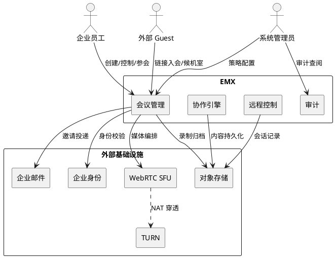
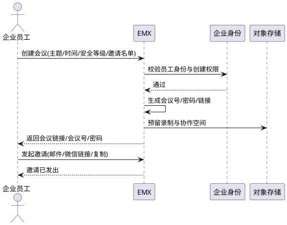
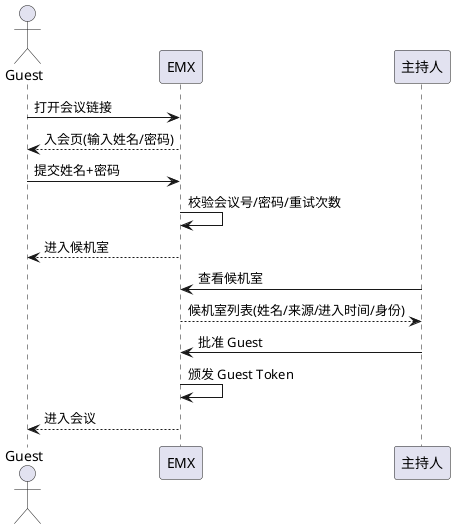
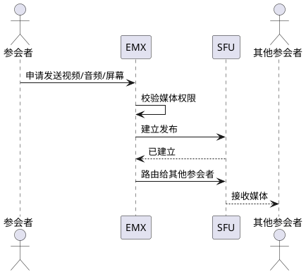
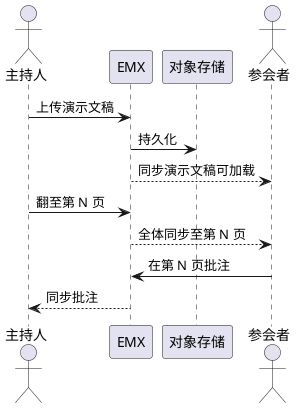
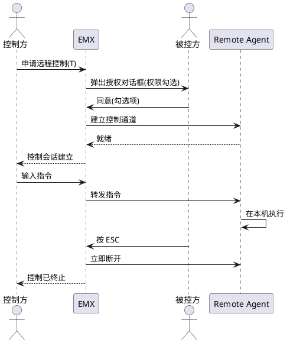
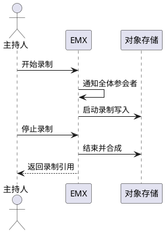
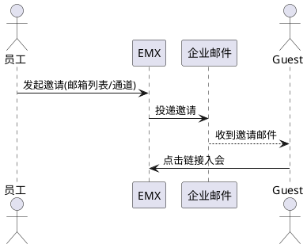
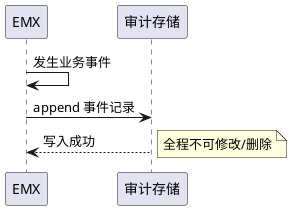

# EMX-001《需求规格说明书》

> **项目：Enterprise Meeting X（EMX）**
> **中文名称：企业实时会议与远程协作平台**
> **文档编号：EMX-001**
> **版本：v0.2**
> **阶段：Requirements Specification**
> **状态：PASS / CLOSED / FROZEN**
> **实现方：华为云团队**
> **部署目标：企业私有化 Debian Server**
> **Requirements Gate：FINAL ACCEPTANCE（PASS / CLOSED）**
> **RR-01~RR-04：全部 CLOSED**
> **D-01~D-03：EMX-002 Design Input**
> **当前裁决：需求已冻结，EMX-002 Architecture Design 已授权，禁止修改需求正文**
> **文档定位：需求规格（What），不含技术设计与实现细节（How）**
> **本版变更：依据 PM Requirements Review 裁决 RR-01~RR-04 修订，D-01~D-03 划入 EMX-002 Design 不修改**

---

# 1. 项目目标与组件定位

## 1.1 项目目标

EMX 用于建设企业自主可控的实时会议与远程协作平台，逐步降低企业对腾讯会议、华为会议、Microsoft Teams 等第三方会议基础设施的依赖。

系统必须支持：

- 企业内部会议；
- 外部客户/供应商 Guest 入会；
- 微信/邮件会议邀请；
- 浏览器免安装入会；
- 实时音视频；
- PPT/文档演示；
- 屏幕共享；
- 多人共享白板；
- 客户桌面共享；
- 远程协助与远程控制；
- 会议录制；
- 会议审计；
- 后续 AI 转写、翻译、摘要和会议知识库。

核心原则：

> **企业拥有会议数据、会议控制权和平台运行环境。**

## 1.2 核心职责

本组件负责提供企业级实时会议与远程协作能力，实现数据主权私有化部署、外部客户零安装浏览器入会、会议全过程审计与远程协作控制。

## 1.3 核心输入

1. **企业员工会议创建请求**：来源于企业内部用户，包含会议主题、时间、安全等级、邀请名单等。
2. **Guest 入会请求**：来源于外部客户/供应商，通过会议链接 + 密码 + 姓名进入。
3. **会议控制指令**：来源于主持人/参会者，包含静音、踢出、批准入会、移交主持、锁定会议等。
4. **实时媒体流**：来源于参会者终端，包含音频、视频、屏幕共享流。
5. **协作内容操作**：来源于参会者，包含 PPT 翻页、白板绘制、文档演示、批注、激光笔等。
6. **远程控制请求与授权**：来源于控制方申请与被控方显式同意。
7. **邀请发送指令**：来源于会议创建者，目标通道为邮件/微信链接/复制链接。
8. **录制控制指令**：来源于主持人，包含开始/暂停/停止录制。
9. **会议结束信号**：来源于主持人主动结束或最后一个参会者离开。

## 1.4 核心输出

1. **会议链接与会议号**：返回给创建者，用于分发邀请。形如 `https://meet.xxx.com/j/8F3K7A` + 6 位密码。
2. **Guest Token**：颁发给通过候机室批准的 Guest，限定会议、限定时间窗、限定权限。
3. **实时媒体分发**：将各参会者媒体流路由给其他参会者。
4. **协作内容同步**：将 PPT 当前页、白板对象、批注、指针广播给全体参会者。
5. **邀请邮件/消息**：发送给企业邮件系统投递，包含会议主题、时间、链接、密码、Guest 入会说明。
6. **会议录制文件**：会议结束后产出，含音视频合成文件与可选的会议记录。
7. **审计日志**：贯穿会议全生命周期，含创建、入会、媒体变更、控制操作、远程控制授权、录制、结束等事件。
8. **会议结束记录**：含参会人员清单、时长、录制引用、主持人、结束原因。

## 1.5 职责边界

1. **不负责企业身份源管理**：AD/LDAP/SSO/MFA 由企业身份系统提供，EMX 仅消费身份结果。V1 仅做基础企业账号，SSO/MFA 划入 P1（V2）。
2. **不负责邮件投递本身**：EMX 生成邀请内容并调用企业邮件系统投递，不替代邮件服务器。
3. **不负责 WebRTC 底层媒体传输实现**：媒体转发、NAT 穿透、RTP 路由、自适应码率由外部 SFU/TURN 基础设施承担，EMX 负责业务编排与控制。**EMX 自主研发重点放在企业会议业务、协作、权限、安全和远程控制，而不是重复实现成熟 WebRTC 协议栈。**
4. **不负责微信原生视频通话集成**：微信仅作为邀请入口与跳转通道，媒体仍在浏览器内进行。
5. **V1 不负责 AI 转写/翻译/摘要/Action Items**：AI 能力划入 P2（V3），V1 仅预留录制产物接口。
6. **V1 不负责企业通讯录/部门/日历/会议室资源/会议模板**：划入 P1（V2）。
7. **不负责把远程控制全部塞进浏览器**：本机鼠标/键盘/多显示器/系统级操作由独立的 EMX Remote Agent 承担，浏览器仅负责会议与协作。
8. **不替代腾讯会议/Teams/华为会议的所有功能**：V1 目标是跑通"员工创建 → 链接邀请 → Guest 浏览器入会 → 协作 → 录制 → 审计"闭环，不追求功能对等。

---

# 2. 产品边界与 V1 核心能力

## 2.1 V1 核心能力清单

| 编号       | 能力          | V1 |
| -------- | ----------- | -: |
| EMX-R001 | 创建会议        | 必须 |
| EMX-R002 | 内部用户入会      | 必须 |
| EMX-R003 | 外部 Guest 入会 | 必须 |
| EMX-R004 | 微信/邮件邀请     | 必须 |
| EMX-R005 | 浏览器入会       | 必须 |
| EMX-R006 | 音频          | 必须 |
| EMX-R007 | 视频          | 必须 |
| EMX-R008 | 屏幕共享        | 必须 |
| EMX-R009 | PPT/文档演示    | 必须 |
| EMX-R010 | 白板          | 必须 |
| EMX-R011 | 会议聊天        | 必须 |
| EMX-R012 | 主持人控制       | 必须 |
| EMX-R013 | 候机室         | 必须 |
| EMX-R014 | 会议录制        | 必须 |
| EMX-R015 | 会议审计        | 必须 |
| EMX-R016 | 远程控制申请      | 必须 |
| EMX-R017 | 被控端明确授权     | 必须 |
| EMX-R018 | 被控端立即终止控制   | 必须 |

## 2.2 V1 闭环成功定义

> 企业员工可创建会议，并通过微信/邮件将链接发给客户；客户无需注册、无需安装客户端，即可通过浏览器安全进入会议；会议中可进行音视频、屏幕共享、PPT/文档演示、白板协作、远程控制；会议可录制；全过程审计；会议结束产出会议记录。

---

# 3. 领域术语

**Meeting（会议）**
: 一次由企业员工发起的实时在线会议实例，具有唯一会议号、固定安全等级、明确主持人、起止时间与参会者集合。

**Meeting Link（会议链接）**
: 形如 `https://meet.xxx.com/j/{MeetingCode}` 的可分发 URL，是 Guest 入会的唯一入口。会议链接不得直接暴露数据库内部 ID。

**Meeting Code（会议号）**
: 会议链接路径段中的短码（如 `8F3K7A`），不可枚举、不可顺序预测，用于人类口头/文本传递。

**Host（主持人）**
: 会议的控制权持有者，承担批准入会、静音他人、移交主持、锁定会议、开始/停止录制等能力。
: 备注：主持人可移交，但同一时刻仅一位。

**Co-host（联席主持人）**
: 由主持人授权的辅助控制角色，可分担部分主持人能力，但不持有主持人归属权。

**Participant（参会者）**
: 会议中任何具有媒体与协作权限的成员，包含企业员工与 Guest。

**Guest（访客）**
: 不持有企业账号、通过会议链接 + 密码 + 姓名入会的外部参会者，权限由 Guest Token 限定。外部人员不得因为参加一次会议而被强制创建企业账户。

**Guest Token（访客令牌）**
: 颁发给 Guest 的短期凭证，绑定单一会议、限定时间窗、限定细粒度权限（摄像头/麦克风/屏幕共享/录制/管理）。

**Waiting Room（候机室）**
: Guest 入会后、被主持人批准前所处的中间状态，此状态下 Guest 不可见、不可听、不可发送媒体与协作内容。

**Media Stream（媒体流）**
: 参会者终端产生的音频、视频或屏幕共享流，由 SFU 转发给其他参会者。

**Screen Share（屏幕共享）**
: 参会者将本机整个屏幕/应用窗口/浏览器标签页作为媒体源分享给全体参会者的能力。
: 备注：**Screen Share ≠ Remote Control**，共享屏幕本身不能自动产生鼠标键盘控制权限。

**Whiteboard（白板）**
: 由若干对象序列构成的协作画布，支持笔/荧光笔/箭头/矩形/圆/文本/便签/图片/激光笔/橡皮擦，可持久化并在会后继续编辑。白板内容以**可编辑对象模型**保存，而不是仅保存截图。

**Whiteboard Document（白板文档）**
: 白板的持久化形态，由对象序列的集合，非位图快照。

**Slide Deck（演示文稿）**
: 主持人上传的 PPT/PDF/Office 文档，在会议中以页为单位同步翻页与批注，而非作为屏幕视频传输。
: 备注：**文档演示与桌面共享属于两种不同能力。**

**Remote Control（远程控制）**
: 控制方通过会议对被控方本机鼠标/键盘等输入设备进行操作的能力，必须经被控方显式授权，可随时单方面终止。
: 备注：**Remote Controller ≠ 自动拥有 Remote Target 权限**，远程控制必须单独授权。

**Remote Controller（控制方）**
: 发起远程控制请求并经被控方授权后获得控制能力的参会者。

**Remote Target（被控方）**
: 共享屏幕并经显式授权后被控制方操作本机设备的参会者。

**Remote Agent（远程代理）**
: 运行在被控方本机的轻量代理程序，承担鼠标/键盘/多显示器/系统级操作，与浏览器解耦。Remote Agent 应独立于浏览器会议页面，其安装、升级、权限和安全策略必须独立管理。

**Consent（授权同意）**
: 被控方对远程控制请求的显式同意动作，含细粒度权限勾选（鼠标移动/点击/键盘/Ctrl-Alt-Win/剪贴板读写/文件传输/应用启动）。

**Recording（录制）**
: 会议音视频与协作过程的持久化产物，加密存储，仅授权角色可回放。

**Audit Log（审计日志）**
: 会议全生命周期不可篡改的事件记录，含创建、入会、媒体变更、控制操作、远程控制授权与撤销、录制开关、结束等。

**Meeting Security Level（会议安全等级）**
: 会议的安全策略分级，L0 公开 / L1 密码 / L2 候机室 / L3 邀请名单 / L4 企业账号+MFA / L5 企业内部机密 / L6 端到端加密。V1 至少支持 L1/L2/L3。

**Internal Meeting（内部会议）**
: 仅企业账号可入的会议，走企业身份与权限体系。

**External Meeting（外部会议）**
: 允许 Guest 入会的会议，Guest 走链接+密码+Guest Token 体系，不创建企业账号。

**Data Sovereignty（数据主权）**
: 企业会议数据默认存储于企业控制的基础设施，不得以第三方 SaaS 为系统运行的强制依赖。

---

# 4. 角色与边界

## 4.1 核心角色

系统至少定义以下角色层次：

```text
Enterprise Admin
      │
      ├── Meeting Host
      │      │
      │      ├── Co-host
      │      └── Participant
      │
      └── External Guest
```

远程协助增加：

```text
Remote Controller
Remote Target
```

其中：**Remote Controller ≠ 自动拥有 Remote Target 权限**，远程控制必须单独授权。

具体角色职责：

1. **Enterprise Admin（系统管理员）**：负责平台配置、安全策略、审计查阅、录制管理。
2. **Meeting Host（会议主持人）**：会议的控制权持有者，可由创建者默认担任或移交，承担批准入会、静音他人、移交主持、锁定会议、开始/停止录制等能力。
3. **Co-host（联席主持人）**：由主持人授权的辅助控制角色，分担部分主持人能力。
4. **Participant（参会者）**：会议中任何具有媒体与协作权限的成员，包含企业员工与 Guest。
5. **External Guest（外部访客）**：不持有企业账号，通过会议链接入会，权限受限。
6. **Remote Controller（控制方）**：发起远程控制请求的参会者。
7. **Remote Target（被控方）**：共享屏幕并经授权后被控制的参会者。

## 4.2 外部系统

1. **企业身份系统（AD/LDAP/SSO）**：向 EMX 提供企业员工身份与基础属性。V1 仅消费基础账号，P1（V2）接入 SSO/MFA。
2. **企业邮件系统**：接收 EMX 邀请内容并投递给收件人。EMX 不自研邮件服务器。
3. **WebRTC SFU**：承担实时音视频/屏幕共享流的转发、自适应码率、RTP 路由。EMX 不自研完整 WebRTC 协议栈。
4. **TURN 服务**：承担 NAT 穿透中继。
5. **对象存储**：持久化录制文件、上传的 PPT/文档、白板文档。
6. **关系型数据库**：持久化会议元数据、参会者、审计日志、Guest Token 等业务数据。
7. **缓存/状态存储**：承载会议实时状态、候机室队列、在线参会者、白板会话等。
8. **微信/企业 IM**：仅作为邀请链接的传递通道与跳转入口，不作为媒体通道。不自研微信原生视频 SDK。

## 4.3 交互上下文



---

# 5. 外部客户接入

这是 EMX 的核心需求之一。外部人员不得因为参加一次会议而被强制创建企业账户。

## 5.1 邮件接入流程

```text
Email
  ↓
Meeting Link
  ↓
Browser
  ↓
Guest Identity
  ↓
Waiting Room
  ↓
Host Approval
  ↓
Meeting
```

## 5.2 微信接入流程

```text
微信消息
   ↓
会议链接
   ↓
浏览器
   ↓
Guest
   ↓
会议
```

## 5.3 零安装原则

系统应允许 Guest 在不安装 EMX 专用客户端的情况下参加会议。浏览器入会为 V1 必须能力（EMX-R005）。

### 5.3.1 适用范围：普通 Guest 会议（零安装）

普通 Guest 会议参与能力**无需安装任何 EMX 专用客户端**，仅通过浏览器即可获得完整会议闭环体验：

```text
微信/邮件
    ↓
会议链接
    ↓
浏览器
    ↓
音视频 / PPT / 白板 / 聊天 / 屏幕共享
```

**零安装适用范围**：普通会议参与能力，包含音视频、白板、PPT/文档演示、会议聊天、屏幕共享。

### 5.3.2 不适用范围：Remote Control（需额外安装）

远程控制属于**额外能力**，不属于零安装范围。被控设备必须安装并运行 EMX Remote Agent：

```text
Guest
    ↓
共享桌面
    ↓
请求远程控制
    ↓
被控端明确授权
    ↓
安装并运行 EMX Remote Agent
    ↓
建立远程控制
```

### 5.3.3 零安装原则声明

> **"零安装"适用于普通会议参与能力（音视频/白板/PPT/聊天/屏幕共享）；远程控制属于额外能力，被控设备必须安装并运行 EMX Remote Agent。**

**验收条件**：
- [Guest 通过浏览器入会] → [可获得音视频/白板/PPT/聊天/屏幕共享全部普通会议能力，无需安装任何客户端]；
- [Guest 作为被控方接受远程控制] → [被控方本机必须安装并运行 EMX Remote Agent，否则控制会话不可建立]；
- [Remote Agent 未安装时申请远程控制] → [拒绝建立并提示安装 Remote Agent]。

---

# 6. DFX 约束

## 6.1 性能

系统必须能够支持：多人实时视频、多人音频、屏幕共享、白板同步、PPT 同步。

具体指标：

1. 会议创建接口响应时间 ≤ 2s（P95）。
2. Guest 从点击链接到进入候机室 ≤ 3s（含页面加载，P95）。
3. 信令端到端延迟 ≤ 500ms（P95）。
4. 音视频媒体端到端延迟 ≤ 200ms（P95）。
5. 屏幕共享 1080p 帧率 ≥ 5fps，可自适应降级。
6. 白板操作同步延迟 ≤ 100ms（P95）。
7. PPT 翻页全体同步延迟 ≤ 200ms（P95）。
8. 单会议支持参会者 ≥ 50 人（V1 目标）。
9. 远程控制输入延迟 ≤ 80ms（P95，同地域）。

> 具体人数和并发指标在 **EMX-002 Design** 阶段通过容量模型确定。

## 6.2 可靠性

1. 系统可用性 ≥ 99.5%（V1，单实例维护窗口除外）。
2. 媒体断线 5s 内自动重连，重连后状态一致。
3. 录制断线续录，不产生不可恢复的丢失。
4. 会议状态最终一致：参会者视图、协作内容、主持人归属在并发操作下最终收敛。
5. 单参会者异常退出不影响其他参会者会议进行。
6. 主持人异常断线后会议不立即结束，并在超时后可由系统按策略回收。

## 6.3 安全性

必须考虑：TLS、Token、Guest Token、权限隔离、Session 生命周期、Remote Control 授权、审计、数据访问控制、防止未授权会议加入。

具体要求：

1. 所有外部链路强制 TLS 1.3。
2. 会议链接的会议号不可枚举、不可顺序预测、不可由数据库自增 ID 暴露。
3. Guest Token 限定单一会议、限定时间窗、限定细粒度权限，过期自动失效。
4. 远程控制默认关闭（DENY），必须被控方显式授权方可建立，被控方可随时单方面终止。
5. 录制文件加密存储，仅授权角色可回放。
6. 审计日志 append-only，不可篡改、不可删除，保留期 ≥ 1 年。
7. 会议密码错误连续失败 ≥ 5 次锁定该 IP 入会尝试 10 分钟。
8. 内部会议与外部会议身份体系隔离，Guest 不可获得企业账号能力。
9. 远程控制会话全程审计，含请求、授权项、建立、撤销、操作事件量。

## 6.4 可维护性

系统必须支持：日志、指标、健康检查、故障诊断、版本升级、数据备份、恢复。

具体要求：

1. 结构化日志（含 meetingId、participantId、traceId）。
2. 关键指标可监控：在线会议数、参会者数、媒体码率、录制吞吐、入会成功率、远程控制会话数。
3. 链路追踪贯穿会议创建→入会→媒体→结束。
4. 配置项（安全等级默认值、录制保留期、Guest Token 有效期、密码重试阈值）可在线调整。

## 6.5 兼容性

1. 桌面浏览器：Chrome / Edge / Safari / Firefox 近 2 个稳定版本。
2. 移动浏览器：iOS Safari / Android Chrome 近 2 个稳定版本。
3. 微信内置浏览器：检测到微信环境时引导"在系统浏览器中打开"，不作为一等媒体客户端。
4. EMX Remote Agent：Windows 10/11 x64（V1），后续扩展 macOS。
5. 接口变更向后兼容，会议链接格式一经发布不可破坏性变更。

---

# 7. 核心能力

## 7.1 会议创建与管理

### 7.1.1 业务规则

1. **会议创建权限**：仅企业员工可创建会议，Guest 不可创建。
   a. 验收条件：[企业员工提交创建请求] → [成功创建并返回会议链接与会议号]；[Guest 提交创建请求] → [拒绝并返回权限不足错误]。
2. **会议号生成**：会议号必须随机、不可枚举、不可顺序预测，长度 ≥ 6 位，字符集不含易混淆字符（0/O、1/I/l）。
   a. 验收条件：[连续创建 10000 次会议] → [会议号无顺序规律、无碰撞、不可由前序号推断后序号]。
3. **会议密码**：当安全等级 ≥ L1 时必须设置会议密码，密码为 6 位数字。
   a. 验收条件：[创建 L1 及以上会议未提供密码] → [拒绝创建并提示设置密码]。
4. **安全等级默认值**：未显式指定时默认 L2（候机室）。
   a. 验收条件：[创建会议未指定安全等级] → [会议安全等级为 L2，Guest 入会进入候机室]。
5. **主持人归属**：会议创建者默认为主持人，主持人可移交且同一时刻仅一位。
   a. 验收条件：[创建者创建会议] → [创建者即主持人]；[主持人移交] → [原主持人失去控制权、目标参会者获得控制权]；[并发移交] → [最终仅一位主持人]。
6. **会议锁定**：主持人可锁定会议，锁定后新参会者不可入会。
   a. 验收条件：[会议锁定后 Guest/员工尝试入会] → [拒绝并提示会议已锁定]。
7. **会议结束**：主持人主动结束则全体参会者退出；主持人异常断线超时后系统可按策略结束或等待重连。
   a. 验收条件：[主持人主动结束] → [全体参会者收到结束通知并退出、产出会议结束记录]；[主持人异常断线且超时未回] → [按策略结束或保持会议待重连]。
8. **禁止项**：禁止用数据库自增 ID 作为会议号或对外暴露；禁止未鉴权直接通过 URL 参数进入会议。
   a. 验收条件：[尝试以自增 ID 访问会议] → [404/拒绝]；[未携带有效 Token 访问会议内部资源] → [401/403]。

### 7.1.2 交互流程



### 7.1.3 异常场景

1. **身份校验失败**
   a. 触发条件：创建者身份无效或无创建权限。
   b. 系统行为：拒绝创建，记录审计。
   c. 用户感知：错误码 `EMX-E-AUTH-001`，提示"无创建权限"。
2. **会议号碰撞**
   a. 触发条件：极小概率生成已存在会议号。
   b. 系统行为：自动重新生成直至唯一，重试上限内成功。
   c. 用户感知：无感知。
3. **邀请投递失败**
   a. 触发条件：企业邮件系统不可达或收件地址无效。
   b. 系统行为：保留邀请记录，标记投递失败，支持重试。
   c. 用户感知：错误码 `EMX-E-INVITE-001`，提示"邀请投递失败，可重试"。

## 7.2 Guest 访问与候机室

### 7.2.1 业务规则

1. **Guest 入会要素**：Guest 须提供会议链接（或会议号）+ 密码（当安全等级 ≥ L1）+ 姓名，方可进入候机室。
   a. 验收条件：[Guest 提供完整且正确的入会要素] → [进入候机室]；[缺少任一要素] → [提示补全]；[密码错误] → [提示密码错误并累计失败次数]。
2. **Guest 不创建企业账号**：Guest 入会全程不产生企业账号、不进入企业通讯录。
   a. 验收条件：[Guest 入会并结束] → [企业账号体系无新增账号、通讯录无新增条目]。
3. **候机室可见性**：候机室中的 Guest 不可见、不可听、不可发送媒体与协作内容，仅主持人可见其等待状态。
   a. 验收条件：[Guest 处于候机室] → [其他参会者收不到其媒体与协作内容]；[主持人视图] → [可见候机室列表]。
4. **主持人批准/拒绝**：主持人可逐一或批量批准/拒绝候机室 Guest，批准后颁发 Guest Token 并进入会议。
   a. 验收条件：[主持人批准 Guest] → [Guest 获得 Guest Token 并进入会议]；[主持人拒绝] → [Guest 被移出并提示]。
5. **Guest Token 限制**：Guest Token 绑定单一会议、限定时间窗（默认覆盖会议开始前 30 分钟至结束后 30 分钟）、限定细粒度权限。
   a. 验收条件：[Guest Token 在时间窗外使用] → [失效拒绝]；[尝试访问其他会议] → [失效拒绝]；[尝试执行未授权权限] → [拒绝]。
6. **密码重试锁定**：同一 IP 密码错误连续 ≥ 5 次锁定 10 分钟。
   a. 验收条件：[同一 IP 连续 5 次密码错误] → [该 IP 10 分钟内不可再尝试入会]。
7. **候机室信息展示**：Host 应看到候机室 Guest 的姓名、来源、进入时间、会议身份。
   a. 验收条件：[Host 查看候机室] → [列表含姓名/来源/进入时间/会议身份]。
8. **禁止项**：禁止 Guest 获得主持人能力；禁止 Guest 在候机室发送任何媒体/协作内容。
   a. 验收条件：[Guest 尝试调用主持人接口] → [拒绝]；[候机室 Guest 尝试发送媒体] → [拒绝]。

### 7.2.2 交互流程



### 7.2.3 异常场景

1. **会议不存在或已结束**
   a. 触发条件：会议号不存在或会议已结束。
   b. 系统行为：返回不可入会提示。
   c. 用户感知：提示"会议不存在或已结束"。
2. **会议已锁定**
   a. 触发条件：会议已被主持人锁定。
   b. 系统行为：拒绝入会。
   c. 用户感知：提示"会议已锁定，请联系主持人"。
3. **Guest Token 过期**
   a. 触发条件：Token 超出时间窗或会议已结束。
   b. 系统行为：失效并要求重新入会。
   c. 用户感知：提示"入会凭证已过期，请重新通过链接入会"。

## 7.3 媒体能力（音视频与屏幕共享）

### 7.3.1 业务规则

系统必须支持：摄像头、麦克风、扬声器、静音、关闭/开启摄像头、多人视频、网络质量检测、自动适应网络质量、断线重连、浏览器权限管理。

会议中至少能够显示：视频、姓名、麦克风状态、摄像头状态、网络状态。

具体规则：

1. **媒体权限受控**：参会者发送/接收音视频与屏幕共享前须具备对应权限（由角色与 Guest Token 共同决定）。
   a. 验收条件：[参会者具备摄像头权限] → [可发送视频]；[Guest Token 未授予屏幕共享] → [屏幕共享被拒绝]。
2. **静音控制**：参会者可自静音；主持人可静音他人；主持人静音他人不可被对方自行解除该次静音（直到对方主动重新开启）。
   a. 验收条件：[主持人静音参会者 A] → [A 麦克风关闭且 A 不可在该次操作内自动恢复]；[A 主动重新开启] → [恢复发言]。
3. **摄像头控制**：参会者可自开/关摄像头；主持人可关闭他人摄像头。
   a. 验收条件：[主持人关闭 A 摄像头] → [A 视频流停止]。
4. **屏幕共享互斥**：同一时刻默认仅一位参会者共享屏幕，主持人可切换共享者。
   a. 验收条件：[A 共享中 B 申请共享] → [主持人决策切换或保留]；[主持人切换至 B] → [A 停止共享、B 开始共享]。
5. **屏幕共享来源选择**：共享者可选择整个屏幕/应用窗口/浏览器标签页。
   a. 验收条件：[共享者选择应用窗口] → [仅该窗口内容被共享]。
6. **媒体自适应**：网络条件变化时媒体码率/分辨率自适应降级，恢复后自适应升回。
   a. 验收条件：[参会者网络劣化] → [码率/分辨率自动降级以维持连续性]；[网络恢复] → [质量回升]。
7. **屏幕共享边界**：**Screen Share ≠ Remote Control**，共享屏幕本身不能自动产生鼠标键盘控制权限。
   a. 验收条件：[A 共享屏幕给 B] → [B 不可自动获得 A 本机控制权]。
8. **禁止项**：禁止未授权参会者发送媒体；禁止绕过主持人切换屏幕共享。
   a. 验收条件：[未授权者发送媒体] → [拒绝]；[非主持人强制切换共享] → [拒绝]。

### 7.3.2 交互流程



### 7.3.3 异常场景

1. **媒体设备不可用**
   a. 触发条件：终端无摄像头/麦克风或被其他应用占用。
   b. 系统行为：提示设备不可用，允许仅语音或仅观看入会。
   c. 用户感知：提示"摄像头/麦克风不可用，可继续以其他模式入会"。
2. **媒体断线**
   a. 触发条件：网络中断或 SFU 连接丢失。
   b. 系统行为：5s 内自动重连，重连成功恢复媒体；超时则该参会者标记为断线。
   c. 用户感知：短暂黑屏/提示"正在重连"。
3. **屏幕共享权限被撤销**
   a. 触发条件：主持人撤销共享者权限。
   b. 系统行为：立即停止该参会者屏幕共享。
   c. 用户感知：共享停止提示。

## 7.4 内容协作（PPT/文档演示与白板）

### 7.4.1 PPT/文档演示业务规则

EMX 必须支持会议内容演示。至少包括：PPT、PDF、图片、常见办公文档。

需求原则：**文档演示与桌面共享属于两种不同能力。**

1. **演示文稿上传**：主持人可上传 PPT/PDF/Office 文档/图片作为演示文稿，存储于对象存储，会议中以页为单位同步。
   a. 验收条件：[主持人上传 PPT] → [全体参会者可见演示文稿]；[主持人翻页] → [全体同步至同一页]。
2. **演示文稿翻页控制**：默认仅主持人（演讲者）可翻页；主持人可授权指定参会者协同翻页。
   a. 验收条件：[非授权参会者翻页] → [拒绝]；[主持人授权 A 翻页] → [A 可翻页且全体同步]。
3. **演示文稿批注**：参会者可在当前页批注（激光笔/荧光笔/箭头/文本），批注随页面同步。
   a. 验收条件：[A 在第 12 页批注] → [全体在第 12 页可见该批注]；[翻至第 13 页] → [第 12 页批注不显示于第 13 页]。
4. **指针与基础批注**：必须支持翻页、页面同步、演讲者控制、指针、基础批注、演示结束。
   a. 验收条件：[主持人翻页] → [全体同步]；[主持人使用指针] → [全体可见指针位置]；[主持人结束演示] → [演示文稿关闭]。
5. **后续可扩展**：激光笔、多人批注、演讲者备注、文档共同编辑划入后续版本。
   a. 验收条件：[V1 不要求多人批注/演讲者备注/共同编辑] → [这些能力在后续版本实现]。
6. **禁止项**：禁止非授权参会者翻页。
   a. 验收条件：[非授权参会者翻页] → [拒绝]。

### 7.4.2 白板业务规则

白板必须支持多人实时协作。V1 至少支持：自由画笔、橡皮擦、文字、线条、箭头、矩形、圆形、撤销、重做、清空、多人实时同步。

白板内容应以**可编辑对象模型**保存，而不是仅保存截图。会议结束后允许保存白板成果。

1. **白板为对象序列**：白板保存为对象序列（笔/荧光笔/箭头/矩形/圆/文本/便签/图片/激光笔/橡皮擦），非位图快照，支持 undo/redo，可持久化为白板文档。
   a. 验收条件：[A 绘制矩形] → [白板文档新增矩形对象]；[undo] → [对象移除]；[会议结束] → [白板文档可独立打开继续编辑]。
2. **白板协同**：多位参会者可同时绘制，对象以操作者标识区分，并发操作最终一致。
   a. 验收条件：[A 与 B 同时绘制] → [两对象均保留、互不覆盖、最终一致]。
3. **激光笔不持久化**：激光笔为瞬时指示，不进入白板文档对象序列。
   a. 验收条件：[A 使用激光笔] → [其他参会者可见指示]；[A 松开] → [指示消失、白板文档无新增对象]。
4. **禁止项**：禁止白板对象被单方删除他人对象（仅作者或主持人可删除）。
   a. 验收条件：[B 尝试删除 A 的对象] → [拒绝]；[主持人删除] → [允许]。

### 7.4.3 交互流程



### 7.4.4 异常场景

1. **演示文稿上传失败**
   a. 触发条件：文件过大、格式不支持或存储不可达。
   b. 系统行为：返回失败并保留已上传页。
   c. 用户感知：错误码 `EMX-E-COLLAB-001`，提示"上传失败，可重试"。
2. **白板对象冲突**
   a. 触发条件：并发操作产生对象 ID 冲突。
   b. 系统行为：服务端以最终一致策略合并。
   c. 用户感知：无感知或轻微重排。
3. **演示文稿格式不支持**
   a. 触发条件：上传非 PPT/PDF/Office/图片格式。
   b. 系统行为：拒绝上传。
   c. 用户感知：提示"格式不支持"。

## 7.5 远程控制

这是 EMX 的高价值能力。典型场景：客户向企业工程师演示软件问题，工程师在获得客户明确授权后远程操作客户电脑进行指导。

### 7.5.1 远程控制流程

```text
客户共享屏幕
       ↓
工程师请求远程控制
       ↓
客户收到授权提示
       ↓
客户明确允许
       ↓
建立 Remote Control Session
       ↓
工程师控制鼠标/键盘
       ↓
客户随时终止
       ↓
控制会话结束
```

### 7.5.2 业务规则

1. **默认关闭**：远程控制默认关闭（DENY），不可隐式开启。
   a. 验收条件：[会议创建] → [远程控制处于关闭状态]；[任何隐式建立控制] → [拒绝]。
2. **前提为屏幕共享**：远程控制建立前被控方须正在共享屏幕。
   a. 验收条件：[被控方未共享屏幕时申请控制] → [拒绝并提示先共享屏幕]。
3. **显式授权**：控制方申请后，被控方须显式同意并勾选细粒度权限方可建立控制会话。
   a. 验收条件：[控制方申请] → [被控方弹出授权对话框含权限勾选]；[被控方同意] → [建立控制会话]；[被控方拒绝] → [不建立]。
4. **细粒度权限**：授权项至少包含鼠标移动/鼠标点击/键盘输入/Ctrl-Alt-Win 组合键/剪贴板读取/剪贴板写入/文件传输/应用启动，默认全部关闭，逐项勾选。
   a. 验收条件：[仅勾选鼠标点击] → [控制方可点击但不可键盘输入/读剪贴板等]。
5. **被控方随时终止**：被控方可随时单方面终止控制会话（含按 ESC、点击断开按钮、关闭共享）。被控端必须具有**一键立即终止远程控制**的能力。
   a. 验收条件：[被控方按 ESC] → [控制会话立即断开、控制方失去控制权]。
6. **控制方主动放弃**：控制方可主动放弃控制，会话结束。
   a. 验收条件：[控制方放弃] → [会话结束、被控方收到通知]。
7. **会话唯一**：同一被控方同一时刻仅可有一个控制会话。
   a. 验收条件：[A 控制中 B 申请控制同一被控方] → [B 进入排队或被拒绝，由被控方决策]。
8. **Remote Agent 承担本机操作**：鼠标/键盘/多显示器/系统级操作由被控方本机 EMX Remote Agent 承担，浏览器不直接进行系统级操作。
   a. 验收条件：[建立控制会话] → [控制指令经 Remote Agent 执行于被控方本机]；[Remote Agent 未安装] → [不可建立控制、提示安装]。
9. **全程审计**：控制请求、授权项、建立、撤销、操作事件量、断开原因全部记入审计日志。
   a. 验收条件：[任意控制会话] → [审计日志含完整生命周期事件]。
10. **两类超时明确区分**：远程控制存在两类不同超时，必须分别定义、分别配置、分别触发：
    - **Control Request Timeout（授权请求超时）**：控制方发起请求后，被控方是否接受请求的最大等待时长。超时则请求自动失效，控制会话不建立。
    - **Control Session Timeout（控制会话超时）**：控制会话建立后，最多可持续的时长。到期自动终止控制会话，被控方恢复完整控制权。
    a. 验收条件：[授权请求超时与控制会话超时] → [两者独立配置、独立计时、独立触发，互不混淆]。
11. **控制会话最大时长**：控制会话必须存在最大时长上限，不得无限期授权。默认最大时长 **30 分钟**，作为**企业策略默认值**（可由企业策略配置调整），而非不可修改的硬编码值。到期后系统自动终止控制会话，被控方恢复完整控制权，控制方收到"控制会话已到期"通知。被控方可提前终止；Host 可终止。
    a. 验收条件：[企业策略配置 maxDuration = 30min（默认）] → [控制会话建立后 30 分钟自动终止]；[企业策略配置 maxDuration = 60min] → [控制会话最多持续 60 分钟]；[会话到期] → [自动终止、被控方恢复控制权、控制方收到到期通知、审计记录终止原因为"超时"]；[被控方提前终止] → [会话立即结束]；[Host 终止] → [会话立即结束]。
12. **授权请求超时默认值**：授权请求超时默认 60 秒，可由企业策略配置。超时后请求自动失效，控制方需重新发起请求。
    a. 验收条件：[控制方发起请求后被控方 60s 内未响应] → [请求自动失效、控制方提示"授权请求超时"]；[企业策略配置 requestTimeout = 120s] → [等待 120s 后失效]。
13. **禁止项**：禁止服务器在无显式授权情况下取得控制权；禁止绕过被控方确认直接建立控制；禁止控制会话跨会议；禁止在会议结束后继续保持控制；禁止未授权读取客户桌面；禁止未授权读取客户文件；禁止控制会话无限期授权（必须存在 maxDuration 上限）。
    a. 验收条件：[无授权的服务器控制尝试] → [拒绝]；[跨会议控制] → [拒绝]；[会议结束后控制] → [拒绝]；[未授权读取桌面/文件] → [拒绝]；[maxDuration 未配置或为无限] → [拒绝建立控制会话]。

### 7.5.3 Remote Control 安全要求（强制）

这是 EMX-001 的**强制安全要求**。默认：

```text
Remote Control = DENY
```

至少支持以下权限，默认全部 DENY：

| 权限    |   默认 |
| ----- | ---: |
| 鼠标移动  | DENY |
| 鼠标点击  | DENY |
| 键盘输入  | DENY |
| 剪贴板   | DENY |
| 文件传输  | DENY |
| 系统级操作 | DENY |

客户明确授权后才能开放相应能力。被控端必须具有**一键立即终止远程控制**的能力。

### 7.5.4 交互流程



### 7.5.5 异常场景

1. **Remote Agent 未安装/未运行**
   a. 触发条件：被控方本机未安装或未运行 EMX Remote Agent。
   b. 系统行为：拒绝建立控制会话。
   c. 用户感知：提示"被控方需安装并运行 EMX Remote Agent"。
2. **授权请求超时（Control Request Timeout）**
   a. 触发条件：控制方发起请求后，被控方未在授权请求超时时间（默认 60s，可由企业策略配置）内响应。
   b. 系统行为：请求自动失效，控制会话不建立。
   c. 用户感知：控制方提示"授权请求超时"，可重新发起请求。
3. **控制会话到期（Control Session Timeout）**
   a. 触发条件：控制会话持续时长达到 maxDuration（默认 30 分钟，可由企业策略配置）。
   b. 系统行为：系统自动终止控制会话，被控方恢复完整控制权，审计记录终止原因为"超时"。
   c. 用户感知：双方提示"控制会话已到期"，控制方需重新申请授权方可再次建立控制。
4. **控制通道中断**
   a. 触发条件：网络中断导致控制通道丢失。
   b. 系统行为：立即终止控制会话，被控方恢复完整控制权。
   c. 用户感知：双方提示"控制已断开"。
5. **权限越界**
   a. 触发条件：控制方尝试执行未授权操作。
   b. 系统行为：拒绝并记入审计。
   c. 用户感知：控制方提示"该操作未授权"。

## 7.6 Remote Agent

涉及系统级鼠标/键盘控制时，采用以下架构：

```text
Browser
   │
   ▼
EMX Meeting
   │
   ▼
Remote Control Channel
   │
   ▼
EMX Remote Agent
   │
   ├── Mouse
   ├── Keyboard
   ├── Screen
   └── Multi-Monitor
```

Remote Agent 应独立于浏览器会议页面。其安装、升级、权限和安全策略必须独立管理。

## 7.7 主持人控制

Host 至少可以：

- 接受 Guest；
- 移除参会者；
- 静音；
- 控制屏幕共享；
- 结束会议；
- 控制录制；
- 管理白板；
- 管理演示；
- 管理远程控制请求。

## 7.8 会议录制

### 7.8.1 业务规则

V1 应支持录制：音频、视频、屏幕共享、演示内容、会议时间、参会人员。

1. **录制权限**：仅主持人可开始/暂停/停止录制。
   a. 验收条件：[非主持人调用录制控制] → [拒绝]。
2. **录制加密存储**：录制文件加密存储于对象存储，仅授权角色可回放。
   a. 验收条件：[未授权角色访问录制] → [拒绝]；[授权角色] → [可回放]。
3. **录制通知**：开始录制时须通知全体参会者（视觉与音频提示）。
   a. 验收条件：[主持人开始录制] → [全体参会者收到录制中提示]。
4. **录制内容**：录制含音视频合成，可含屏幕共享与协作内容（按策略）。
   a. 验收条件：[会议含视频+屏幕共享+白板] → [录制产物含对应内容（按策略）]。
5. **断线续录**：录制过程中断线可续录，不产生不可恢复丢失。
   a. 验收条件：[录制中断线] → [重连后续录、最终产物可播放]。
6. **录制归属**：录制归属于会议与会议创建企业，保留期由策略决定（默认 ≥ 90 天）。录制数据必须与会议建立明确关联。
   a. 验收条件：[会议结束] → [录制归档并关联会议]；[超保留期] → [按策略清理或归档]。
7. **录制权限受策略控制**：录制权限必须受到会议策略控制。
   a. 验收条件：[会议策略禁止录制] → [主持人不可开始录制]。
8. **禁止项**：禁止未通知参会者即开始录制；禁止未授权角色下载录制。
   a. 验收条件：[未通知即录制] → [违规并记审计]；[未授权下载] → [拒绝]。

### 7.8.2 录制数据结构

```text
Meeting
  │
  └── Recording
        ├── Video
        ├── Audio
        ├── Metadata
        └── Audit
```

### 7.8.3 交互流程



### 7.8.4 异常场景

1. **存储不可达**
   a. 触发条件：对象存储不可用。
   b. 系统行为：录制失败或降级本地缓冲（按策略）。
   c. 用户感知：提示"录制不可用"。
2. **录制合成失败**
   a. 触发条件：合成阶段失败。
   b. 系统行为：保留原始分轨，支持后续重合成。
   c. 用户感知：提示"录制处理中，稍后可回放"。

## 7.9 邀请通知

### 7.9.1 业务规则

1. **邀请通道**：支持邮件、微信链接（复制链接在微信中打开）、复制链接三种通道。
   a. 验收条件：[选择邮件] → [企业邮件系统投递含主题/时间/链接/密码/Guest 说明]；[选择微信链接] → [生成可复制链接供微信发送]；[选择复制链接] → [链接复制至剪贴板]。
2. **邀请内容**：邀请须包含会议主题、时间、会议链接、会议号、密码（当 ≥ L1）、Guest 入会说明（无需安装、支持浏览器）。
   a. 验收条件：[任意通道邀请] → [内容包含上述全部要素]。
3. **邀请对象**：可邀请企业员工（走企业身份）与外部 Guest（走邮箱/微信）。
   a. 验收条件：[邀请企业员工] → [员工以企业账号入会]；[邀请外部邮箱] → [Guest 以链接入会]。
4. **禁止项**：禁止在邀请中暴露数据库自增 ID；禁止在邀请中暴露企业内部敏感信息。
   a. 验收条件：[邀请内容] → [仅含会议号/链接/密码，无内部 ID 或敏感信息]。

### 7.9.2 交互流程



### 7.9.3 异常场景

1. **邮件投递失败**
   a. 触发条件：企业邮件系统不可达或地址无效。
   b. 系统行为：标记失败、支持重试。
   c. 用户感知：提示"邀请投递失败，可重试"。
2. **链接在微信内置浏览器受限**
   a. 触发条件：微信内置浏览器 WebRTC 受限。
   b. 系统行为：引导"在系统浏览器中打开"。
   c. 用户感知：Landing Page 提示跳转。

## 7.10 审计与安全

### 7.10.1 审计事件清单

系统必须记录以下关键安全事件：

```text
Meeting Created
Guest Invited
Guest Joined
Guest Approved
Screen Share Started
Screen Share Stopped
Recording Started
Recording Stopped
Remote Control Requested
Remote Control Approved
Remote Control Rejected
Remote Control Terminated
Participant Removed
Meeting Ended
```

尤其是：**Remote Control 必须完整审计。**

### 7.10.2 业务规则

1. **审计事件覆盖**：审计须覆盖会议创建、入会、媒体变更、控制操作、候机室批准/拒绝、远程控制请求/授权/撤销、录制开关、会议结束等全生命周期事件。
   a. 验收条件：[任意上述事件发生] → [审计日志含对应记录]。
2. **审计不可篡改**：审计日志 append-only，不可修改、不可删除，保留期 ≥ 1 年。
   a. 验收条件：[尝试修改/删除审计] → [拒绝]；[超保留期前] → [不可删除]。
3. **审计查阅权限**：仅系统管理员与授权角色可查阅审计。
   a. 验收条件：[未授权角色查阅审计] → [拒绝]。
4. **会议安全等级策略**：L1 密码 / L2 候机室 / L3 邀请名单 / L4 企业账号+MFA / L5 企业内部机密 / L6 端到端加密，V1 至少支持 L1/L2/L3。
   a. 验收条件：[创建 L1 会议] → [需密码]；[L2] → [Guest 入候机室]；[L3] → [仅邀请名单可入会]。
5. **邀请名单**：L3 会议仅邀请名单中的身份/邮箱可入会。
   a. 验收条件：[非名单 Guest 尝试入会 L3 会议] → [拒绝]。
6. **内部/外部会议隔离**：内部会议仅企业账号可入；外部会议允许 Guest，Guest 不可获得企业账号能力。
   a. 验收条件：[Guest 尝试入内部会议] → [拒绝]；[Guest 入外部会议] → [权限受限、无企业账号能力]。
7. **禁止项**：禁止审计日志被任何角色修改；禁止 Guest 调用企业管理接口。
   a. 验收条件：[任意角色修改审计] → [拒绝]；[Guest 调用企业管理接口] → [拒绝]。

### 7.10.3 交互流程



### 7.10.4 异常场景

1. **审计写入失败**
   a. 触发条件：审计存储不可达。
   b. 系统行为：业务事件不阻塞，审计异步补写并告警。
   c. 用户感知：无感知（运维告警）。
2. **越权查阅审计**
   a. 触发条件：未授权角色尝试查阅。
   b. 系统行为：拒绝并记审计。
   c. 用户感知：错误码 `EMX-E-AUDIT-001`，提示"无审计查阅权限"。

---

# 8. 企业身份

内部员工未来必须支持：

```text
AD / LDAP
SSO
MFA
```

但 Guest 不得强制进入企业身份体系。

```text
Internal
    ↓
Enterprise Identity

External
    ↓
Guest Identity
```

V1 仅消费基础企业账号，SSO/MFA/AD/LDAP 深度集成划入 P1（V2）。

---

# 9. 数据主权

EMX 的核心数据原则：

> **企业会议数据默认存储于企业控制的基础设施。**

至少包括：

- 会议元数据；
- 会议审计；
- 录制；
- 白板；
- 文档；
- 会议纪要；
- Guest 信息。

不得以第三方 SaaS 为系统运行的强制依赖。

---

# 10. 部署要求

目标环境：

```text
Debian Server
```

第一阶段：

```text
Internet
    │
    ▼
HTTPS
    │
    ▼
EMX Gateway
    │
    ├── Meeting Service
    ├── Media Service
    ├── Collaboration
    ├── Recording
    └── Storage
```

底层实时媒体采用成熟 WebRTC/SFU 技术。**EMX 自主研发重点放在企业会议业务、协作、权限、安全和远程控制，而不是重复实现成熟 WebRTC 协议栈。**

## 10.1 WebRTC 媒体连通能力要求（强制）

EMX 私有化部署必须支持 WebRTC 实时媒体网络连通能力，并必须提供 TURN/NAT Traversal 能力；部署架构必须覆盖 UDP/TCP 媒体传输及受限网络环境下的连接建立。

```text
EMX 私有化部署
    │
    ├── WebRTC 实时媒体连通能力（必须）
    │
    ├── TURN / NAT Traversal（必须）
    │
    ├── UDP 媒体传输（必须支持）
    │
    ├── TCP 媒体传输（必须支持，用于受限网络回退）
    │
    └── 受限网络环境下连接建立（必须支持）
```

**验收条件**：
- [EMX 私有化部署完成] → [必须具备 WebRTC 实时媒体网络连通能力]；
- [参会者处于 NAT/防火墙后] → [通过 TURN/NAT Traversal 可建立媒体连接]；
- [UDP 受阻的受限网络] → [可通过 TCP 媒体传输回退建立连接]；
- [受限网络环境] → [参会者仍可建立音视频/屏幕共享媒体连接]。

## 10.2 端口与网络拓扑边界声明

**EMX-001 不冻结具体端口号、端口范围、媒体拓扑、TURN 部署模式、NAT 穿透策略、防火墙策略。** 这些属于 Architecture Design 范畴。

> **EMX 私有化部署必须支持 WebRTC 实时媒体网络连通能力，并必须提供 TURN/NAT Traversal 能力；部署架构必须覆盖 UDP/TCP 媒体传输及受限网络环境下的连接建立。具体端口、端口范围、网络拓扑及防火墙策略由 EMX-002 Architecture Design 确定。**

**禁止项**：禁止在 EMX-001 需求规格中硬编码具体端口号（如 UDP 443、TCP 443、XXXX-YYYY 端口范围）；禁止在需求阶段冻结媒体拓扑与 TURN 部署模式。
a. 验收条件：[EMX-001 文档] → [不包含硬编码的具体端口号/端口范围/媒体拓扑/防火墙规则]；[这些决策] → [由 EMX-002 Architecture Design 确定]。

---

# 11. 数据约束

## 11.1 Meeting

每个会议至少具有：

```text
Meeting
├── Meeting ID
├── Meeting Name
├── Host
├── Participants
├── Guests
├── Start Time
├── End Time
├── Security Policy
├── Media Session
├── Content Session
├── Recording
└── Audit Log
```

字段约束：

1. **meetingId**：系统内部唯一标识，不对外暴露，不可为数据库自增 ID。
2. **meetingCode**：对外会议号，长度 ≥ 6 位，字符集排除易混淆字符，全局唯一，随机不可枚举。
3. **subject**：会议主题，非空，长度 ≤ 200。
4. **scheduledStartTime / scheduledEndTime**：计划起止时间，结束晚于开始。
5. **securityLevel**：安全等级，取值 L0~L6，V1 至少支持 L1/L2/L3。
6. **password**：当 securityLevel ≥ L1 时必填，6 位数字。
7. **hostParticipantId**：主持人归属参会者，同一时刻仅一位。
8. **locked**：会议锁定状态，布尔。
9. **status**：会议状态，取值 {待开始, 进行中, 已结束, 已取消}。
10. **invitationList**：L3 会议的邀请名单，非空时仅名单内身份/邮箱可入会。

会议链接不得直接暴露数据库内部 ID。

## 11.2 Participant

1. **participantId**：会议内唯一标识。
2. **meetingId**：所属会议。
3. **identityType**：身份类型，取值 {企业员工, Guest}。
4. **displayName**：展示姓名，非空，长度 ≤ 50。
5. **role**：会议角色，取值 {主持人, 联席主持人, 普通参会者}。
6. **joinTime / leaveTime**：加入/离开时间。
7. **mediaPermissions**：媒体权限集合，含摄像头/麦克风/屏幕共享/录制/管理。
8. **status**：参会状态，取值 {候机室, 在会, 断线, 已离开}。

## 11.3 Guest Token

1. **token**：令牌值，不可枚举、不可预测。
2. **meetingId**：绑定单一会议。
3. **participantId**：绑定单一 Guest 参会者。
4. **validFrom / validTo**：有效时间窗，默认覆盖会议开始前 30 分钟至结束后 30 分钟。
5. **permissions**：细粒度权限集合（摄像头/麦克风/屏幕共享/录制/管理），均为布尔且默认按 Guest 策略收敛。
6. **revoked**：撤销状态，布尔，撤销后立即失效。

## 11.4 Recording

1. **recordingId**：唯一标识。
2. **meetingId**：所属会议。
3. **startedBy / stoppedBy**：开始/停止操作的主持人。
4. **startedAt / stoppedAt**：起止时间。
5. **storageUri**：加密存储地址，不对外直接暴露。
6. **retentionUntil**：保留截止时间，默认 ≥ 会议结束后 90 天。
7. **status**：录制状态，取值 {录制中, 已合成, 合成失败, 已归档, 已清理}。
8. **contentPolicy**：录制内容策略，含是否含屏幕共享/白板/协作内容。

## 11.5 Whiteboard Document

1. **documentId**：唯一标识。
2. **meetingId**：来源会议（可在会后独立编辑）。
3. **objects**：对象序列，有序，每个对象含 type/author/createdAt/geometry/style。
4. **object.type**：取值 {pen, highlighter, arrow, rectangle, circle, text, sticky, image, laser, eraser}，其中 laser 不持久化。
5. **object.author**：对象创建者 participantId，仅作者或主持人可删除该对象。
6. **version**：文档版本，支持 undo/redo 与最终一致合并。

## 11.6 Remote Control Session

1. **sessionId**：唯一标识。
2. **meetingId**：所属会议，不可跨会议。
3. **controllerParticipantId**：控制方。
4. **targetParticipantId**：被控方，同一被控方同一时刻仅一个会话。
5. **grantedPermissions**：已授权权限集合，子集于 {鼠标移动, 鼠标点击, 键盘输入, Ctrl-Alt-Win, 剪贴板读取, 剪贴板写入, 文件传输, 应用启动}，默认全部 DENY。
6. **establishedAt / terminatedAt**：建立/终止时间。
7. **maxDuration**：控制会话最大时长（Control Session Timeout），默认 30 分钟，可由企业策略配置。会话持续时长达到 maxDuration 时系统自动终止。不得为空、不得为无限。**此为策略默认值，非硬编码。**
   a. 约束：maxDuration > 0 且 maxDuration ≠ ∞；取值由企业策略决定；到期触发自动终止，终止原因记为"超时"。
8. **requestTimeout**：授权请求超时（Control Request Timeout），默认 60 秒，可由企业策略配置。控制方发起请求后被控方在 requestTimeout 内未响应则请求自动失效。**与 maxDuration 独立配置、独立计时、独立触发。**
   a. 约束：requestTimeout > 0；仅作用于授权请求阶段，不影响已建立会话的持续时长。
9. **terminatedBy**：终止方，取值 {控制方, 被控方, Host, 系统}。
10. **terminateReason**：终止原因，取值 {主动放弃, ESC, 关闭共享, 通道中断, 授权请求超时, 控制会话超时, 越权, Host终止}。
11. **operationEventCount**：操作事件量（不含具体内容），用于审计。

> **RR-03 区分声明**：`requestTimeout`（授权请求超时）与 `maxDuration`（控制会话超时）是两个独立字段，分别对应"用户是否接受请求"和"已建立控制后最多持续多久"，不得混淆。

## 11.7 Audit Log

1. **eventId**：唯一标识。
2. **meetingId**：所属会议（部分系统级事件可为空）。
3. **eventType**：事件类型，取值覆盖会议全生命周期（见 7.10.1 审计事件清单）。
4. **actorParticipantId / actorType**：操作者标识与类型。
5. **occurredAt**：发生时间。
6. **payload**：事件内容，按事件类型结构化，不含敏感明文（密码/Token 仅含哈希或前缀）。
7. **immutable**：不可修改、不可删除标记，恒为真。

---

# 12. V1 范围与边界声明

## 12.1 V1 必须交付的 11 个核心场景

| 场景编号 | 场景名称 | 关联需求 |
| --- | --- | --- |
| EMX-UC-001 | 企业内部视频会议 | EMX-R001/R002/R006/R007 |
| EMX-UC-002 | 邮件邀请外部客户 | EMX-R003/R004/R005 |
| EMX-UC-003 | 微信链接邀请外部客户 | EMX-R003/R004/R005 |
| EMX-UC-004 | PPT 在线演示 | EMX-R009 |
| EMX-UC-005 | PDF/Office 文档演示 | EMX-R009 |
| EMX-UC-006 | 多人共享白板 | EMX-R010 |
| EMX-UC-007 | 客户桌面共享 | EMX-R008 |
| EMX-UC-008 | 主持人远程控制客户电脑 | EMX-R016/R017/R018 |
| EMX-UC-009 | 客户授权工程师远程技术指导 | EMX-R016/R017/R018 |
| EMX-UC-010 | 会议录制 + 会议记录 | EMX-R014/R015 |
| EMX-UC-011 | 会议实时聊天 | EMX-R011 |

> **RR-01 一致性声明**：EMX-R011（会议聊天）在 §2.1 标记为"必须"、在 §12.1 对应 EMX-UC-011、在 §13 列入 P0，三处保持一致。会议聊天是完整会议闭环的基础能力（发送链接/联系方式/错误代码/文件/确认事项，以及不方便打断发言时的文字沟通），非锦上添花。

## 12.2 V1 明确不做

为了防止无限扩张范围，EMX-001 明确冻结以下内容。**V1 不要求：**

- 自研完整 WebRTC 协议栈；
- 自研浏览器；
- 微信原生视频 SDK；
- 自研邮件服务器；
- 企业 IM；
- CRM；
- ERP；
- 电话 PSTN 大规模融合；
- 全球多区域灾备；
- 复杂 AI Agent；
- 全功能 Office 在线编辑器。

这些进入后续版本或独立项目。

## 12.3 V1 不做（划入 P1/P2）

1. SSO / MFA / AD/LDAP 深度集成（P1/V2）。
2. 企业通讯录 / 部门 / 日历 / 会议室资源 / 会议模板（P1/V2）。
3. 文件共享 / 会议知识库 / 企业搜索（P1/P2）。
4. AI 实时字幕 / 转写 / 翻译 / 摘要 / Action Items / AI Meeting Agent（P2/V3）。
5. 端到端加密会议 L6（P2/V3）。
6. macOS Remote Agent（P1/V2，V1 仅 Windows）。
7. 移动原生客户端（V1 仅浏览器）。

---

# 13. 第一版优先级划分

```text
P0 — 核心会议闭环
│
├── 创建会议
├── 内部入会
├── Guest 入会
├── 音视频
├── 屏幕共享
├── PPT/文档
├── 白板
├── 会议聊天
├── 主持人
├── 录制
├── 审计
└── 远程控制安全闭环

P1 — 企业增强
│
├── AD/LDAP
├── SSO
├── MFA
├── 日历
├── 企业通讯录
└── 文件协作

P2 — 智能化
│
├── AI Transcript
├── AI Summary
├── Translation
├── Action Items
└── Meeting Knowledge
```

---

# 14. EMX-001 验收原则

需求阶段最终必须形成以下可追溯链：

```text
Requirement
      ↓
Design Traceability
      ↓
Task
      ↓
Implementation
      ↓
Test
      ↓
Evidence
      ↓
Acceptance
```

每一个 P0 需求都必须能够追溯到：

```text
REQ → DESIGN → TASK → CODE → TEST → EVIDENCE
```

特别是以下能力不能出现"功能做出来了，但需求无法追踪"的情况：

```text
Guest Access
Screen Share
Whiteboard
PPT
Remote Control
Remote Consent
Audit
Recording
```

---

# 15. 验收 Gate 声明与 PM 裁决

## 15.1 验收 Gate 声明

本规格作为后续 Design / Task / Implementation / Test / Evidence / Review / Gate 的基线。任何超出本规格范围的能力变更须回到本规格修订并经 Gate 审查，禁止在实现阶段隐式扩边界。

## 15.2 Requirements Review 重点检查项

下一步应该由华为云团队先针对这份需求规格做一次 **Requirements Review**，重点检查：

1. P0 是否完整；
2. PPT/白板模型是否可实现；
3. Guest 是否真正做到零安装；
4. Screen Share 与 Remote Control 是否边界清晰；
5. Remote Agent 的安全边界；
6. 远程控制授权/撤销机制；
7. 录制和审计；
8. Debian 私有化部署边界；
9. 并发规模与性能指标；
10. 是否存在遗漏的企业实际会议场景。

## 15.3 PM 当前裁决

**EMX-001 当前状态：`DRAFT / REVIEW REQUIRED`**

**版本标记：`EMX-001 v0.2 DRAFT`**

**当前不授权编码。**

**等 EMX-001 通过 Requirements Gate 后，再进入 EMX-002 Architecture Design。**

**在你明确授权前，不进入 Design 和 Coding。**

## 15.4 Requirements Review 裁决记录（v0.1 → v0.2）

### RR-01：EMX-R011 会议聊天 → 补入 P0 ✅ 已关闭

- **裁决**：🟢 补入 P0
- **修改内容**：
  1. §2.1 EMX-R011 标记为"必须"（v0.1 已存在，v0.2 确认保持）；
  2. §12.1 核心场景表补入 EMX-UC-011"会议实时聊天"，场景数由 10 扩展为 11；
  3. §13 P0 优先级列表补入"会议聊天"。
- **一致性验证**：§2.1（EMX-R011=必须）/ §12.1（EMX-UC-011）/ §13（P0 含会议聊天）三处一致。
- **状态**：✅ CLOSED

### RR-02：零安装原则 → 补充适用范围说明 ✅ 已关闭

- **裁决**：🟢 必须补充
- **修改内容**：
  1. §5.3 拆分为 §5.3.1（普通 Guest 会议零安装）、§5.3.2（Remote Control 需额外安装）、§5.3.3（零安装原则声明）；
  2. 明确"零安装"适用范围为"普通会议参与能力（音视频/白板/PPT/聊天/屏幕共享）"；
  3. 明确"被远程控制方需额外安装 EMX Remote Agent"。
- **状态**：✅ CLOSED

### RR-03：远程控制会话最大时长 → 增加 ✅ 已关闭

- **裁决**：🟢 必须增加
- **修改内容**：
  1. §7.5.2 业务规则新增规则 10（两类超时明确区分）、规则 11（控制会话最大时长默认 30min 可策略配置）、规则 12（授权请求超时默认 60s），原禁止项扩展为规则 13（含禁止无限期授权）；
  2. §7.5.5 异常场景明确区分"授权请求超时（Control Request Timeout）"与"控制会话到期（Control Session Timeout）"；
  3. §11.6 Remote Control Session 新增 `maxDuration`（默认 30min，策略可配）与 `requestTimeout`（默认 60s，策略可配）字段，`terminatedBy` 增加 Host，`terminateReason` 细化为"授权请求超时/控制会话超时/Host终止"。
- **状态**：✅ CLOSED

### RR-04：TURN / WebRTC 媒体部署 → 补入 §10 ✅ 已关闭

- **裁决**：🟢 必须补入 §10
- **修改内容**：
  1. §10 新增 §10.1"WebRTC 媒体连通能力要求（强制）"，要求支持 WebRTC 连通、TURN/NAT Traversal、UDP/TCP 媒体传输、受限网络连接建立；
  2. §10 新增 §10.2"端口与网络拓扑边界声明"，明确不在 EMX-001 硬编码具体端口号/端口范围/媒体拓扑/防火墙策略；
  3. 明确具体端口/网络拓扑/防火墙策略由 EMX-002 Architecture Design 确定。
- **状态**：✅ CLOSED

### D-01 ~ D-03：Design Input，不修改 ✅ 已确认

- **D-01 Remote Agent ↔ Server** → 划入 EMX-002 Architecture Design
- **D-02 Whiteboard CRDT / OT / LWW** → 划入 EMX-002 Architecture Design
- **D-03 Capacity Model** → 划入 EMX-002 Architecture Design
- **状态**：✅ 不在 EMX-001 修改，保持需求规格边界

### v0.2 裁决汇总

| 裁决编号 | 内容 | 裁决 | 状态 |
| --- | --- | --- | --- |
| RR-01 | EMX-R011 会议聊天补入 P0 | 🟢 补入 | ✅ CLOSED |
| RR-02 | 零安装原则补充适用范围 | 🟢 补充 | ✅ CLOSED |
| RR-03 | 远程控制会话最大时长增加 | 🟢 增加 | ✅ CLOSED |
| RR-04 | TURN/WebRTC 媒体部署补入 §10 | 🟢 补入 | ✅ CLOSED |
| D-01 | Remote Agent ↔ Server | → EMX-002 | ✅ 不修改 |
| D-02 | Whiteboard CRDT/OT/LWW | → EMX-002 | ✅ 不修改 |
| D-03 | Capacity Model | → EMX-002 | ✅ 不修改 |

---

> **文档结束**
> **本文档为 EMX-001 v0.2，状态 PASS / CLOSED / FROZEN。**
> **Requirements Gate = FINAL ACCEPTANCE；RR-01~RR-04 = CLOSED；D-01~D-03 = EMX-002 Design Input。**
> **需求已冻结，禁止修改需求正文。**
